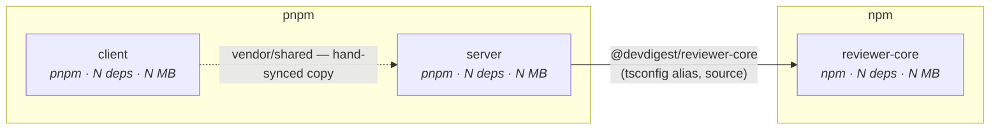

# Report format

Six sections, always in this order, always all six. A section with nothing to say
says "nothing found" and stays — a missing section reads as "not checked", and the
difference between *checked and clean* and *never looked* is the whole value of an audit.

Write the report to `docs/dependency-audit/<YYYY-MM-DD>.md` unless the user asked
for it somewhere else. Sizes as MB with one decimal. Never round a count.

---

## A · Method

Four lines, no prose:

```
Scanned:      client, server, reviewer-core, e2e, mcp-server, evals   (6 of 6)
Commands:     scan.mjs @ <git sha> · pnpm audit (client, server, evals) · npm audit (reviewer-core, e2e, mcp-server)
Date:         <YYYY-MM-DD>
Not measured: <what, and why — "npm audit: no network" / "client bundle: no production build present">
```

*Not measured* is mandatory and may not be empty without justification. Anything the
report does not cover is stated here, once, rather than being silently absent.

---

## B · Map

Two Mermaid diagrams. Plain `flowchart` and `pie` only — they render in GitHub, in
the IDE preview and in an Artifact without a plugin.

**B1 — internal edges.** Our six packages and the tsconfig aliases between them.
Label each node with its manager. Mark the hand-synced `vendor/shared` copies as a
dashed edge, because they are a duplicated contract and not a dependency.



**B2 — weight.** Where the bytes are. One `pie` of installed size per package, or —
when one package dominates and the pie is unreadable — a `flowchart` of the top
external dependencies hung off the package that declares each.

Do not draw the full transitive graph. A 600-node diagram is not a map, and nobody
reads one. Cap B2 at the packages or dependencies that account for ~80% of the bytes
and say in one line what the remainder is.

---

## C · Inventory

One table per package, direct dependencies only. Transitive packages are counted,
never listed.

```
### server — pnpm · 22 prod · 12 dev · 509 installed packages · 256.0 MB

| Dependency | Type | Range | Installed | Self | Closure | +Transitive | Used in | Note |
|---|---|---|---|---|---|---|---|---|
| drizzle-kit | dev | ^0.31.5 | 0.31.5 | 12.1 MB | 49.4 MB | 22 | 0 files | CLI, via `db:generate` |
```

- **Type** — `prod` / `dev` / `peer` / `optional`, taken from `package.json`, not guessed.
- **Self** vs **Closure** — the package's own bytes vs it plus everything it drags in.
  The gap between the two columns is the actual finding; see [metrics.md](metrics.md).
- **Used in** — product source files importing it. `0 files` is normal for toolchain
  and means "invoked, not imported" — put the invoking script in **Note**.
- Sort by Closure descending. A package with more than ~25 direct dependencies gets
  its top 15 plus a `… and N more (X MB total)` row.

---

## D · Weight

The numbers section. Five fixed sub-parts:

1. **Totals** — installed bytes and package count per workspace package, and the repo
   sum. State plainly that a dependency shared by two packages is counted in both,
   because each package installs its own copy.
2. **Top 10 by closure**, repo-wide, with the package that declares each.
3. **Shipped vs not shipped.** Only `client/`'s `dependencies` can reach a browser.
   Everything else — all of `server/`, every `devDependencies` block — is install-time
   weight and costs CI minutes and disk, not user bytes. Never present the two as one
   number; conflating them is the most common way a dependency report misleads.

   **A closure sum is not shipped weight, and must never be labelled as one.** The
   eleven runtime dependencies of `client/` come to ~473 MB of overlapping closure, of
   which `next` is 291 MB — a framework that is mostly build-time and never reaches a
   browser. Report `client/` runtime dependencies as *install* weight like every other
   package, and if a real shipped figure is wanted, build the client and read the
   route sizes from the build output. If that was not done, `Not measured` says so.
4. **Shared platform choices** — a dependency declared by three or more packages
   (`crossPackage.sharedDeps`). These are the ones a change has to be coordinated across.
5. **Duplication** — the same package installed at two or more versions
   (`crossPackage.versionDrift`), with each version's holders named.

---

## E · Risks

Findings, not yet prioritised. Each is one line: what, where (`path:line` or the
command), and what breaks if it is left alone. Six fixed classes — a class with
nothing in it prints `none`:

| Class | What it means |
|---|---|
| **Undeclared** | Imported but not in any `dependencies` block. Resolves today by hoisting; breaks on a clean install or a linker change. |
| **Unused** | Declared, and all four Step 4 checks came back empty. |
| **Advisories** | From `audit`, split by `dev: true` / `false`. |
| **Drift** | The same package at two or more versions. Split types-only from runtime — they are not the same risk. |
| **Misplaced** | Runtime code importing a `devDependencies` entry, or vice versa. |
| **Contract** | Drift between the two hand-synced `vendor/shared` copies. Report only; both are do-not-touch. |

---

## F · Priorities

The section a reader who scrolled past everything else still acts on. Group by
P0/P1/P2 per the rubric in [SKILL.md](SKILL.md#prioritisation-rubric). Within a
group, order by impact per unit effort.

```
### P1 — real cost, no incident yet

**1. Remove `@fastify/autoload` from `server/`**
- Evidence:  zero references in `server/src` (`grep -ran autoload server/src` → empty);
             modules are registered statically in `src/modules/index.ts`
- Effort:    S — one line of `package.json`
- Impact:    install −N MB, one fewer runtime dependency
- Command:   remove the entry from `server/package.json`, then `cd server && pnpm install`
- Verify:    `cd server && pnpm typecheck && pnpm test && pnpm lint:arch`
```

Close the report with two short lists:

- **Open questions** — anything that could not be resolved, and what would resolve it.
  A finding that cannot fill all five lines of the rubric belongs here, not above.
- **Deliberately not recommended** — the candidates that were checked and rejected,
  each with the check that saved it (`@vscode/ripgrep` — dynamic import at
  `adapters/codeindex/ripgrep.ts:33`). This list is what stops the next audit from
  re-proposing the same three removals.
