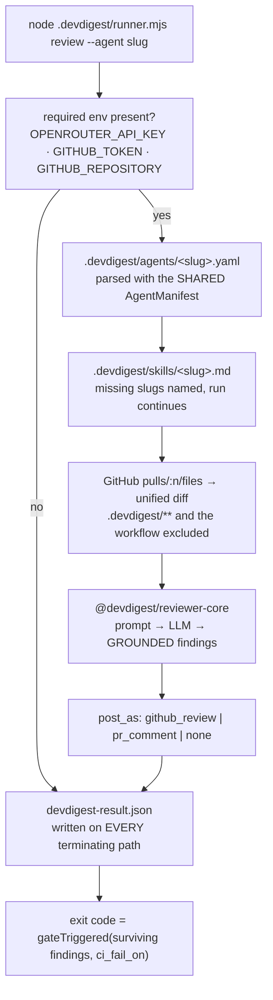

# `agent-runner` — the DevDigest reviewer, running in someone else's CI

The I/O wrapper around the `reviewer-core` engine. The studio exports it into a
target repository as **one committed file**, and a generated GitHub Actions
workflow runs it on every pull request:

```
node .devdigest/runner.mjs review --agent <slug>
```

Same engine as the studio, same grounding gate, same `ci_fail_on` policy — only
the I/O around it is different: the diff comes from the GitHub API instead of a
local clone, the review is posted instead of streamed, and the result is written
to a file the studio reads back later.

## What it does, in order



## The rules it is built to

- **It reads files; it never runs them.** No `spawn`, no `exec`, no import of
  anything in the checked-out tree beyond the `.devdigest/` files the manifest
  names. The diff, the pull request title and body, the branch name and every
  skill body are data.
- **Every skill body is wrapped as untrusted.** The studio exempts skills a human
  in that workspace typed; here a skill body is a markdown file in a repository
  DevDigest does not control, so the exemption does not travel.
- **The review event is arithmetic, not opinion.** It comes from the surviving
  findings' severities and the manifest's `ci_fail_on` — never from the model's
  self-reported verdict.
- **`ci_fail_on` is read from the manifest and never defaulted here.** The
  contract already defaults it; a second default in the runner is a second
  policy nobody can see.
- **The fork gate is not here.** It is an `if:` on the generated workflow's job,
  where a reviewer of the export pull request can read it. A promise in a header
  comment is not a control.
- **A result is always written.** The workflow uploads it with `if: always()`,
  and a run with no artifact is a run the studio cannot report — so a thrown
  model call still leaves a file that parses against `CiResultArtifact`.
- **No secret reaches any output.** The token lives in one HTTP header, the model
  key inside the provider, and everything the runner emits passes through a
  redactor first.

## Layout

| File | What it owns |
|---|---|
| `src/main.ts` | the CLI, the env check, the result file and the exit code |
| `src/review-pr.ts` | diff → engine → grounded review → publish (no process, no env) |
| `src/manifest.ts` | the shared `AgentManifest` parse and skill-body resolution |
| `src/diff.ts` | GitHub file patches → `UnifiedDiff`, and the DevDigest-owned exclusions |
| `src/github.ts` | three REST calls over global `fetch`, plus the mocks |
| `src/llm.ts` | re-exports the shared `OpenRouterProvider`, plus the test providers |
| `src/redact.ts` | the last line of defence on secret values |

## Why `dist/` is committed

The runner lands in a repository that will never run a build: the generated
workflow invokes `node .devdigest/runner.mjs` directly. So the bundle is the
deliverable, and it is committed. `build.mjs` produces it with esbuild; the
`agent-runner` workflow rebuilds it and runs `git diff --exit-code -- dist/`,
which is the one check a committed artefact can be given. **After editing
`src/`, run `npm run build` and commit `dist/` in the same change.**

The bundle inlines everything — the shared contracts, the engine and the three
npm dependencies. Its one concession is the `createRequire` banner `build.mjs`
adds: the OpenAI SDK's CommonJS runtime shims call `require("stream")`, which an
ESM bundle has no `require` for. Every specifier that reaches it is a Node
builtin, so nothing is resolved from the host repository.

## Commands

Run the binaries directly; `pnpm`/`npm run <script>` indirection is what the
scripts wrap, and this package is plain npm.

```sh
npm install
./node_modules/.bin/tsc --noEmit -p tsconfig.json
./node_modules/.bin/vitest run
node build.mjs && node --check dist/runner.mjs
```
