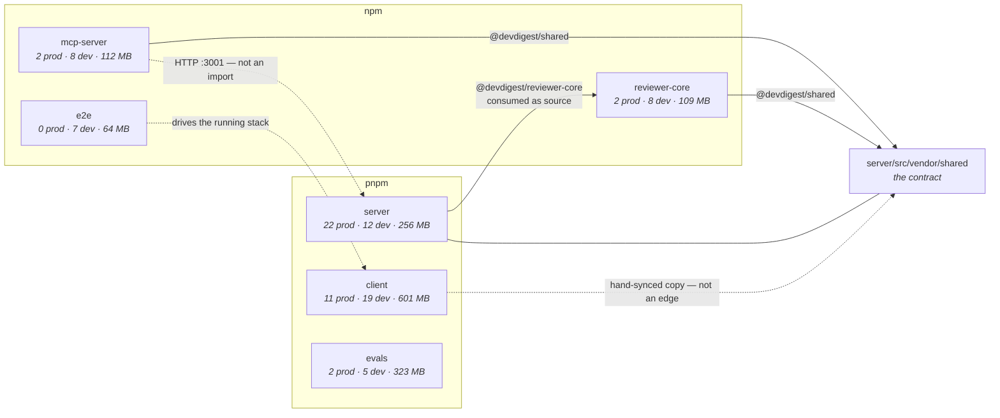
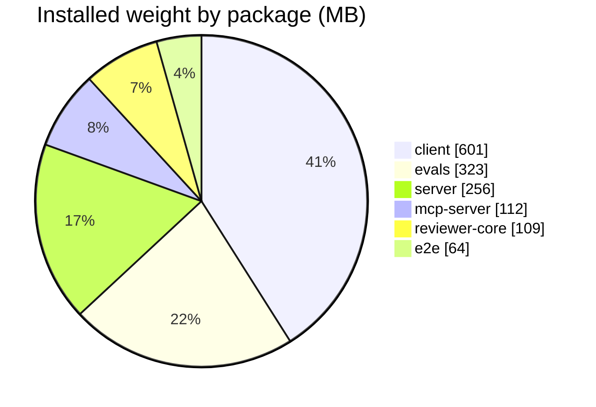

# Dependency audit — 2026-08-22

Produced by the [`dependency-checker`](../../.claude/skills/dependency-checker/SKILL.md)
skill. Read-only: nothing in this repository was installed, edited or upgraded to
produce it.

## A · Method

```
Scanned:      client, server, reviewer-core, e2e, mcp-server, evals   (6 of 6)
Commands:     scan.mjs @ 002853e  ·  pnpm audit --json (client, server, evals)
                                  ·  npm  audit --json (reviewer-core, e2e, mcp-server)
                                  ·  diff -rq server/src/vendor/shared client/src/vendor/shared
Date:         2026-08-22
Not measured: client shipped bundle size — no production build present, and a closure
              sum is not a shipped figure (see D3). Transitive licence compatibility —
              only direct dependencies' `license` fields were read. Advisory data is a
              point-in-time read of the registry on 2026-08-22.
```

## B · Map

### B1 — internal edges

Six packages, not a workspace. Every edge below is a **tsconfig `paths` alias**, not a
dependency — no dependency tool sees any of them.



Two edges deserve a second look, and neither is this skill's verdict to give:

- **`reviewer-core` → `../server/src/vendor/shared/`.** The pure engine reaches into
  `server/`'s directory for the contract. It resolves and it typechecks; whether the
  *direction* is acceptable is an `onion-architecture` question.
- **`client/src/vendor/shared/` is a hand-made copy** of the same contract, not a
  reference to it. Both are do-not-touch, and they drift silently — no tool compares them.

### B2 — where the bytes are



Three dependencies account for roughly half of everything: `next` (291 MB),
`@anthropic-ai/claude-agent-sdk` (233 MB) and `mermaid` (121 MB).

## C · Inventory

Direct dependencies only, top 6 per package by closure. Transitive packages are
counted, never listed.

### client — pnpm · 11 prod · 19 dev · 647 installed packages · 601.1 MB

| Dependency | Type | Range | Installed | Self | Closure | +Transitive | Used in |
|---|---|---|---|---|---|---|---|
| `next` | prod | `^15.1.3` | 15.5.19 | 139.5 MB | 290.8 MB | 17 | 27 files |
| `mermaid` | prod | `^11.15.0` | 11.15.0 | 76.3 MB | 120.8 MB | 110 | 1 files |
| `vitest` | dev | `^2.1.8` | 2.1.9 | 1.6 MB | 32.6 MB | 43 | 51 files |
| `lucide-react` | prod | `^0.469.0` | 0.469.0 | 28.6 MB | 28.6 MB | 0 | 1 files |
| `typescript` | dev | `^5.7.2` | 5.9.3 | 23.6 MB | 23.6 MB | 0 | 0 files |
| `eslint-plugin-react-hooks` | dev | `^7.1.1` | 7.1.1 | 4.1 MB | 21.5 MB | 43 | 1 files |
| … and 24 more | | | | | 111.7 MB total | | |

### server — pnpm · 22 prod · 12 dev · 509 installed packages · 255.6 MB

| Dependency | Type | Range | Installed | Self | Closure | +Transitive | Used in |
|---|---|---|---|---|---|---|---|
| `drizzle-kit` | dev | `^0.30.1` | 0.30.6 | 7.8 MB | 49.4 MB | 22 | 1 files |
| `vitest` | dev | `^2.1.8` | 2.1.9 | 1.6 MB | 32.6 MB | 43 | 70 files |
| `@testcontainers/postgresql` | dev | `^10.16.0` | 10.28.0 | 0.0 MB | 30.6 MB | 157 | 1 files |
| `testcontainers` | dev | `^10.16.0` | 10.28.0 | 0.4 MB | 30.5 MB | 156 | 0 files |
| `typescript` | dev | `^5.7.2` | 5.9.3 | 23.6 MB | 23.6 MB | 0 | 0 files |
| `js-tiktoken` | prod | `^1.0.21` | 1.0.21 | 22.4 MB | 22.4 MB | 1 | 1 files |
| … and 28 more | | | | | 114.9 MB total | | |

### reviewer-core — npm · 2 prod · 8 dev · 192 installed packages · 108.6 MB

| Dependency | Type | Range | Installed | Self | Closure | +Transitive | Used in |
|---|---|---|---|---|---|---|---|
| `vitest` | dev | `^2.1.8` | 2.1.9 | 1.6 MB | 32.6 MB | 43 | 6 files |
| `typescript` | dev | `^5.7.2` | 5.9.3 | 23.6 MB | 23.6 MB | 0 | 0 files |
| `tsx` | dev | `^4.19.2` | 4.22.4 | 0.5 MB | 21.9 MB | 3 | 0 files |
| `eslint` | dev | `^9.39.5` | 9.39.5 | 3.0 MB | 11.2 MB | 85 | 0 files |
| `openai` | prod | `^4.77.0` | 4.104.0 | 4.2 MB | 10.9 MB | 38 | 2 files |
| `typescript-eslint` | dev | `^8.66.0` | 8.66.0 | 0.0 MB | 5.8 MB | 26 | 1 files |
| … and 4 more | | | | | 6.4 MB total | | |

### e2e — npm · 0 prod · 7 dev · 115 installed packages · 64.3 MB

| Dependency | Type | Range | Installed | Self | Closure | +Transitive | Used in |
|---|---|---|---|---|---|---|---|
| `typescript` | dev | `^5.7.2` | 5.9.3 | 23.6 MB | 23.6 MB | 0 | 0 files |
| `tsx` | dev | `^4.19.2` | 4.22.4 | 0.5 MB | 21.9 MB | 3 | 0 files |
| `eslint` | dev | `^9.39.5` | 9.39.5 | 3.0 MB | 11.2 MB | 85 | 0 files |
| `typescript-eslint` | dev | `^8.66.0` | 8.66.0 | 0.0 MB | 5.8 MB | 26 | 1 files |
| `@types/node` | dev | `^22.10.0` | 22.19.21 | 2.4 MB | 2.5 MB | 1 | 0 files |
| `globals` | dev | `^17.9.0` | 17.9.0 | 0.3 MB | 0.3 MB | 0 | 1 files |
| … and 1 more | | | | | 0.0 MB total | | |

### mcp-server — npm · 2 prod · 8 dev · 240 installed packages · 111.8 MB

| Dependency | Type | Range | Installed | Self | Closure | +Transitive | Used in |
|---|---|---|---|---|---|---|---|
| `vitest` | dev | `^2.1.8` | 2.1.9 | 1.6 MB | 32.5 MB | 42 | 8 files |
| `typescript` | dev | `^5.7.2` | 5.9.3 | 23.6 MB | 23.6 MB | 0 | 0 files |
| `tsx` | dev | `^4.19.2` | 4.23.12 | 0.5 MB | 21.9 MB | 2 | 0 files |
| `@modelcontextprotocol/sdk` | prod | `^1.30.0` | 1.30.0 | 4.3 MB | 14.4 MB | 92 | 5 files |
| `eslint` | dev | `^9.39.5` | 9.39.5 | 3.0 MB | 12.2 MB | 87 | 0 files |
| `typescript-eslint` | dev | `^8.66.0` | 8.67.0 | 0.0 MB | 5.8 MB | 26 | 1 files |
| … and 4 more | | | | | 6.4 MB total | | |

### evals — pnpm · 2 prod · 5 dev · 98 installed packages · 322.8 MB

| Dependency | Type | Range | Installed | Self | Closure | +Transitive | Used in |
|---|---|---|---|---|---|---|---|
| `@anthropic-ai/claude-agent-sdk` | prod | `^0.3.198` | 0.3.198 | 3.7 MB | 233.0 MB | 1 | 1 files |
| `vitest` | dev | `^2.1.0` | 2.1.9 | 1.6 MB | 32.6 MB | 43 | 5 files |
| `typescript` | dev | `^5.6.0` | 5.9.3 | 23.6 MB | 23.6 MB | 0 | 0 files |
| `tsx` | dev | `^4.19.0` | 4.22.4 | 0.5 MB | 22.0 MB | 3 | 0 files |
| `openai` | prod | `^4.77.0` | 4.104.0 | 4.2 MB | 10.9 MB | 38 | 1 files |
| `@types/node` | dev | `^22.0.0` | 22.20.0 | 2.4 MB | 2.5 MB | 1 | 0 files |
| … and 1 more | | | | | 0.8 MB total | | |

## D · Weight

**1 · Totals.** A dependency shared by two packages is counted in both — each package
runs its own install, so both copies are really on disk.

| Package | Manager | Installed packages | Installed size |
|---|---|---|---|
| `client` | pnpm | 647 | 601.1 MB |
| `evals` | pnpm | 98 | 322.8 MB |
| `server` | pnpm | 509 | 255.6 MB |
| `mcp-server` | npm | 240 | 111.8 MB |
| `reviewer-core` | npm | 192 | 108.6 MB |
| `e2e` | npm | 115 | 64.3 MB |
| **total** | | **1801** | **1464.2 MB** |

**2 · Top 10 by closure.** Closure = the dependency plus everything it drags in.
Closures overlap, so this column does not sum.

| Closure | Dependency | Declared by | Type | +Transitive |
|---|---|---|---|---|
| 290.8 MB | `next` | client | prod | 17 |
| 233.0 MB | `@anthropic-ai/claude-agent-sdk` | evals | prod | 1 |
| 120.8 MB | `mermaid` | client | prod | 110 |
| 49.4 MB | `drizzle-kit` | server | dev | 22 |
| 32.6 MB | `vitest` | client, server, reviewer-core, evals | dev | 43 |
| 32.5 MB | `vitest` | mcp-server | dev | 42 |
| 30.6 MB | `@testcontainers/postgresql` | server | dev | 157 |
| 23.6 MB | `typescript` | all six | dev | 0 |
| 21.9 MB | `tsx` | server, reviewer-core, e2e, evals | dev | 3 |
| 11.2 MB | `eslint` | five packages | dev | 85 |

**3 · Shipped vs not shipped.** Only `client/`'s 11 runtime dependencies can reach a
browser at all. Everything else — all of `server/`, all of `evals/`, every
`devDependencies` block — is install-time weight paid in CI minutes and disk, not in
user bytes.

Their closure comes to ~473 MB, of which `next` is 291 MB. **That is not a shipped
figure and must not be quoted as one**: `next` is overwhelmingly build-time, and the
number counts source maps, dual ESM/CJS builds and TypeScript sources that no bundle
includes. A real shipped figure needs a production build; see *Not measured*.

**4 · Shared platform choices** (declared by 3+ packages). A change to any of these
has to be coordinated across every holder:

`@types/node`, `typescript` (all six) · `@eslint/js`, `eslint`, `globals`,
`typescript-eslint` (five) · `vitest`, `tsx` (five) · `zod` (four: client, server,
reviewer-core, mcp-server) · `openai` (three: server, reviewer-core, evals)

**5 · Duplication.** Four packages sit at more than one version. **All four are types
or toolchain — none is a runtime contract**, so none of them can produce a runtime
mismatch:

| Dependency | Versions |
|---|---|
| `@types/node` | 22.19.19 (client, server) · 22.19.20 (reviewer-core) · 22.19.21 (e2e) · 22.20.0 (evals) · 22.20.1 (mcp-server) |
| `typescript-eslint` | 8.65.0 (client, server) · 8.66.0 (reviewer-core, e2e) · 8.67.0 (mcp-server) |
| `globals` | 17.9.0 (four packages) · 17.11.0 (mcp-server) |
| `tsx` | 4.22.4 (four packages) · 4.23.12 (mcp-server) |

Note the shape: `mcp-server` is the outlier in all four. It was installed later than
the rest, and the caret ranges resolved higher.

## E · Risks

| Class | Result |
|---|---|
| **Undeclared** | none — the anchored check is clean across all six packages |
| **Unused** | 1 confirmed (`@fastify/autoload` in `server/`); 2 candidates checked and rejected, see F |
| **Advisories** | 101 across six packages. **17 high at PROD reachability**, 3 critical (all `dev`) |
| **Drift** | 4, all types/toolchain, no runtime contract among them |
| **Misplaced** | 1 borderline — `gray-matter` sits in `evals/` `devDependencies` while `evals/src/skill-quality.ts` (the code behind `pnpm eval:quality`) imports it. The package's own convention puts script-backing deps in `dependencies` (`openai`, `@anthropic-ai/claude-agent-sdk` are prod); this one never deploys, so the cost is inconsistency, not breakage — see F item 7 |
| **Contract** | **measured: 5 of 20 files differ** between the two copies — `adapters.ts` (45 diff lines; the documented gaps: `openrouter`, `sessionId`, `CommitFile`) plus `contracts/eval-ci.ts`, `contracts/knowledge.ts`, `contracts/productionize.ts`, `contracts/trace.ts` (partly comment-only drift). Report only; both are do-not-touch, sync is coordination |

Advisories by package:

| Package | critical | high (prod) | high (dev) | moderate | low |
|---|---|---|---|---|---|
| `server` | 1 (dev) | 6 | 11 | 14 | 3 |
| `client` | 1 (dev) | 8 | 2 | 18 | 3 |
| `evals` | 1 (dev) | 3 | 5 | 10 | 1 |
| `reviewer-core` | 1 | 4 | — | 3 | 0 |
| `mcp-server` | 1 | 1 | — | 3 | 0 |
| `e2e` | 0 | 0 | — | 0 | 1 |

## F · Priorities

### P0 — breaks, or ships a known flaw

**1. Upgrade `drizzle-orm` in `server/` — SQL injection**

- Evidence: `pnpm audit --json` in `server/` — HIGH, path `.>drizzle-orm` (a **direct**
  runtime dependency, not transitive). "SQL injection via improperly escaped SQL
  identifiers", vulnerable `<0.45.2`; installed **0.38.4** against range `^0.38.3`
- Effort: **M** — 0.38 → 0.45 crosses seven minors; `drizzle-kit` 0.30.6 moves with it
- Impact: closes the only high-severity advisory on a *directly declared* runtime
  dependency in the repo
- Command: `cd server && pnpm add drizzle-orm@^0.45.2 drizzle-kit@latest`
- Verify: `cd server && pnpm typecheck && pnpm test && pnpm lint:arch`, then
  `pnpm db:generate` and confirm it produces **no** unexpected migration

**2. Upgrade `next` in `client/` — 3 high advisories**

- Evidence: `pnpm audit --json` in `client/` — DoS in Server Actions, SSRF in Server
  Actions on custom servers, SSRF in rewrites. All `<15.5.21`; installed **15.5.19**.
  Also pulls the fixed `postcss`, `nanoid` and `sharp`
- Effort: **S** — a patch bump inside 15.5.x
- Impact: clears 8 of the 8 high-prod advisories in `client/`
- Command: `cd client && pnpm add next@^15.5.21`
- Verify: `cd client && pnpm typecheck && pnpm test && pnpm build`, then the e2e suite —
  `rm -rf client/.next` first, or the run dies in setup (`e2e/INSIGHTS.md`, 2026-08-05)

### P1 — real cost, no incident yet

**3. Remove `@fastify/autoload` from `server/`**

- Evidence: `grep -ran 'autoload' server/src` → empty. Modules are registered
  statically in `server/src/modules/index.ts`; the root `CLAUDE.md` states this as a
  convention, so the package is not merely unused but contrary to the design
- Effort: **S** — one line
- Impact: one fewer runtime dependency; install saving is small (self size only)
- Command: remove the entry from `server/package.json`, then `cd server && pnpm install`
- Verify: `cd server && pnpm typecheck && pnpm test && pnpm lint:arch`

**4. Upgrade `vitest` to ≥3.2.6 in the four packages holding 2.1.x**

- Evidence: `audit` — CRITICAL in `client`, `server`, `evals` (and via npm in
  `reviewer-core`, `mcp-server`): "when Vitest UI server is listening, arbitrary file
  can be read and executed". `dev: true` in every finding, and the UI server is not
  used here — which is why this is P1 and not P0
- Effort: **L** — 2.1 → 3.2 is a major, and it lands in five packages with different
  managers; `server/`'s integration suite needs the serial re-run to be believed
  (`server/INSIGHTS.md`, 2026-08-06)
- Impact: clears all 3 critical advisories
- Command: per package — `pnpm add -D vitest@^3.2.6` / `npm i -D vitest@^3.2.6`
- Verify: per package `pnpm test`; in `server/` additionally
  `pnpm vitest run .it.test --pool=forks --poolOptions.forks.singleFork` and read the
  `↓` lines, not the pass count

### P2 — worth doing when the file is open anyway

**5. Align the four drifting toolchain packages on `mcp-server`'s versions**

- Evidence: section D5 — `@types/node`, `typescript-eslint`, `globals`, `tsx`;
  `mcp-server` is the high outlier in all four
- Effort: **M** — six packages, two package managers, no shared lockfile
- Impact: none at runtime. Removes a class of "works in one package, fails in another"
  confusion, and makes the next drift readable
- Command: per package, raise the range in `package.json`, then that package's own
  install — pnpm for client/server/evals, npm for the other three
- Verify: `typecheck` and `lint` in each touched package

**6. Confirm `mermaid` (121 MB, 110 transitive) is loaded lazily in `client/`**

- Evidence: third-heaviest dependency in the repo and a `client/` runtime dependency,
  so unlike `next` it genuinely can reach a browser
- Effort: **S** to check, unknown to fix
- Impact: unmeasured — needs a production build to size honestly
- Command: `cd client && pnpm build`, then read the per-route sizes
- Verify: n/a — this is an investigation, not a change

**7. Move `gray-matter` to `dependencies` in `evals/`**

- Evidence: `evals/src/skill-quality.ts` imports it (`grep -rln gray-matter evals/src`
  → one file), and that file is the body of the `eval:quality` script; the package
  declares it under `devDependencies` while its two other script-backing deps are prod
- Effort: **S** — move one line between blocks
- Impact: 0 bytes; manifest consistency only (the package never installs with `--prod`)
- Command: move the entry in `evals/package.json`, then `cd evals && pnpm install`
- Verify: `cd evals && pnpm typecheck && pnpm eval:quality`

### Open questions

- ~~**Do the two `vendor/shared` copies currently agree?**~~ **Resolved 2026-08-22
  (read-only diff): they do not — 5 of 20 files differ; see E · Contract.** What to do
  about it stays a coordination decision outside this skill.
- **`reviewer-core` aliases into `server/src/vendor/shared/`.** Whether the pure engine
  may reach into `server/`'s tree is an `onion-architecture` verdict, not a dependency one.
- **True shipped bundle size for `client/`** — requires a production build.

### Deliberately not recommended

Checked, and rejected. This list exists so the next audit does not re-propose them.

| Candidate | Why it stays |
|---|---|
| `@vscode/ripgrep` (`server/`) | Used, and invisible to every static scanner: `src/adapters/codeindex/ripgrep.ts:33` loads it as `await import(/* @vite-ignore */ '@vscode/ripgrep' as string)`. The cast to `string` is deliberate |
| `testcontainers` (`server/`) | Only `@testcontainers/postgresql` is imported (`test/helpers/pg.ts:1`), and that package already depends on `testcontainers@^10.28.0`. Dropping the direct entry works but hands the version pin to the child — a real cost for no gain |
| `react-dom` (`client/`) | Loaded by React, never imported by name. Never a removal candidate |
| every `@types/*` | Consumed by `tsc` through `node_modules/@types` with no import anywhere |
