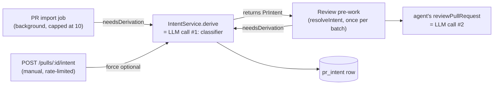

# Intent Layer

A pull request now carries a derived statement of what it is trying to do, computed by a
cheap classification pass and stored per PR so every reviewer — human or agent — starts
from the same frame instead of a cold diff.

Client half of this feature: [`../../client/specs/intent-layer.md`](../../client/specs/intent-layer.md).
The prompt slot this record feeds: [`../../reviewer-core/specs/intent-in-prompt.md`](../../reviewer-core/specs/intent-in-prompt.md).

## Behaviour

1. `GET /pulls/:id/intent` returns the workspace's stored `PrIntent` for the PR, or `null`
   when the PR has never been classified. `null` is a normal answer, not a 404 — the route
   resolves the PR in the caller's workspace first, and a PR outside that workspace 404s
   before the intent lookup runs at all.
2. `POST /pulls/:id/intent` derives — or re-derives — the intent **synchronously** and
   returns the persisted record with `200`. The body is optional; its only field is
   `force`, which bypasses the freshness check and re-derives even against an unchanged
   head SHA. The route is rate-limited to 5 requests/minute.
3. A derivation is triggered from exactly three places: **from `GET /pulls/:id`** (a
   background job, non-blocking — the PR-detail read, which is the only writer of the
   material the classifier needs), inline before a review runs (when no fresh intent exists
   for the PR's current head), and manually from `POST /pulls/:id/intent`. All three call the
   same `IntentService.derive`.
4. The detail-route trigger passes a window of **one row** — the PR being opened — to
   `IntentService.enqueueDerivations(workspaceId, rows, log)`, which holds the whole decision:
   whether the stored intent still satisfies `needsDerivation`, what a job payload looks like,
   and what happens when a job fails (caught per row and logged). `modules/pulls/routes.ts`
   wires only and holds none of that rule. The call is **not awaited** and is `void`-ed with a
   defensive `.catch`, so it cannot affect the response's status, body or latency, and a
   floating rejection cannot kill the process. `INTENT_IMPORT_SCAN_LIMIT` and the
   `updatedAt DESC` ordering are inert for a single-row window and are kept deliberately —
   they are the record of why the bound is on rows *examined* rather than rows enqueued, which
   is what the next person to move this trigger will need.

   **Why this route and not the PR list.** `pr_files` and `pull_requests.body` are written by
   `GET /pulls/:id` and by nothing else, so a derivation started from the list read could only
   ever see the title. Do not add a second trigger back on the list route: with no
   material-improved rule (see #15a), whichever trigger fires first wins for that head SHA, so
   a list-route derivation would re-create the bug at a figure that merely *looks* plausible.
   Consequence worth stating plainly: a PR nobody opens gets its intent from the review path or
   from the card's re-derive button, not from this trigger.

5. The trigger is **not** gated on GitHub being configured. `GET /pulls/:id` fires it on both
   exits, and the offline exit serves persisted files, commits and body — real material, and
   exactly the degradation this feature is supposed to survive. A repo with no token still
   gets an intent rather than none.
6. Review pre-work derives the intent **once per fanned-out batch of queued agent runs**,
   not once per agent, and never fails the review: a failure inside `resolveIntent` emits
   one log line and the review proceeds with the intent prompt slot omitted. The derivation
   is started **before, and concurrently with, the diff load** — not after it — since neither
   needs the other's result; on the normal path this costs the review nothing, because the
   classifier has usually answered by the time the diff is assembled. The review then waits
   at most `INTENT_INLINE_BUDGET_MS` (10s, roughly one model round-trip) before proceeding
   without the slot — it is no longer bounded by `INTENT_CALL_DEADLINE_MS` (the 75s job-path
   deadline) on this blocking path. Losing that race is not a failure and nothing is
   cancelled: the derivation keeps running under its own 75s deadline, records its own
   outcome on the `pr_intent` row, and the next review of the PR finds it already there.
7. A derivation always writes a row, even when it produces no intent text yet: `status` is
   one of `running`, `ok`, `partial`, `failed`. `intent` is nullable for exactly this
   reason — a row that is still in flight, or one that only records a failure, has nothing
   to say yet.
8. The classifier is given, per PR: the title; the body (omitted, not marked unfetched,
   when blank — an empty description is the normal case, not a gap); the changed-file list
   (path + `+additions/-deletions`, capped at `MAX_FILES_LISTED`); every `@@ … @@` hunk
   header of each changed file's stored patch, verbatim, capped at `MAX_HUNK_HEADERS`; and,
   when the body references them, same-repository GitHub issues/PRs and repo-relative
   documents read from the existing local clone. `MAX_FETCHED_LINKS` is a **per-category**
   budget — issues and documents are sliced independently, so one derivation performs at most
   `2 × MAX_FETCHED_LINKS` fetches. Anything beyond a category's budget is recorded
   `unfetched`, up to `MAX_RECORDED_LINKS`.
9. No diff `+`/`-` line, no file body other than a fetched `repo_doc`, and no secret or
   environment value ever reaches the classifier prompt.
10. Any link that is not a same-repository GitHub issue/PR or a path-confined document in
    the local clone is recorded as an `unfetched` source with a reason and is never
    dereferenced — this includes every external host, every `../` or absolute-path
    traversal attempt, and every symlink that resolves outside the clone.
11. `confidence` on the stored row is **derived**, not read from the model: it sums a fixed
    weight per distinct source *kind* actually read (`SOURCE_CONFIDENCE_WEIGHTS`, counted
    once per kind regardless of how many sources of that kind were fetched), floors at
    `INTENT_MIN_CONFIDENCE`, and is then **discounted** — not capped — by the model's own
    self-reported figure: the self-report can only ever lower what the sources alone were
    worth, never raise it, and two properties hold at once as a result: (a) the derived
    figure is monotonically non-decreasing in the self-report, equal to the sources-only
    figure exactly at a self-report of 1; and (b) for any fixed self-report, a source set
    that includes a used `pr_body` is **strictly greater** than the same set without it —
    which a hard `Math.min` of sources-figure and self-report does not guarantee, because it
    collapses both sides to the same number whenever the self-report sits at or below the
    smaller of the two sources-only figures. See `server/src/modules/intent/confidence.ts`
    (`deriveConfidence`) for the formulas and the case the old spelling collapsed.
12. Any `unfetched` source among those the classifier was offered caps `confidence` at
    `INTENT_UNFETCHED_CONFIDENCE_CEILING` and forces `status: 'partial'`. That ceiling sits
    above every value reachable from an empty PR body, so a no-description derivation can
    never tie with one that had a body.
13. The one call to the classifier is bounded by an explicit deadline
    (`INTENT_CALL_DEADLINE_MS`, raced with `Promise.race`) **and** `maxRetries: 0`. Both are
    required: the provider ignores `StructuredRequest.timeoutMs`, and its default
    `maxRetries` is 2 (three round-trips of up to 90s each).
14. `IntentService.derive` throws `NotFoundError` when the PR does not belong to the caller's
    workspace — the `getPull` resolution is the only statement deliberately left outside the
    method's `try`, because a PR the caller was never entitled to see must not get a row
    written for it. **Everything else** is inside: the freshness read
    (`reviewRepo.getIntent`), the row claim (`reviewRepo.markIntentRunning`), the source
    collection, the provider resolution and the bounded model call. Each of their failures —
    a missing provider key, a provider error, a losing race against the deadline, a database
    blip on either of the first two — is written to the row as `status: 'failed'` with the
    message in `error`, and the method returns normally. This is what stops the background job
    runner retrying a workspace with no LLM key configured. The one residual escape is a
    database that cannot accept even the failure row: recording is attempted, and if that
    write also fails the **original** error propagates rather than being masked by the
    bookkeeping error that replaced it.
15. A `running` row older than `INTENT_STALE_AFTER_MS` (or with no `derived_at` at all) is
    treated as abandoned, not in flight — `needsDerivation` returns `true` for it, so a
    process that died mid-derivation does not brick the PR's intent forever.
16. A review's persisted trace records two distinct model calls in the order they
    happened: `tool_calls[0]` is `derive_intent` (the classifier), present only when an
    intent was actually resolved, followed by the `review_file` entries of the agent's own
    call.
17. `findings.scope` (`in_scope` / `out_of_scope` / absent) persists per finding and
    round-trips unchanged through `insertFindings` and every findings read path.
18. **Risk areas** come from the SAME single classifier call — no second model pass, no new
    module, no extra cost. The classifier returns `risk_areas` with a closed `kind`
    (`security`, `db_migration`, `breaking_api`, `perf`, `deps`, `other`), a chip `title`, an
    `explanation`, a `severity` and `file_refs`. They are stored as `Risk[]`, reusing the
    `Risk`/`RiskSeverity` already defined in `contracts/brief.ts` — reuse rather than a second
    risk vocabulary, because that type had exactly these five fields and no consumer.
19. `file_refs` are **grounded before anything is stored** (`groundRiskAreas`): a reference
    whose path is not in the PR's real changed-file list is dropped, and a risk whose *every*
    reference was invented is discarded whole — it cited files and got all of them wrong, so
    nothing of the claim is left to trust. A risk that cites **nothing** is kept: a whole-PR
    observation is legitimate and the model was never required to cite. Matching is on the
    path, so `src/a.ts:12-18` matches `src/a.ts` and keeps its line suffix.
20. Risk areas do **not** influence `confidence` or `status`. Confidence is about what was
    *read*; a risk is what was *produced*. Letting an output raise the confidence in the inputs
    would break the two properties `intent-confidence.test.ts` pins.
21a. A risk the model labelled `other` has its `kind` **inferred from its grounded
    `file_refs`** — a changed `package.json`/lockfile is a `deps` risk, a path under
    `migrations/` or a `.sql` file is `db_migration`, an auth/middleware/session path is
    `security`, a routes/api/contracts/schema path is `breaking_api`. Only ever an upgrade
    away from `other`: a kind the model chose positively is left alone, because it may rest on
    something in the description that no path reveals. The inference runs on the GROUNDED refs,
    so an invented path cannot decide a category. Why it exists: the model reaches for `other`
    constantly (measured: all five risks on a 100-file PR), and on the card every `other` draws
    the same fallback icon, which is the one thing an icon row must not do. A path is not a diff
    body, so this stays inside Behaviour #9.
21. The classifier's kind enum is closed while the stored `Risk.kind` is an open string, on
    purpose: strict at the model boundary, where an enum is expressible in JSON Schema and
    stops a free-text kind from breaking the card's icon lookup; tolerant at the storage
    boundary, so a row written by a future vocabulary still parses and the client falls back to
    a neutral icon instead of crashing on `Icon[undefined]`.

### Diagram — the three triggers and the two model calls per review

Key: the cylinder is the persisted `pr_intent` row; the two LLM-call nodes are the ones a
run trace's `tool_calls` shows in order. Rendering: **not checked** — verify at
<https://mermaid.live/>.

## Data

`PrIntent` (`server/src/vendor/shared/contracts/intent.ts`), served by both endpoints above,
one row per PR (`pr_id` is the primary key):

| Field | Comes from |
|---|---|
| `pr_id` | `pr_intent.pr_id`, FK to `pull_requests.id` |
| `intent`, `in_scope`, `out_of_scope` | the classifier's structured response, trimmed and length-capped |
| `head_sha` | the PR's `head_sha` at the moment the derivation started |
| `confidence` | `deriveConfidence(sources, model's self-report)` — see Behaviour #11–12 |
| `sources` | the audit trail `collectSources` built — every input offered, `used` or `unfetched` |
| `missing_context` | `deterministicMissingContext(sources)` merged with the model's own `missing_context`, deduplicated |
| `risk_areas` | the classifier's risk areas, `Risk[]` reusing `contracts/brief.ts`; every `file_refs` entry checked against the PR's real changed-file list by `groundRiskAreas`, invented ones dropped |
| `status` | `intentStatusFor(sources)` (`ok`/`partial`) unless the call itself failed (`failed`) or is in flight (`running`) |
| `provider`, `model`, `tokens_in`, `tokens_out`, `cost_usd` | the classifier call's own usage figures |
| `derived_at` | when the current row's attempt started/finished |
| `error` | the failure message, only when `status: 'failed'` |

Endpoints: `GET /pulls/:id/intent`, `POST /pulls/:id/intent` — both in
`server/src/modules/intent/routes.ts`.

### Contract changes — `src/vendor/shared/` is do-not-touch; this is where the agreed change is on the record

Per [`README.md`](README.md), a spec that changes a Zod contract in `src/vendor/shared/`
must say so explicitly. This feature changes four files, both copies
(`server/src/vendor/shared/` and `client/src/vendor/shared/`):

1. **New file** `contracts/intent.ts` — `IntentSourceKind`, `IntentSourceStatus`,
   `IntentSource`, `IntentStatus`, `PrIntent` (extends the pre-existing, untouched
   `PrIntentRecord`), `DeriveIntentPayload`. Additive; nothing existing is edited.
2. `contracts/findings.ts` — new `FindingScope` enum (`'in_scope' | 'out_of_scope'`) and
   `Finding.scope: FindingScope.nullish()`. Nullish so every finding row written before
   this feature, and every finding from a PR whose intent could not be derived, still
   parses.
3. `contracts/trace.ts` — `PromptAssembly.intent: z.string().nullish()`. Traces persisted
   before this feature carry the key **absent**, not `null` — the same tolerance every
   other optional `PromptAssembly` slot already requires.
4. `contracts/platform.ts` — the `review_intent` `FEATURE_MODELS` entry's
   `defaultProvider`/`defaultModel` flips from `openai`/`gpt-4.1` to
   `openrouter`/`deepseek/deepseek-v4-flash`. Not additive — an existing default changes.
   Reason: Settings → Feature Models writes `provider: "openrouter"` on every pick
   (`client/src/app/settings/[section]/_components/SettingsView/_components/SettingsModels/SettingsModels.tsx`),
   so an OpenAI default was unreachable from that screen the moment anyone touched the
   picker. Doing the flip now, before this feature has users, is the one-way move's
   cheapest moment.

### Two schema decisions that read as oversights and are not

- **No `workspace_id` on `pr_intent`.** `pr_id` is the primary key and it FKs to
  `pull_requests`, which is already workspace-scoped. `IntentService.get` and
  `IntentService.derive` both resolve the PR through
  `reviewRepo.getPull(workspaceId, prId)` *before* touching the intent row — that lookup
  **is** the authorization check, and a `workspace_id` column would denormalise a fact no
  query here needs a second time.
- **No new index.** `pr_id` is the table's `PRIMARY KEY`, so the FK column already carries
  a unique B-tree. The table has no other access path — it is read one PR at a time — so
  the usual "Postgres does not index a bare FK column" caveat that applies to `reviews`
  does not apply here.

## States

| Case | `status` | What the reader sees |
|---|---|---|
| Never classified | — (no row) | `GET` returns `null` |
| In flight | `running` | row exists, `intent` may still be `null`; `derived_at` marks the attempt's start |
| Abandoned in-flight row | `running`, but `derived_at` older than `INTENT_STALE_AFTER_MS` | treated as needing derivation again (Behaviour #15) |
| Full material available | `ok` | `intent`, `in_scope`, `out_of_scope` populated at the highest reachable confidence |
| Something could not be read | `partial` | intent still populated; `sources` shows the `unfetched` entry; confidence capped |
| The model call itself failed | `failed` | `intent` stays whatever it was (or `null`); `error` holds the message |
| Derived against an older commit | any terminal status | `head_sha` on the row differs from the PR's current `head_sha`; `needsDerivation` returns `true` |

## Non-goals

- No third LLM call, and no string-matching of finding titles against intent bullets.
- No fetching of arbitrary external URLs (Jira, Notion, any non-GitHub host) — every one is
  recorded `unfetched`, never followed.
- No backfill of PRs imported before this feature shipped.
- No change to the `DiffHunk` contract or to `server/src/adapters/git/diff-parser.ts` — hunk headers
  for the classifier are read from `pr_files.patch` directly, deliberately bypassing the
  parsed structure (see `server/src/modules/intent/hunks.ts`).
- No edit to `INJECTION_GUARD`'s existing text (`reviewer-core/src/prompt.ts`).
- No `agent_runs` or `run_traces` schema change — the intent call is recorded as a
  `tool_calls` entry on the existing `RunTrace` shape, not a new column.
- No dedicated repository for the intent module: `pr_intent` is reached through
  `container.reviewRepo`, exactly like `pull_requests` and `pr_files`.

## Implementation

| File | Role |
|---|---|
| `server/src/modules/intent/routes.ts` | `GET`/`POST /pulls/:id/intent`, the background job registration |
| `server/src/modules/intent/service.ts` | `IntentService.derive`/`.get`, `needsDerivation`, `enqueueDerivations` (the import-trigger's window, dedup and per-row failure isolation), the bounded classifier call |
| `server/src/modules/intent/sources.ts` | `collectSources`, link resolution, and the module's declared ports (`IntentStore`, `RepoDocReader`, `FeatureModelResolver`, `IntentJobQueue`, `IntentDeps`). No `node:fs` — see the row below |
| `server/src/adapters/git/confined-doc.ts` | `ConfinedRepoDocReader` — the path-confined clone read (absolute-path refusal, `realpath` both ends, prefix check, regular-file only) |
| `server/src/modules/intent/hunks.ts` | `hunkHeaders` — `@@` lines taken verbatim from the stored patch |
| `server/src/modules/intent/confidence.ts` | `deriveConfidence`, `intentStatusFor` |
| `server/src/modules/intent/risks.ts` | `groundRiskAreas` — the evidence gate for risk areas and their bounds |
| `server/src/modules/intent/prompt.ts` | `buildClassifyMessages`, `loadTemplate` |
| `server/src/modules/intent/constants.ts` | every bound and weight named above |
| `server/src/modules/intent/schemas.ts` | `IntentClassification` — the classifier's structured-output schema |
| `server/src/prompts/intent.classify.system.md` | the classifier's system prompt body |
| `server/src/db/schema/reviews.ts` | `prIntent` table, `findings.scope` column |
| `server/src/db/migrations/0015_glossy_ogun.sql` | the generated migration |
| `server/src/modules/reviews/repository/pull.repo.ts` | `upsertIntent`, `markIntentRunning`, `failIntent`, `getIntent`, `toPrIntent` |
| `server/src/modules/reviews/repository.ts` | `ReviewRepository`'s intent methods, delegating to `pull.repo.ts` |
| `server/src/modules/reviews/repository/review.repo.ts` | the `scope` round-trip on findings read |
| `server/src/modules/reviews/helpers.ts` | the `scope` round-trip on the finding row → `FindingRecord` mapping |
| `server/src/modules/reviews/run-executor.ts` | `startIntent`, `resolveIntent` (`INTENT_INLINE_BUDGET_MS`, started concurrently with the diff load), `renderIntentBlock`, the `derive_intent` trace entry |
| `server/src/modules/pulls/routes.ts` | wires the import-time trigger to `container.intent.enqueueDerivations`; holds none of the trigger's own rule |
| `server/src/platform/container.ts` | `container.intent`, `container.repoDocs` and `container.featureModel` — the three bindings that let the intent module import no sibling module and no adapter |
| `server/src/modules/settings/feature-models.ts` | `resolveFeatureModel` takes a `Db`, not the `Container` — what took this file out of every import cycle |
| `server/src/modules/index.ts` | static registration of the `intent` module |
| `server/src/vendor/shared/contracts/intent.ts` | the new contract file (see above) |
| `server/src/vendor/shared/contracts/findings.ts` | `FindingScope`, `Finding.scope` |
| `server/src/vendor/shared/contracts/trace.ts` | `PromptAssembly.intent` |
| `server/src/vendor/shared/contracts/platform.ts` | the `review_intent` default flip |
| `server/src/db/seed.ts` | `seedPrIntent` + its `SEED_*` constants — the fixture `e2e/specs/11-pr-intent.flow.json` reads |
| `server/test/intent-confidence.test.ts` | `deriveConfidence`'s two properties, the ceiling, the clamps, `intentStatusFor` |
| `server/test/intent-hunks.test.ts` | `hunkHeaders` — `@@` verbatim, never a `+`/`-` line |
| `server/test/intent-sources.test.ts` | `collectSources` path confinement and URL redaction |
| `server/test/intent.it.test.ts` | DB-backed: the two routes, workspace scoping, a recorded failure, staleness, the no-description path |
| `server/test/intent-enqueue.test.ts` | `enqueueDerivations` — the examined-rows window, the dedup over five stored states, per-row failure isolation, the job payload, and the `job.done` bookkeeping catch |

## History

- **2026-08-10** — Wired up on L03: the `pr_intent` table (previously an empty placeholder)
  is widened, the classifier module is built, and the three triggers are connected. A
  deliberate deviation from the L03 task brief (not checked into this repository), which
  specifies that a plan/spec link
  must be fetched: this feature fetches only same-repository GitHub issues/PRs (via the
  existing octokit adapter) and repo-relative files already present in the local clone
  (path-confined, see Behaviour #10). Every other URL — a Jira ticket, a Notion page, any
  external host — is recorded `unfetched` and never dereferenced. That removes the SSRF
  surface entirely rather than filtering it, and still satisfies "flag the missing
  context" via `missing_context`/`sources[].status`. This first iteration shipped with **no
  new automated tests**; that is no longer true of the feature as it stands — see the
  2026-08-10 entry below that supersedes the claim.

- **2026-08-10** — Review found three things this spec described incorrectly, all fixed in
  code the same day. (1) Behaviour #4 said the import trigger capped **queued** PRs at 10;
  it caps rows **examined** at 10 (`INTENT_IMPORT_SCAN_LIMIT`), ordered by `updatedAt` DESC,
  so a repository whose intents are already fresh still only pays a constant handful of
  lookups instead of paying for every PR on every list read. The decision also moved out of
  `modules/pulls/routes.ts`, which used to hold the cap and the dedup check itself, into one
  `IntentService.enqueueDerivations(...)` call the route now only wires to. (2) Behaviour #6
  was silent on order and on the blocking-path deadline: the derivation now starts before,
  and concurrently with, the diff load (previously implied sequential, though the spec did
  not say so explicitly), and the review's own wait is bounded by
  `INTENT_INLINE_BUDGET_MS` (10s), not by the 45s `INTENT_CALL_DEADLINE_MS` job-path
  deadline — a slow classifier no longer holds every queued agent of a review for up to 45s.
  (3) Behaviour #11 said the model's self-report **caps** the derived confidence
  (`Math.min`); it now **discounts** it multiplicatively. The `Math.min` spelling collapsed
  a body-having and a body-less source set to the same stored figure whenever the
  self-report sat at or below the smaller of the two, which broke the property that a used
  `pr_body` must always be worth strictly more, for any fixed self-report.

- **2026-08-10** — **Supersedes the "no new automated tests" claim made in both entries
  above.** That claim was carried forward unchanged after the tests were written, so the spec
  understated its own coverage. What exists, all verified by running each suite: this package
  has `test/intent-confidence.test.ts` (24 cases — both stated properties of
  `deriveConfidence`, including the two exact self-reports where the rejected `Math.min`
  spelling collapsed), `test/intent-hunks.test.ts` (4 — `@@` lines verbatim, never a `+`/`-`
  line), `test/intent-sources.test.ts` (7 — `collectSources` path confinement against `..`,
  an absolute path, an escaping symlink and a non-regular file, plus URL query-string
  redaction), `test/intent.it.test.ts` (5, DB-backed — POST/GET round-trip, cross-workspace
  404, a `ConfigError` landing on the row, stale-vs-fresh `running`, and a description-less
  PR deriving at lower confidence), and three added cases in `test/reviews.it.test.ts`
  (`scope` surviving `insertFindings`, `tool_calls[0] === 'derive_intent'`, a failed
  derivation still completing the review). `reviewer-core` went from 4 files/31 tests to
  5/45. Measured: server 275 hermetic + 79 integration (9/9 `.it.test.ts` files actually
  ran), reviewer-core 45, client 175 — all green, typecheck clean in all three packages,
  `eslint` and `dependency-cruiser` at 0 errors. **Still genuinely uncovered**, and the one
  thing the old claim was right about: `enqueueDerivations` (the import trigger) has no test
  of its own, and `resolveIntent`/`INTENT_INLINE_BUDGET_MS` (the pre-work trigger) is
  exercised only indirectly through `reviews.it.test.ts`. The client half has no
  `IntentCard`/`ScopeFilter` test either — see the client spec.

- **2026-08-10** — `test/intent-enqueue.test.ts` closes the `enqueueDerivations` gap the entry
  above named: 8 hermetic cases over the examined-rows window (asserted on *which ids were
  looked up at all*, so bounding enqueues instead of lookups fails the test), the dedup across
  five stored states, per-row failure isolation with the newest row unreadable, the exact job
  payload, and the `job.done` bookkeeping catch including an assertion that no
  `unhandledRejection` fires — the shape that killed the API twice
  (`server/INSIGHTS.md`, 2026-08-06 / 2026-08-07). Server hermetic is now 283 tests over 29
  files. **Still uncovered:** `resolveIntent`/`INTENT_INLINE_BUDGET_MS`, exercised only
  indirectly through `reviews.it.test.ts`.

- **2026-08-10** — Two spec-vs-code corrections that were documentation-only: Behaviour #8
  implied `MAX_FETCHED_LINKS` was a per-derivation budget when `sources.ts` applies it per
  category, for up to twice as many fetches (the constant's own doc-comment said the same and
  now says which it is), and the History above overstated its own test coverage.

- **2026-08-10** — Then five code-level fixes, all of them things the documentation had been
  edited to describe rather than to fix:
  1. **`derive`'s `try` now covers the freshness read and the row claim** (Behaviour #14), so a
     database blip on the job path lands on the row instead of propagating. The `catch`
     records defensively and rethrows the ORIGINAL error if even that write fails, rather than
     reporting "could not record a failure" for every cause.
  2. **`staleRunningIntent` is deleted.** It was defined in
     `reviews/repository/pull.repo.ts`, delegated in `reviews/repository.ts`, and called by
     nothing — staleness is decided in `IntentService.needsDerivation` from `derived_at`. Its
     three now-unused drizzle imports (`isNull`, `lt`, `or`) went with it; `markIntentRunning`'s
     doc-comment cited it and now names `needsDerivation` instead.
  3. **The import trigger is no longer awaited** in `modules/pulls/routes.ts` (Behaviour #4),
     which is what makes the comment above it true.
  4. **The clone read moved out of the feature module into the adapters ring.**
     `modules/intent/sources.ts` had its own `node:fs` import and did `realpath`/`stat`/
     `readFile` inline; `.dependency-cruiser.cjs`'s `modules-no-raw-sdk` rule lists SDKs and
     **not** `node:fs`, so the module read the disk directly while the architecture gate
     reported clean. The confinement is now `ConfinedRepoDocReader` in
     `adapters/git/confined-doc.ts`, reached through a `RepoDocReader` port the intent module
     declares and the container wires. It is a consumer-declared port rather than a new
     `GitClient` method because `src/vendor/shared/` is coordination-only. `GitClient.readFile`
     is still not reused for the final read, deliberately: it joins and reads in one step,
     which would drop the post-`realpath` re-check that is the only defence against an
     escaping symlink. `intent-sources.test.ts` drives the real adapter over a real temp tree,
     so every confinement assertion still covers the real code.
  5. **Feature-model resolution is a port too.** `resolveFeatureModel` now takes a `Db`
     instead of the whole `Container` — the retirement condition the old code named itself —
     and the intent module reaches it through a `FeatureModelResolver` the composition root
     satisfies. That removed this feature's only two `dependency-cruiser` warnings (one
     `no-circular` through the DI root, one `no-cross-module-internals`): the tree went from 24
     warnings to 22, and **the Intent Layer now contributes none of them**. `IntentService`'s
     constructor lost its second parameter as a result, and `modules/intent/routes.ts` uses
     `container.intent` instead of constructing a second instance. `modules/intent/prompt.ts`
     also stopped duplicating `platform/prompts.ts`'s loader and its `node:fs` import.
  Verified after all five: `tsc` clean, `eslint` 0 errors, `depcruise` 0 errors / 22 warnings,
  275 hermetic + 79 integration tests (9/9 `.it.test.ts` files) green, and the 11 e2e flows
  green. One pre-existing test needed updating for the `Db` signature —
  `test/settings-models.it.test.ts` passed `app.container` and now passes `app.container.db`.

- **2026-08-11** — Three changes after looking at the card on real pull requests, where it was
  visibly wrong: `MISSING CONTEXT` claimed *"The pull request has no description."* while the
  DESCRIPTION card directly below showed a long body.

  **The measured facts.** 15 of 21 `pr_intent` rows had `sources = [pr_title]` alone, pinned at
  the `INTENT_MIN_CONFIDENCE` floor of 10%. Two PRs derived 0.6s apart proved the read path was
  fine: one read all four sources at 46%, the other only the title at 10%. The cause was write
  ORDERING, not a read bug — `pull_requests.body` and `pr_files` are written by `GET /pulls/:id`
  and by nothing else, while the derivation was enqueued from `GET /repos/:id/pulls`, i.e.
  always strictly before either existed. A title-only derivation then records `status: 'ok'`
  (nothing was `unfetched`), and `needsDerivation` takes `Pick<IntentPull,'headSha'>` — it is
  structurally incapable of noticing that material improved — so the poor row was cached
  forever at that head SHA. And the user could not repair it, because the card's Re-derive
  button POSTed with no body: `force` was `undefined`, so the route returned the stored row and
  the button was a silent no-op.

  1. **The trigger moved to `GET /pulls/:id`** (Behaviour #3-#5), where the material it needs
     is written. Sequencing, not policy: `needsDerivation` gained nothing, and the number of
     model calls per head SHA is unchanged at one. The list route now carries a comment saying
     why it must not trigger again.
  2. **`headSha` is persisted by the detail refresh** alongside the files it replaces. Without
     it a row could claim head *N* while `pr_files` held head *N+1*, and the intent would be
     stamped with a SHA that did not match the material it read. Visible side effect, on the
     record: `deriveReviewStatus` compares `last_reviewed_sha` to this column, so a reviewed PR
     whose head has moved starts reading `stale` one detail-read sooner — which is what `stale`
     already means.
  3. **`body` is also persisted by the list route's existing stats-backfill loop**, which
     already had `detail.body` in hand and discarded it. Zero extra GitHub calls. After change
     1 this no longer feeds the classifier, but it makes the list upsert lossless.
  4. **Risk areas added** (Behaviour #18-#21) to the same call, grounded, capped, and rendered
     as the card's chip row.
  5. **`INTENT_CALL_DEADLINE_MS` raised 45s → 75s**, on measurement. `risk_areas` roughly
     doubles output tokens (151 → 347 out on a 6-file PR; 895 on a 100-file PR), and one live
     call on the 100-file PR exceeded 45s and failed while the identical call moments later
     finished in 18s. 45s was not a bound on the work, it was a coin flip on a slow response
     from this provider — whose latency variance is already on the record
     (`server/INSIGHTS.md`, 2026-08-06).

  **Honest limitation, verified live rather than assumed.** Risk quality is bounded by
  Behaviour #9: the classifier never sees a diff body, so it cannot name an added dependency or
  a changed column. On a small, focused PR the risks are specific and correctly grounded. On a
  100-file refactor they degrade toward restating the change ("New and expanded i18n messages"),
  and most land in `other` because the five named kinds do not fit a UI refactor. The prompt was
  tightened to say that restating the change is worth nothing and that an empty list is a good
  answer; that helped, it did not solve it. The route to real parity with the design mock is to
  extract facts deterministically server-side (added dependency names from a manifest diff) and
  pass them as *counted facts*, which stays inside the no-diff-bodies rule. Not done here.

  **Deliberately NOT done:** no material-improved rule in `needsDerivation` (an explicit
  product decision — the button is the repair path), so the pre-existing title-only rows stay
  until re-derived; and no Blast Radius, in any form.