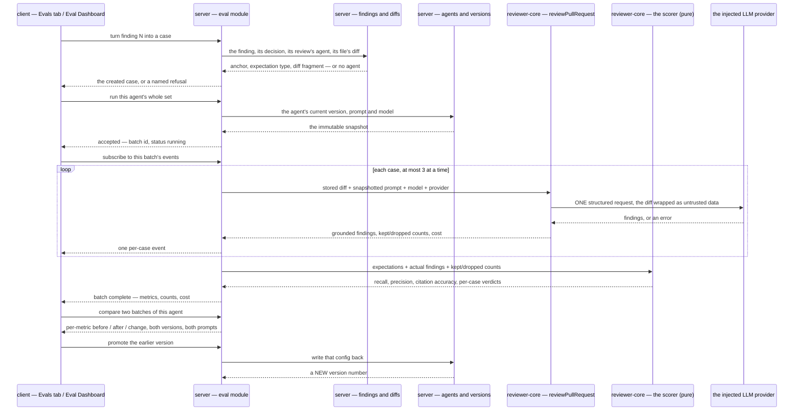

# Spec: Eval Pipeline | Spec ID: SPEC-04 | Status: approved
Supersedes: —

A reviewer can turn their own accept/dismiss decisions on real findings into an eval set for
the agent that produced them, run that agent over the whole set on demand, and read back
recall, precision and citation accuracy — computed arithmetically, with no model call in the
scorer — so that changing a system prompt, a model or a linked skill produces a number that
says whether the agent got better or worse.

## Problem & why

DevDigest can review a pull request, and it can record what a human thought of each finding.
It cannot answer the one question that decides whether a prompt change was an improvement:
**did that edit make the agent better or worse, measured against decisions we already
trusted?** Today the only evidence is a person re-reading a run and forming an impression, and
an impression does not survive a second prompt edit.

The material for the answer is already in the database. Every finding carries an
`accepted_at` and a `dismissed_at`. An accepted finding is a statement that *this problem, at
this file and these lines, is real and worth reporting*. A dismissed finding is the opposite
statement about the same anchor. Those two statements are exactly an eval set — a positive
expectation and a negative one — and nobody is reading them.

**This feature is roughly 60% pre-wired, and the parts get rebuilt if that is not written
down.** This is the third time this repository has hit the shape `server/INSIGHTS.md` records
for the conventions extractor (2026-08-06), Project Context (2026-08-18) and the Onboarding
Generator: a feature arrives four-fifths built across three packages with no single name to
grep for, because the module tree is the one place a pre-wired feature leaves no trace. The
inventory below is therefore the spine of this section rather than an appendix to it.

**The tables.** `eval_cases` and `eval_runs` shipped in the **first** migration
(`0000_init.sql`), are applied, and are empty. `eval_cases` already carries `owner_kind`
(`skill` | `agent`), `owner_id`, `name`, `input_diff`, `input_files`, `input_meta`,
`expected_output` and `notes`. `eval_runs` already carries `case_id`, `ran_at`,
`actual_output`, `pass`, and — named exactly as the assignment asks — `recall`, `precision`
and `citation_accuracy`, plus `duration_ms` and `cost_usd`. Neither table has a reader or a
writer anywhere in the server.

**The contracts.** `EvalCase`, `EvalRun`, `EvalOwnerKind` and `EvalPerTrace` sit under an
`// ---- Eval ----` heading in `contracts/knowledge.ts`; `EvalCaseInput`, `EvalRunRecord`,
`EvalRunResult`, `EvalTrendPoint` and `EvalDashboard` sit in `contracts/eval-ci.ts`, whose
own header says it exists for "L06". Both hand-synced copies carry all nine.
`EvalDashboard` is already the dashboard screen's payload: `cases_total`, a `current` block of
the three metrics plus `traces_passed`/`traces_total` and cost, a `delta` block, a `trend`
array, a `recent_runs` array and a **nullable** `alert` — and its `owner_kind`/`owner_id` are
both nullable, which is already how it says *the whole workspace*.

**Reproducibility, already solved.** `agent_versions` is an immutable per-agent snapshot of
provider, model, `system_prompt`, output schema, strategy, `ci_fail_on`, repo-intel settings
and ordered skill ids, keyed `(agent_id, version)`, auto-bumped and re-snapshotted on any
config change including a prompt edit. Its own code comment gives the reason as
"reproducibility for eval". `GET /agents/:id/versions` and `GET /agents/:id/versions/:version`
already serve it. "Which prompt produced this number" is therefore a join, not a new
mechanism.

**Citation accuracy, already computed.** `groundFindings` in `reviewer-core` is a pure
function that drops any finding whose `[start_line, end_line]` range does not intersect a real
new-side diff hunk for the same file, returning `{ kept, dropped }`; `groundingSummary`
already renders that as `"3/4 passed"`. `citation_accuracy` is `kept / (kept + dropped)` and
needs no new logic at all.

**The replay seam, already pure.** `reviewPullRequest` takes a parsed `UnifiedDiff`, a system
prompt, a model and an **injected** `LLMProvider`, performs zero I/O of its own, and returns
grounded findings plus the grounding result and the cost. `parseUnifiedDiff` turns stored diff
text into that input. So executing an eval case needs no pull-request row, no git clone, no
review row and no persistence — the engine cannot tell an eval case from a real review, and
must not be taught to.

**The client copy.** `messages/en/eval.json` is written and unused, with four sections:
`dashboard` (title, metric labels, legend, trend and recent-runs headings, an empty-runs
line), `caseEditor` (name, input tabs, expected output, `valid JSON`/`invalid JSON`, a
last-run summary), `evalsTab` (metrics title, cases heading, `never run`, per-row run / edit /
delete) and `page` (the breadcrumbs `Skills Lab › Eval Dashboard`). `shell.json` carries
`nav.eval: "Eval Dashboard"`. `agents.json` carries `editor.tabs.evals: "Evals"` between
`context` and `stats`. The shell's active-key resolver already maps any path under `/eval` to
the key `eval`. And `vendor/ui/nav.ts`'s own doc comment names this screen as pending: *"Only
routes that EXIST belong here. Conventions, Eval Dashboard, Memory and the rest arrive with
their lessons."*

**The charts.** `MetricCard` (a value with a signed delta and an optional sparkline),
`LineChart` (multi-series, y-axis already defaulted to 0.6–1.0 — the exact range the metric
trend needs), `Sparkline`, `BarRow` and `ProgressBar` all exist and are used only by a
component showcase. `Modal`, `Badge`, `Skeleton`, `EmptyState` and `ErrorState` exist and are
used everywhere.

**Seven things are missing**, and everything else above is either already there or is a
decision this spec records:

1. A **server module** for eval. Nothing named `eval` is registered, so every read is a 404
   today.
2. A **run-batch entity**. The shipped `eval_runs` is one row per *case execution*, with no
   batch identity and no agent version — so "this run of the whole set", "compare two runs"
   and "which prompt produced this" are not expressible on it.
3. The **mechanical scorer**. `groundFindings` gives citation accuracy; nothing computes
   recall or precision, and nothing knows what a positive or a negative expectation is.
4. The **`Evals` tab body** in the agent editor.
5. The **`/eval` route** — the workspace dashboard and its per-agent drill-down — and its
   sidebar entry.
6. The **`Turn into eval case`** action on a finding.
7. **`verify:l06`**. Only `verify:l03` exists, and it is the model to copy.

Two facts about the starting state that shape the whole feature. The workspace holds 122 real
findings across 40 reviews and 5 agents, **and zero accepted and zero dismissed** — so the
dataset does not exist until a human clicks decisions, and an agent with no cases is the
**first** state every user sees, not an edge case. And the scoring makes **zero LLM calls**:
the expectation is a `file:line` anchor and the match is arithmetic, so there is no judge to
build, no judge to pay for, and no judge to disagree with itself between two runs. That last
property is an acceptance criterion (AC-71, AC-72, AC-82), not an optimisation, because a
regression harness whose scorer is itself non-deterministic measures nothing.

## Goals / Non-goals

**Goals**

- **G1** Turn an **accepted** finding into a `must_find` case, and a **dismissed** finding into
  a `must_not_flag` case, in one click, carrying the finding's own anchor and diff fragment.
- **G2** Show every case in an agent's set with its expectation type and its last verdict.
- **G3** Run one agent over its whole set on demand, asynchronously, with live progress.
- **G4** Score that run **arithmetically** — file equality plus line-range overlap — with no
  model call anywhere in the scorer, and report `recall`, `precision` and `citation_accuracy`.
- **G5** Keep a run history with a total order, and compare any two runs of one agent side by
  side: metric deltas plus the diff of the two system prompts they actually ran.
- **G6** Make a system-prompt edit **visibly move** the metrics between two runs, by counting
  an extra finding that covers no expected anchor as a false positive.
- **G7** Record what a run *was supposed to cover*, so a case killed by a deadline lowers the
  score instead of vanishing from the denominator.
- **G8** Show every agent's eval health in one place, and let a version be promoted back onto
  its agent from the comparison.
- **G9** One command — `verify:l06` — answers "is L06 still whole?", including a mechanical
  gate proving the scorer imports nothing LLM-shaped.

**Non-goals** — each with its reason, because each is something a reader of the design will
otherwise assume is included.

- **N1 Skill-owned case sets.** `EvalOwnerKind` allows `skill` and that half stays out of
  scope: a skill is a prompt fragment, not a thing that produces findings, so there is nothing
  to run it against without first deciding which agent hosts it. The enum member is
  **deliberately left in place and unused** (P4); nothing should remove it.
- **N2 Any change to the accept/dismiss mechanism.** `findings.accepted_at` and
  `findings.dismissed_at`, and the `POST /findings/:id/(accept|dismiss)` routes, are read by
  this feature and unchanged by it. The decisions are the dataset; changing how they are made
  would change the dataset under the harness.
- **N3 Wiring the `Learn` and `Reply to author` finding actions.** They are drawn beside the
  new action in the design and are not implemented today. They stay unimplemented.
- **N4 Reshaping any existing contract symbol.** Every addition is a **new** symbol in both
  hand-synced copies. Root `CLAUDE.md`: *"When a change is agreed, extend with a new file
  rather than reshaping an existing symbol."* Reshaping a symbol two hand-made copies both
  declare is how those copies drift.
- **N5 Editing a generated migration by hand.** Schema changes are declared and generated.
- **N6 Touching the vendored design system**, beyond the one route-config file whose own doc
  comment carves itself out: *"adding a route here is not that"*. No primitive is restyled and
  no primitive gains a prop.
- **N7 The `Stats` and `CI` agent-editor tabs.** The tab strip gains `Evals` only.
- **N8 CI integration of eval runs.** No workflow runs the set, no gate blocks a merge on a
  metric, and `ci_runs` is not read or written. The harness is a studio tool this lesson.
- **N9 An LLM judge.** Not deferred — **excluded**. See G4.
- **N10 Reviving the pull request an eval case came from.** A case stores a diff fragment and
  an anchor; it does not link a run back to a `pull_requests` row, and re-running a case
  never creates a review, a finding or an `agent_runs` row.

## User stories

- **US-1** As a reviewer, from a finding I have **accepted**, I turn it into an eval case in
  one click, so the agent is thereafter required to find that problem.
- **US-2** As a reviewer, from a finding I have **dismissed**, I turn it into an eval case in
  one click, so the agent is thereafter required *not* to report that anchor.
- **US-3** As an agent author, I see every case in this agent's set, which kind of expectation
  each one carries, and whether it passed last time.
- **US-4** As an agent author, I run the agent over the whole set with one control, and watch
  it progress rather than staring at a spinner.
- **US-5** As an agent author, I read that run's recall, precision and citation accuracy, and
  how many cases passed out of how many were attempted.
- **US-6** As an agent author, I open the run history and compare two runs — old prompt versus
  new — seeing both the metric deltas and the diff of the two prompts.
- **US-7** As a team lead, I see every reviewer agent's eval health on one screen and drill
  into the one that regressed.
- **US-8** As an agent author, when a comparison shows the older prompt was better, I promote
  that version back onto the agent.
- **US-9** As an agent author, I edit a case — its name, its diff fragment, its expectation —
  and run that one case alone.
- **US-10** As anyone reading a metric, I can tell from the screen that the number was
  computed mechanically and not by another model.

## Acceptance criteria (EARS)

### AC-1 … AC-49 — server

**Creating a case from a finding**

- **AC-1** — WHEN the user turns an **accepted** finding into an eval case, the system
  **shall** create a case whose expectation type is `must_find`.
  `Verify: test` — *observable: a case created from a finding with a non-null `accepted_at`
  reads back `expectation: "must_find"`.*
- **AC-2** — WHEN the user turns a **dismissed** finding into an eval case, the system
  **shall** create a case whose expectation type is `must_not_flag`.
  `Verify: test` — *observable: a case created from a finding with a non-null `dismissed_at`
  reads back `expectation: "must_not_flag"`.*
- **AC-3** — WHEN a case is created from a finding, the system **shall** store one expected
  anchor carrying that finding's file path, low line and high line, with the low line taken as
  the smaller of `start_line` and `end_line`.
  `Verify: test` — *observable: a finding stored as `start_line: 27, end_line: 18` yields an
  anchor of `18`–`27`.*
- **AC-4** — WHEN a case is created from a finding, the system **shall** store that finding's
  id on the case as its provenance.
  `Verify: test` — *observable: the created case reads back `source_finding_id` equal to the
  finding's id.*
- **AC-5** — WHEN a case is created from a finding, the system **shall** store as the case's
  input diff the unified-diff text for that finding's file, taken from the pull request the
  finding's review belongs to.
  `Verify: test` — *observable: the stored `input_diff` parses to exactly one file whose path
  equals the finding's `file`.*
- **AC-6** — WHEN a case is created from a finding, the system **shall** set the case's owner
  kind to `agent` and its owner id to the agent that produced the finding's review.
  `Verify: test` — *observable: the created case's `owner_id` equals `reviews.agent_id` for
  the finding's review.*
- **AC-7** — IF the finding's review carries no agent reference, THEN the system **shall**
  refuse the creation with `422` and the reason `review_has_no_agent`.
  `Verify: test` — *observable: a finding on the seeded review, whose `agent_id` is null, is
  refused with that code and reason, and no `eval_cases` row is written.*
- **AC-8** — IF the finding carries neither an accepted nor a dismissed decision, THEN the
  system **shall** refuse the creation with `422` and the reason `finding_has_no_decision`.
  `Verify: test` — *observable: a finding with both timestamps null is refused, because no
  expectation type is derivable from it.*
- **AC-9** — IF a case in that agent's set already names this finding as its source, THEN the
  system **shall** refuse the creation with `409` and return the existing case's id, rather
  than creating a second case or silently updating the first.
  `Verify: test` — *observable: two consecutive creations from one finding leave exactly one
  `eval_cases` row, and the second response carries the first row's id.*
- **AC-10** — IF the anchor derived from the finding would overlap, on the same file path, an
  anchor already stored in that agent's set under the **other** expectation type, THEN the
  system **shall** refuse the creation with `422` and the reason `conflicting_anchor`, naming
  the existing case.
  `Verify: test` — *observable: with a `must_find` case at `src/modules/tasks/repo.ts:72-75`
  in the set, creating a `must_not_flag` case at `:72-75` — or at `:70-73` — is refused and
  names the first case; a `must_not_flag` case at `:80-84` in the same file is accepted.*
- **AC-11** — IF the agent's set already holds 50 cases, THEN the system **shall** refuse a
  further creation with `422` and the reason `case_limit_reached`.
  `Verify: test` — *observable: the 51st creation is refused and the set still reads back 50
  cases.*
- **AC-12** — IF a case's input diff text would exceed 64 KB, THEN the system **shall** refuse
  to store it with `422` and the reason `diff_too_large`, rather than truncating it.
  `Verify: test` — *observable: a 65 KB diff is refused; the stored case is unchanged.*

**Reading and editing a set**

- **AC-13** — WHEN an agent's case set is read, the system **shall** return every case with
  its expectation type, its expected anchors, its source finding id, and the outcome, expected
  count and actual count of that case's most recent execution.
  `Verify: test` — *observable: a set with one executed and one never-executed case returns
  both, the second with a null outcome.*
- **AC-14** — the system **shall** order a case set by name ascending, then by case id
  ascending.
  `Verify: test` — *observable: two cases sharing a name come back in a fixed order that does
  not change after either row is updated.*
- **AC-15** — WHEN the user saves an edited case, the system **shall** persist its name, input
  diff, expectation type and expected anchors as submitted.
  `Verify: test` — *observable: a read after the save returns the submitted values.*
- **AC-16** — IF a saved case's expectation type is `must_not_flag` and its forbidden anchor
  names a file absent from that case's input diff, THEN the system **shall** refuse the save
  with `422` and the reason `anchor_not_in_diff`.
  `Verify: test` — *observable: a case whose banner names `src/api/users.ts:3` while its
  stored diff contains only `src/config.ts` is refused — such a case can never be violated and
  would pass vacuously forever.*
- **AC-17** — WHEN the user deletes a case, the system **shall** delete it without
  changing any stored batch's recorded metrics or counts.
  `Verify: test` — *observable: a completed batch's `recall` and `cases_covered` read the same
  values before and after one of its cases is deleted.*
- **AC-18** — the system **shall** answer `404` to any eval read or write that names an agent
  outside the caller's workspace.
  `Verify: test` — *observable: an agent id from another workspace answers `404` with the
  service's own error envelope, not a route-not-found.*

**Running a batch**

- **AC-19** — WHEN a run of an agent's whole set is requested, the system **shall** acknowledge
  the request with the new batch's id and the status `running` before the first case executes.
  `Verify: test` — *observable: the response arrives while `cases_passed` is still null, and
  the batch row exists.*
- **AC-20** — WHEN a batch is created, the system **shall** record on it the agent's current
  config version number **and** a snapshot of the system prompt and model text that version
  carries.
  `Verify: test` — *observable: the batch reads back `agent_version` plus a
  `system_prompt_snapshot` and `model_snapshot` equal to the agent's config at creation time;
  editing the prompt afterwards does not change the stored batch.*
- **AC-21** — the system **shall** execute a case by replaying its stored input diff through
  the review engine with the batch's snapshotted system prompt and model, creating no pull
  request row, no review row, no finding row, no `agent_runs` row and no clone.
  `Verify: test` — *observable: running a batch against a fake provider leaves the `reviews`,
  `findings` and `agent_runs` row counts unchanged.*
- **AC-22** — WHILE a batch is running, the system **shall** deliver progress as a live event
  stream keyed on the batch id, emitting one event as each case reaches an outcome.
  `Verify: demonstration` — *observable: a subscriber on a three-case batch receives three
  per-case events and one completion event, in order.*
- **AC-23** — WHILE a batch is running and no case has reached an outcome for 15 s, the system
  **shall** emit a heartbeat event.
  `Verify: test` — *observable: with a provider held open past 15 s, the stream carries a
  heartbeat before the first per-case event.*
- **AC-24** — WHEN a subscriber attaches to a batch that has already completed, the system
  **shall** replay that batch's buffered events and then close the stream.
  `Verify: test` — *observable: a late subscriber receives the completion event rather than
  hanging.*
- **AC-25** — the system **shall** execute at most 3 cases of one batch concurrently.
  `Verify: analysis` — *observable: a provider fake recording concurrent in-flight calls never
  observes a fourth.*
- **AC-26** — the system **shall** bound each case's model work at 120 000 ms with
  provider retries disabled.
  `Verify: inspection` — *observable: the per-case request is raced against a 120 s deadline
  the caller owns, and carries `maxRetries: 0` — because `StructuredRequest.timeoutMs` is
  silently ignored and `maxRetries` defaults to 2.*
- **AC-27** — IF a case does not reach an outcome within 120 000 ms, THEN the system **shall**
  record it with the outcome `not_run` and the reason `deadline`.
  `Verify: test` — *observable: the case appears in the batch's results with
  `outcome: "not_run"`, and is neither `passed` nor `failed`.*
- **AC-28** — IF the model provider returns an error for a case, THEN the system **shall**
  record that case `not_run` with the reason `provider_error` without ending the batch.
  `Verify: test` — *observable: a batch whose second of four cases errors still records
  outcomes for all four.*
- **AC-29** — IF a case's stored input diff parses to no files, THEN the system **shall**
  record that case `not_run` with the reason `diff_unparseable` without issuing a model call
  for it.
  `Verify: test` — *observable: a case whose diff is prose records that reason, and the fake
  provider records zero calls for it.*
- **AC-30** — IF a batch has not completed within 900 000 ms, THEN the system **shall** set
  its status to `error`, record the reason, and start no further cases.
  `Verify: test` — *observable: with a clock advanced past the deadline the batch reads
  `status: "error"` and the remaining cases read `not_run`.*
- **AC-31** — IF a batch's status is `running` and its start is older than the batch deadline,
  THEN the system **shall** permit a new batch for that agent.
  `Verify: test` — *observable: a `running` batch left behind by a process restart does not
  block the agent's next run forever.*
- **AC-32** — WHEN a batch completes, the system **shall** compute its metrics over every case
  the batch set out to cover, counting a `not_run` case in `cases_covered` and not in
  `cases_passed`.
  `Verify: test` — *observable: a four-case batch with two passes, one failure and one
  `not_run` reads `cases_passed: 2, cases_covered: 4` — never `2/3`.*
- **AC-33** — WHEN a batch completes, the system **shall** record its `cases_covered`,
  `cases_passed`, three metrics, total cost, started-at and finished-at.
  `Verify: test` — *observable: every one of those fields is non-null on a completed batch
  except where a metric is undefined per AC-34.*
- **AC-34** — IF a metric's denominator for a batch is zero, THEN the system **shall** record
  that metric as null rather than zero.
  `Verify: test` — *observable: a batch in which every case is `not_run` records all three
  metrics as null; "we could not measure recall" and "recall is 0%" are different claims.*
- **AC-35** — the system **shall** issue zero model requests between the last case's model
  response and the batch's completion.
  `Verify: test` — *observable: a provider fake counts exactly one call per executed case over
  a whole batch, and the count does not change when the metrics are computed.*
- **AC-36** — IF a case's total cost is unavailable, THEN the system **shall** record the
  batch's total cost as null rather than summing the available cases into a smaller number.
  `Verify: test` — *observable: a batch with one cost-less case reads `cost_usd: null`.*

**History, comparison and promotion**

- **AC-37** — WHEN an agent's batch history is read, the system **shall** order it by
  started-at descending, then by batch id descending.
  `Verify: test` — *observable: two batches sharing a `started_at` come back in a fixed order
  that does not change after either row is updated.*
- **AC-38** — the system **shall** retain only the 50 most recent batches per
  agent.
  `Verify: test` — *observable: after the 51st batch of one agent, the history reads 50 rows
  and the oldest is gone.*
- **AC-39** — WHEN two batches of the same agent are compared, the system **shall** return,
  per metric, the earlier value, the later value and the signed change, together with both
  agent version numbers and both system-prompt snapshots.
  `Verify: test` — *observable: comparing a 78%/93% batch with an 82%/91% batch returns
  `+0.04` for recall and `-0.02` for precision, and two prompt strings.*
- **AC-40** — IF either side of a compared metric is null, THEN the system **shall** return
  that metric's change as null.
  `Verify: test` — *observable: comparing an all-`not_run` batch against a complete one returns
  null changes, not a change computed from zero.*
- **AC-41** — IF the two batches named for comparison belong to different agents, THEN the
  system **shall** refuse with `422` and the reason `cross_agent_compare`.
  `Verify: test` — *observable: two batch ids from different agents are refused; the sets are
  different, so no metric delta between them means anything.*
- **AC-42** — IF the two compared batches recorded the same agent version, THEN the system
  **shall** return a flag saying the two configurations are identical, alongside the
  (identical) prompt snapshots.
  `Verify: test` — *observable: comparing two runs of v7 returns that flag true, so the client
  has something honest to render instead of an empty diff box.*
- **AC-43** — WHEN the user promotes a stored agent version, the system **shall** write that
  version's stored config onto the agent as a **new** version whose number is higher than every
  existing one.
  `Verify: test` — *observable: promoting v6 while v7 is current leaves the agent's config
  equal to v6's and its current version at v8; no existing `agent_versions` row is mutated.*

**Dashboard**

- **AC-44** — WHEN the workspace eval dashboard is read, the system **shall** return one row
  per agent carrying the agent's name and model, its most recent batch's version, started-at,
  `cases_passed`, `cases_covered` and three metrics, and a chronological trend series over
  that agent's retained batches.
  `Verify: test` — *observable: five agents produce five rows, ordered and complete.*
- **AC-45** — WHERE an agent has no completed batch, the system **shall** return its dashboard
  row with null metrics and an empty trend rather than omitting the agent.
  `Verify: test` — *observable: a freshly created agent appears on the dashboard.*
- **AC-46** — WHEN an agent's most recent completed batch records a metric lower than the
  batch before it, the system **shall** include an alert naming that metric and the signed
  change.
  `Verify: test` — *observable: a precision drop from 93% to 91% yields an alert naming
  precision and `-0.02`.*
- **AC-47** — WHEN a run of every agent is requested, the system **shall** answer with exactly
  one created batch per enabled agent holding at least one case, plus the id and reason of
  every agent it skipped.
  `Verify: test` — *observable: with three agents of which one has no cases, two batches are
  created and the response names the third as skipped.*
- **AC-48** — WHERE a dashboard or per-agent read names a period, the system **shall** include
  only batches whose started-at falls within it.
  `Verify: test` — *observable: a 30-day period over a history spanning 90 days returns only
  the recent batches, and the trend has correspondingly fewer points.*
- **AC-49** — IF the agent a stored batch refers to has been deleted, THEN the system **shall**
  keep that batch readable with its agent presented as unavailable, rather than failing the
  history read.
  `Verify: test` — *observable: deleting an agent leaves its batches readable with an
  unavailable-agent marker; no read throws.*

### AC-50 … AC-81 — client

**The finding action**

- **AC-50** — WHERE a finding carries an accepted or a dismissed decision, the expanded
  finding card **shall** offer a `Turn into eval case` action beside `Accept`, `Dismiss`,
  `Learn` and `Reply to author`.
  `Verify: test` — *observable: the card for a decided finding renders five actions.*
- **AC-51** — WHERE a finding carries neither decision, the card **shall** render the
  `Turn into eval case` action disabled, with an accessible name stating that a decision is
  required first.
  `Verify: test` — *observable: on an undecided finding the control is present, is
  `aria-disabled`, and its accessible name names the precondition — the mock draws the action
  on an undecided finding, and the expectation type is not derivable there.*
- **AC-52** — WHEN the user activates `Turn into eval case`, the client **shall** create the
  case in one request, with no intermediate form.
  `Verify: test` — *observable: one outgoing request per activation, carrying the finding id
  and no expectation type — the server derives it (AC-1, AC-2).*
- **AC-53** — IF the creation is refused, THEN the client **shall** render the refusal's reason
  inline on that finding card without disabling the card's other actions.
  `Verify: test` — *observable: a `conflicting_anchor` refusal renders its message on the card
  while `Accept` and `Dismiss` stay operable.*

**The `Evals` tab**

- **AC-54** — the agent editor's tab strip **shall** carry `Evals` between `Context` and
  `Stats`.
  `Verify: test` — *observable: the strip reads Config, Skills, Context, Evals, Stats, CI, in
  that order.*
- **AC-55** — the Evals tab **shall** render four metric tiles: recall, precision and citation
  accuracy each with a signed change against the previous batch, and cases passed as
  `cases_passed / cases_covered`.
  `Verify: test` — *observable: four tiles, the fourth reading `17/20` for a batch of those
  counts.*
- **AC-56** — every metric change this feature renders **shall** carry the unit its value is
  displayed in — percentage points where the value is a percentage.
  `Verify: test` — *observable: a metric shown as `82%` renders its change as `4pt`, not as
  `0.04`; the two conventions do not appear on one screen.*
- **AC-57** — the Evals tab **shall** render, beneath the tiles, a statement that scoring is
  mechanical — a finding counts when the file matches and the line ranges overlap — and that
  there is no model call in the scorer.
  `Verify: test` — *observable: the sentence is present and comes from the `eval` message
  catalogue rather than a literal.*
- **AC-58** — the Evals tab **shall** render a link to the eval dashboard.
  `Verify: test` — *observable: a link whose destination is the dashboard route.*
- **AC-59** — the case list **shall** render, per case, its name, an expectation badge reading
  `MUST FIND` or `MUST NOT FLAG`, its last outcome as an icon **and** a word, the expected and
  actual finding counts, and per-row run, edit and delete controls.
  `Verify: test` — *observable: a passing row and a failing row are distinguishable with
  colour removed.*
- **AC-60** — WHERE a case's expectation type is `must_not_flag`, its row **shall** render
  `assert empty` in place of a severity and category tag.
  `Verify: test` — *observable: a negative case's row carries no severity tag.*
- **AC-61** — WHERE a case has never been executed, its row **shall** read `never run` rather
  than a pass or fail indicator.
  `Verify: test` — *observable: a new case's row uses the catalogue's `neverRun` string.*
- **AC-62** — WHERE a case's last outcome is `not_run`, its row **shall** say so and name the
  reason, distinctly from a failure.
  `Verify: test` — *observable: a deadline-killed case is not rendered with the failure
  icon.*
- **AC-63** — WHERE an agent has no cases, the Evals tab **shall** render an empty state whose
  text names the next action — accept or dismiss a finding, then turn it into a case — rather
  than a spinner or a bare empty list.
  `Verify: test` — *observable: the empty state is present for an agent with zero cases, and
  names the accept/dismiss step; this is the first state every user sees.*
- **AC-64** — WHILE a batch of this agent is running, the Evals tab **shall** show its
  progress from the live event stream in place of an enabled run-all control.
  `Verify: test` — *observable: with a running batch the control is disabled and the per-case
  progress advances as events arrive.*

**The case editor**

- **AC-65** — the case editor **shall** render the case name, the stored input under an `Input`
  tab strip of `Diff`, `Files` and `PR meta`, and the expected output as JSON with a validity
  badge.
  `Verify: test` — *observable: all three tabs are present and the diff tab shows the stored
  fragment.*
- **AC-66** — WHILE the expected-output text is not valid JSON, the editor **shall** hold both `Save` and
  `Run case` unavailable behind an `invalid JSON` badge.
  `Verify: test` — *observable: typing a trailing comma flips the badge to `invalid JSON` and
  both controls to disabled.*
- **AC-67** — WHERE the case's expectation type is `must_not_flag`, the editor **shall** present the
  case as a negative one — a leading banner naming the forbidden file and line range, and an
  expected-output column labelled as asserting no finding at that anchor.
  `Verify: test` — *observable: the banner reads the anchor from the case, and the right column
  carries the `assert empty` badge.*
- **AC-68** — WHEN a case has a recorded most-recent execution, the editor **shall** show a
  strip stating that outcome, the expected and actual finding counts, the duration and the
  cost.
  `Verify: test` — *observable: a failed execution renders a failure strip, not the passed
  one; the strip's counts come from the recorded result.*

**The dashboard and the per-agent page**

- **AC-69** — the sidebar's `SKILLS LAB` group **shall** carry an `Eval Dashboard` entry
  pointing at the eval route.
  `Verify: test` — *observable: the entry renders in that group and the shell marks it active
  on any path under `/eval`.*
- **AC-70** — the dashboard **shall** render one row per agent carrying its name, model chip,
  last batch version, timestamp, `cases_passed / cases_covered`, and the three metric
  percentages, and each row **shall** navigate to that agent's eval page.
  `Verify: test` — *observable: activating a row lands on the per-agent page for that agent.*
- **AC-71** — WHERE an agent has fewer than two completed batches, its dashboard row **shall**
  omit the sparkline rather than render a single-point line.
  `Verify: test` — *observable: a one-batch agent's row has no sparkline element.*
- **AC-72** — the dashboard **shall** render a recent-runs table across all agents, one row per
  batch, carrying the agent, the timestamp, the version, the three metrics and the pass count.
  `Verify: test` — *observable: six batches across three agents produce six rows.*
- **AC-73** — the per-agent page **shall** render the three metric cards with their signed
  changes, a metric-trend chart with three named series, and a recent-runs table with per-row
  selection.
  `Verify: test` — *observable: all three regions mount for an agent with a history.*
- **AC-74** — WHERE the most recent batch regressed on a metric, the per-agent page **shall**
  render an alert strip naming that metric and its change.
  `Verify: test` — *observable: the strip's text comes from the payload's `alert`, not from a
  client-side comparison.*
- **AC-75** — the `Compare` control **shall** be enabled if and only if exactly two runs are
  selected.
  `Verify: test` — *observable: zero, one and three selections leave it `aria-disabled`, and
  its accessible name names the two-run requirement in each of those states.*
- **AC-76** — WHEN two runs are compared, the modal **shall** render four cards — recall,
  precision, citation and cost — each showing the earlier value, the later value and the
  signed change.
  `Verify: test` — *observable: `78% → 82% ▲4pt` and its three siblings render from the
  comparison payload.*
- **AC-77** — WHERE a compared metric's change is null, its card **shall** say the metric was
  not measured rather than render a zero change.
  `Verify: test` — *observable: comparing against an all-`not_run` batch renders that wording.*
- **AC-78** — WHERE the two compared batches recorded the same agent version, the prompt-diff
  region **shall** state that the prompt is unchanged between them rather than render an empty
  box.
  `Verify: test` — *observable: comparing two runs of v7 renders that sentence and no diff
  body.*
- **AC-79** — WHEN the user promotes a version from the comparison, the client **shall** show
  the agent's resulting new version number rather than the promoted one.
  `Verify: test` — *observable: promoting v6 while v7 is current shows v8 afterwards.*
- **AC-80** — WHILE any eval read is in flight, the screen **shall** render skeletons shaped
  like the rows or tiles that are coming.
  `Verify: test` — *observable: the loading dashboard renders agent-row-shaped skeletons, so
  nothing jumps when the data lands.*
- **AC-81** — IF an eval read fails, THEN the screen **shall** render an error next to the
  region that failed rather than replacing the shell.
  `Verify: test` — *observable: with the eval read stubbed to fail, the sidebar and breadcrumb
  still render and the error sits in the content column.*

### AC-82 … AC-96 — reviewer-core (the scorer)

- **AC-82** — the scorer **shall** be a pure function of its arguments, performing no network,
  filesystem, database, environment or clock access.
  `Verify: test` — *observable: the scorer takes no provider and no clock; a fake whose every
  method throws is never reachable because there is nothing to inject, and two calls with
  identical inputs return deep-equal results.*
- **AC-83** — the scorer **shall** treat an actual finding as covering an expected anchor when
  the two file paths are equal and their line ranges overlap.
  `Verify: test` — *observable: `src/a.ts:10-14` covers an anchor of `12-20`; `src/b.ts:10-14`
  does not, and neither does `src/a.ts:1-9`.*
- **AC-84** — the scorer **shall** normalise every line range before comparing, taking the low
  bound as the smaller of start and end.
  `Verify: test` — *observable: a finding stored `start_line: 27, end_line: 18` matches an
  anchor of `20-22` — the `Finding` contract does not guarantee `start_line ≤ end_line`.*
- **AC-85** — the scorer **shall** interpret every line number as a new-side diff line number,
  the same side the citation-grounding gate indexes.
  `Verify: analysis` — *observable: the scorer and `buildLineIndex` are shown to read the same
  side, so the two gates cannot disagree about one finding.*
- **AC-86** — the scorer **shall** count a `must_find` anchor covered by at least one actual
  finding as a true positive.
  `Verify: test` — *observable: one anchor covered twice contributes one true positive.*
- **AC-87** — the scorer **shall** count a `must_find` anchor covered by no actual finding as
  a false negative.
  `Verify: test` — *observable: an empty actual list over three `must_find` anchors yields
  three false negatives.*
- **AC-88** — the scorer **shall** count an actual finding that covers a `must_not_flag`
  case's forbidden anchor as a false positive.
  `Verify: test` — *observable: one finding at the forbidden anchor yields one false
  positive.*
- **AC-89** — the scorer **shall** count an actual finding in a `must_find` case that covers
  none of that case's expected anchors as a false positive.
  `Verify: test` — *observable: adding "Flag unused imports as suggestions." to a prompt
  produces two extra findings on the same set and precision falls while recall does not — this
  is the criterion the assignment's sensitivity test rests on.*
- **AC-90** — the scorer **shall** compute recall as true positives divided by true positives
  plus false negatives, over the whole batch.
  `Verify: test` — *observable: 18 true positives and 4 false negatives give `0.818…`.*
- **AC-91** — the scorer **shall** compute precision as true positives divided by true
  positives plus false positives, over the whole batch.
  `Verify: test` — *observable: 18 true positives and 2 false positives give `0.9`.*
- **AC-92** — the scorer **shall** compute citation accuracy as kept divided by kept plus
  dropped, using the existing grounding gate's counts, aggregated over the batch's executed
  cases.
  `Verify: test` — *observable: cases contributing 19 kept and 1 dropped give `0.95`; no new
  grounding logic is introduced.*
- **AC-93** — IF a metric's denominator is zero, THEN the scorer **shall** return that metric
  as null.
  `Verify: test` — *observable: a batch of only `must_not_flag` cases with no violations
  returns null recall and null precision, not `0` and not `1`.*
- **AC-94** — the scorer **shall** mark a `must_find` case passed when at least one actual
  finding covers its anchor, and failed otherwise.
  `Verify: test` — *observable: `expected 1 finding, got 1` passes; `got 0` fails.*
- **AC-95** — the scorer **shall** mark a `must_not_flag` case passed when no actual finding
  covers its forbidden anchor, irrespective of how many other findings that case's diff
  produced.
  `Verify: test` — *observable: a negative case whose diff also contains a real, unrelated
  critical problem still passes when the forbidden anchor is untouched — a whole-output
  emptiness assertion would fail it for being right.*
- **AC-96** — the scorer **shall** report a case with no actual output as neither passed nor
  failed.
  `Verify: test` — *observable: a `not_run` case is absent from both the passed and the failed
  tallies while remaining in the covered count.*

### AC-97 … AC-100 — repository (the `verify:l06` gate)

These sit in neither package: `verify:l03` is a repository-level script and this one mirrors it.

- **AC-97** — `verify:l06` **shall** exit with the number of failed gates, having run every
  gate regardless of an earlier gate's failure.
  `Verify: demonstration` — *observable: with two gates deliberately broken the run reports
  both and exits `2`.*
- **AC-98** — `verify:l06` **shall** include a gate that fails if the scorer's own module, or
  any module it imports, references a model provider, an HTTP client or a network call.
  `Verify: demonstration` — *observable: adding a provider import to the scorer turns that
  gate red; the gate is scoped to import statements, not to whole-file text, and is run with
  `grep -a` — two of this package's siblings contain a NUL byte and a plain `grep` reports
  nothing on them.*
- **AC-99** — `verify:l06` **shall** run its Postgres-backed gates only when explicitly asked.
  `Verify: inspection` — *observable: the default invocation runs no integration file, and the
  opt-in flag runs them serially in a single fork.*
- **AC-100** — `verify:l06` **shall** invoke each tool's binary directly rather than through a
  package script.
  `Verify: inspection` — *observable: no `pnpm run` or `npm run` appears in the script —
  pnpm's pre-script dependency check shells out to `pnpm install`, trips this repo's
  supply-chain policy, and kills the run before the gate starts.*

## Edge cases

**Provenance and case creation**

- **EC-1** — **A finding whose review has no agent.** `reviews.agent_id` is `uuid('agent_id')`
  with neither `.notNull()` nor a foreign key, and the seeded review carries `agent_id: null`
  and `run_id: null`. So "which agent must find this?" is genuinely unanswerable for some real
  rows, and this is a `422` rather than a hypothetical. Served by AC-7.
- **EC-2** — **A finding with no decision.** Neither `accepted_at` nor `dismissed_at` is set,
  so no expectation type is derivable. Today **every one** of the 122 findings is in this
  state. Served by AC-8 (server) and AC-51 (the disabled control).
- **EC-3** — **The same finding turned into a case twice.** Decided: an error that returns the
  existing case, not an update and not a second case — a second case with the same anchor would
  double-count one true positive and one false negative, quietly changing both metrics. Served
  by AC-9.
- **EC-4** — **An expected and a forbidden anchor that overlap on one file.** Measured on real
  data: one agent's 25 usable findings contain five near-duplicate pairs at overlapping
  anchors — `src/modules/tasks/repo.ts:72-75` twice for the same `sql.raw` injection,
  `src/adapters/webhooks.ts:2-7` and `:3-8` for one SSRF, `src/modules/auth/routes.ts:18-27`
  and `:19-28` for one fail-open, plus two more. A user accepting one of a pair and dismissing
  the other as "already reported" is the natural behaviour, and it puts a `must_find` anchor
  and a `must_not_flag` anchor over the same lines. One actual finding then satisfies the
  expectation and violates the prohibition **simultaneously**, counting as a true positive and
  a false positive at once — both metrics wrong in the same run, and the run looks like an
  ordinary mediocre score. Refused at creation, because a set that cannot be scored coherently
  is a data defect and creation is the cheapest place to stop it. Served by AC-10.
- **EC-5** — **A `must_find` case demanding that the agent re-report a non-finding.** One
  measured finding reads *"Path normalization in buildSmartDiff is correct — no bug found"* —
  an agent reporting the **absence** of a defect, stored as a `SUGGESTION` with a real file and
  line range. Accepting it produces a case demanding the agent find nothing-in-particular
  there. The row is not malformed and no validation would reject it; only the title reveals it.
  `accepted` — the expectation's *quality* is inherited from the human decision, and the system
  neither judges nor can judge whether a decision was sound. Stated as a limit in
  `## Inputs (provenance)` so a reader of a metric knows the floor comes from the decisions.
- **EC-6** — **Two `must_find` cases with identical anchors.** Legal after EC-4's refusal,
  since both are the same expectation type. `accepted` — two cases mean two attempts at the
  same problem, and counting both is a defensible weighting; the metrics stay internally
  consistent.
- **EC-7** — **A `must_not_flag` anchor whose file is absent from the case's stored diff.**
  Drawn in the design: the negative-case modal's banner reads
  `MUST NOT comment on src/api/users.ts:3 (Unused import)` while the `Diff` pane below it shows
  only `src/config.ts`. Grounding drops any finding on a file not in the diff, so such a case
  can never be violated and passes forever, inflating the pass rate with a case that asserts
  nothing. Served by AC-16.
- **EC-8** — **A `must_find` anchor whose lines lie outside the stored diff's hunks.** A `@@`
  header does not decide which lines exist — the body lines do — so a fragment whose header
  claims a long range but whose body carries two lines renders only those two on the new side.
  Grounding then drops any finding the agent produces at the anchor, and the case can never
  pass. Served by AC-5, which stores the fragment for the finding's own file so the anchor and
  the hunk come from the same source; a hand-edited diff is the reader's own affair and is
  `accepted`.
- **EC-9** — **A 51st case, and a 65 KB diff fragment.** Both refused with a named reason
  rather than truncated, because a truncated diff silently changes what the case asserts.
  Served by AC-11 and AC-12.

**Running and scoring**

- **EC-10** — **A case killed by the deadline vanishing from the denominator.** The failure
  this repository's own harness already made: a case killed by a timeout dropped out of the
  count and the runner printed a passing score. A run's metrics must be computed over what the
  run *set out to cover*. Served by AC-27 and AC-32.
- **EC-11** — **A batch in which every case failed to execute.** The metrics are undefined, not
  zero — "recall is 0%" and "we could not measure recall" are different claims and the UI must
  not conflate them. Served by AC-34, AC-93 and AC-77.
- **EC-12** — **A per-case timeout that is silently ignored.** `StructuredRequest.timeoutMs` is
  never read by the provider — the timeout is fixed when the client is constructed — and
  `maxRetries` defaults to 2, i.e. three attempts of up to 90 s each. Eight cases at that
  bound is 36 minutes, far outside any HTTP or job budget. Served by AC-26, and the reason is
  restated beside the number in `## Non-functional`.
- **EC-13** — **A batch that cannot be one background job.** The job runner's timeout is a
  fixed 120 s, and this batch's own deadline is 15 minutes; tuning a batch size against a live
  provider does not converge either — concurrency 4 and 5 were each measured both fitting and
  overrunning on the same repo and model. The shape that works is per-call deadlines plus
  bounded concurrency, keeping whatever answered in time. Served by AC-25, AC-26 and AC-30.
- **EC-14** — **A discarded job rejection killing the API process.** `JobRunner.enqueue`
  returns a `done` promise that **rejects** when the job fails; a caller that discards it
  leaves a floating rejection and Node kills the process. This is fixed centrally now, but a
  batch that fails also needs its own row updated rather than only surviving. Served by AC-30
  and AC-33.
- **EC-15** — **A `running` batch orphaned by a restart.** Without a staleness window a dead
  worker bricks the agent: the row stays `running` and the next run is refused forever. The
  conventions scan hit exactly this. Served by AC-31.
- **EC-16** — **A second run requested for an agent whose batch is still in flight.** Decided:
  refused while a non-stale batch is `running`, because two concurrent batches of one agent
  would race on the same set and produce two histories of the same version. Served by AC-19
  and AC-31, and surfaced by AC-64.
- **EC-17** — **`Run all agents` while one agent is already running, or has no cases at all.**
  Served by AC-47 — agents with no cases are skipped and named, rather than producing an empty
  batch whose metrics are all null.
- **EC-18** — **A case whose stored diff no longer parses.** No model call is made for it, and
  it is `not_run` with its own reason, so it is visibly different from a case the agent got
  wrong. Served by AC-29.
- **EC-19** — **A case whose cost is unavailable.** Summing the available cases produces a
  quietly smaller number with no error — the exact shape that made the PR list report $0.00064
  of $0.0051. Served by AC-36.
- **EC-20** — **A batch whose agent config changes mid-run.** The version and both snapshots
  are taken at batch creation and never re-read, so a prompt edited during a run does not
  half-apply. Served by AC-20.

**History, comparison and promotion**

- **EC-21** — **Two batches sharing a `started_at`.** Ordering a list on a non-unique column
  returns rows in physical heap order, and an update moves one — reported here once already as
  "the row I clicked moves down the list", and intermittent enough that "it stopped happening"
  is not evidence it is fixed. A total order is required. Served by AC-37, and by AC-14 for the
  case list.
- **EC-22** — **Comparing two batches of the same agent version.** Legal — it is how run-to-run
  variance is measured — but the prompt diff is empty, and an empty diff box reads as a bug.
  Served by AC-42 and AC-78.
- **EC-23** — **Comparing batches of different agents.** Refused: different sets, so no delta
  between them means anything. Served by AC-41.
- **EC-24** — **Promotion making the comparison stale immediately.** Version history is
  immutable, so promoting v6 while v7 is current produces **v8**, not a return to v6; a UI that
  reported "now on v6" would be lying about the history. Served by AC-43 and AC-79.
- **EC-25** — **A deleted agent that a stored batch refers to.** Batches stay readable. Note
  the neighbouring hazard: grouping rows by agent needs a fallback key, because a null
  `agent_id` collapses every agent-deleted row into one bucket and a cost sum then drops all
  but one of them, with no error. Served by AC-49.
- **EC-26** — **A deleted case that a stored batch refers to.** The batch's recorded counts and
  metrics are historical facts and do not move. Served by AC-17.
- **EC-27** — **The 51st batch.** The oldest is dropped, so the trend chart's window is bounded
  and the history read stays flat. Served by AC-38.
- **EC-28** — **A period filter that excludes every batch.** The trend has no points and the
  metric cards have no current value; this is an empty state, not an error. Served by AC-48
  and AC-80.

**Design and client**

- **EC-29** — **The set's three denominators disagreeing on one screen.** The `Evals` tab mock
  shows `TRACES PASSED 17/20`, a `6 / 8 passing` badge and a `9 cases` chip at the same time —
  three different denominators for one agent. All three must be sourced from the same batch
  and the same set. Served by AC-55 and by open question 3.
- **EC-30** — **A metric change shown in two units on one screen.** The per-agent metric cards
  draw `↓ 0.02` while the compare modal draws `▼ 2pt` for the same quantity. Served by AC-56.
- **EC-31** — **An agent with one completed batch.** A sparkline with one point is a dot, and a
  trend chart with one point is an empty grid. Served by AC-71.
- **EC-32** — **A dashboard listing fewer agents than the workspace has.** The mock draws
  three; the workspace has five, one of them disabled. Served by AC-45 (no agent is omitted)
  and open question 8 (whether a disabled agent is run).
- **EC-33** — **A very long case name in a narrow row, and a case name repeated in one set.**
  The design's rows carry short slugs like `stripe-key-leak`; a name derived from a finding
  title is a sentence. `accepted` for truncation — the row shows the name with its full value
  as a title — and served by AC-14 for the ordering half.
- **EC-34** — **A metric contract used as a model response format.** `EvalRun`'s three metrics
  carry `.min(0).max(1)`, and Anthropic models via OpenRouter **reject** a JSON schema carrying
  numeric range keywords, surfacing only as `400 Provider returned error`. These are
  persistence and API shapes and are never a response format. `accepted`, and stated in
  `## Contracts` because it is exactly the kind of implicit assumption that decays.
- **EC-35** — **A runtime import of the shared contract package on the client.** The vendored
  barrel re-exports with ESM `.js` extensions webpack will not map back to `.ts`, so a runtime
  import 500s **every route that transitively reaches it** while `tsc` and `vitest` both stay
  green. Every client import of the new eval symbols stays `import type`, and any runtime
  constant lives in the client's own library. `accepted` — a standing rule, restated because
  this feature adds ten new symbols the client reads.
- **EC-36** — **This feature's copy landing in another feature's namespace.** The precedent
  cost a card titled "Brief not available yet." on the Intent screen, with every gate green.
  The `eval` namespace already exists and is the home for the tab, the editor and the
  dashboard; the `Turn into eval case` label belongs to the **findings** namespace it renders
  in, not to `eval`. `accepted`, with open question 1 for the one key the catalogue lacks.
- **EC-37** — **A new table that ships and is never applied.** A feature can pass every gate,
  every reviewer and the whole suite and still `500` on its first real request, because nothing
  in the pipeline applies the migration it ships, and no hermetic test can tell "schema
  shipped" from "schema applied". Read the status code first: `404` means the module is not
  registered, `500` on a route that exists means the migration was never applied. `accepted` —
  it is structural rather than anyone's oversight, and it belongs in the plan's own steps.
- **EC-38** — **A batch that is `running` when the reader arrives.** Not an error and not
  empty: partial. The tab shows progress and the metrics tiles read the previous completed
  batch until this one finishes. Served by AC-64.

## Cross-module interactions

Three packages. `client` calls `server`; `server` reaches its own data, the review engine and
the injected model provider; `reviewer-core` gains one pure scorer and is otherwise
**relied upon and unchanged**.

Five directions that must **not** exist, and they matter as much as the ones that must:

- **The client never scores anything.** All three metrics, every per-case verdict and every
  delta arrive computed. A metric assembled in the browser would drift from the one stored in
  the batch, and the stored one is what the history compares.
- **The scorer never reaches a provider, a database, the filesystem, the environment or a
  clock.** It is a pure function of expectations and actual findings. This is what makes a
  regression harness a measurement rather than another sample.
- **The scorer is not reached from the client, and the engine is not reached from the client.**
  Both are server-side.
- **The review engine is never told it is being evaluated.** `reviewPullRequest` gains no
  eval-specific parameter and no eval-specific branch; if it behaved differently under
  evaluation, the harness would measure the harness.
- **The eval module never reaches another feature module's internals.** Findings, diffs and
  agent versions arrive through the boundaries the server already exposes for them, and the
  model arrives through the same injected provider port a real review uses.

## Contracts

Both `vendor/shared` copies are do-not-touch and coordination-only; they move together, and a
spec is where that agreement goes on the record. **Every addition below is a new symbol; not
one existing symbol is reshaped** (N4).

**Already present, and used unchanged:**

| Type | What it gives us |
|---|---|
| `EvalCase` | the shipped case shape — owner kind and id, name, `input_diff`, `input_files`, `input_meta`, `expected_output`, `notes`. Untouched. |
| `EvalCaseInput` | the create/update payload, including `expected_output` typed `unknown` — which is what lets the expected anchor live inside it without a reshape |
| `EvalRun` | the per-run metric block: the three metrics, `traces_passed`, `traces_total`, `duration_ms`, `cost_usd`, `per_trace` |
| `EvalRunRecord` | the persisted per-case row the API returns, including the three metrics and `pass` |
| `EvalRunResult` | the single-case run response |
| `EvalTrendPoint` | one chronological point: the three metrics, `pass_rate`, `cost_usd` |
| `EvalDashboard` | **already the dashboard payload** — `cases_total`, `current`, `delta`, `trend`, `recent_runs`, and a nullable `alert`; its nullable `owner_kind`/`owner_id` already express "the whole workspace" |
| `EvalPerTrace` | name, pass, expected, actual — the per-case row inside a run |
| `EvalOwnerKind` | keeps `skill` **and** `agent`. The `skill` half stays unused (N1) and is not to be removed. |
| `Finding` | the anchor source: `file`, `start_line`, `end_line`, and no guarantee that start ≤ end (AC-84) |
| `FindingActionKind` | its four members — `accept`, `dismiss`, `learn`, `reply` — are **not** extended. Turning a finding into a case is not an action *on* the finding; it creates an entity elsewhere and records the finding's id as provenance. |
| `UnifiedDiff` | what `parseUnifiedDiff` produces and the engine consumes |

**Relied upon and unchanged, in `reviewer-core`:** `wrapUntrusted` (which wraps the diff
section of every review prompt), `groundFindings` and `groundingSummary` (which supply
citation accuracy with no new logic), `reviewPullRequest` (the replay seam), `parseUnifiedDiff`
and `toJsonSchema`'s numeric-keyword stripping. This spec adds a scorer beside them and
changes none of them.

**New symbols, in both copies:**

| Type | Must carry |
|---|---|
| `EvalExpectation` | `must_find` \| `must_not_flag` — a **first-class** field, because the UI filters and counts by it and a batch's metrics aggregate by it (P2) |
| `EvalAnchor` | a file path, a low line and a high line, all new-side |
| `EvalCaseOutcome` | `passed` \| `failed` \| `not_run` — three, not a boolean, because a case that did not execute is neither (P6) |
| `EvalNotRunReason` | `deadline`, `provider_error`, `diff_unparseable`, `not_scorable`, `cancelled` |
| `EvalRefusalReason` | `review_has_no_agent`, `finding_has_no_decision`, `duplicate_source_finding`, `conflicting_anchor`, `case_limit_reached`, `diff_too_large`, `anchor_not_in_diff`, `cross_agent_compare`, `batch_already_running` |
| `EvalAgentCase` | the shipped `EvalCase` fields **plus** its expectation type, its expected anchors, its source finding id, and its most recent outcome with expected and actual counts. A new symbol precisely so `EvalCase` is not reshaped. |
| `EvalBatchStatus` | `running` \| `complete` \| `error` |
| `EvalBatch` | the workspace, the agent, the **agent config version number** it ran, a **snapshot of the system prompt and the model text** it ran with, the status, an optional label, started-at, finished-at, cases covered, cases passed, the three nullable metrics, total cost (nullable), and an error description when it failed |
| `EvalBatchCaseResult` | the case id, its outcome, its not-run reason, expected and actual finding counts, kept and dropped citation counts, duration and cost |
| `EvalMetrics` | the three metrics, each **nullable**, plus the true-positive, false-negative and false-positive counts they were computed from |
| `EvalComparison` | both batch ids, both agent version numbers, both prompt snapshots, a flag saying whether the two configurations are identical, and per metric an earlier value, a later value and a nullable signed change — for recall, precision, citation accuracy **and** cost |

**Data the two entities must carry**, stated once so no reader has to infer it from the
criteria:

- **The batch** carries the prompt and model **snapshot as well as the version number**. The
  version row is immutable and joinable, so the number alone looks sufficient — but a version
  row is deleted with its agent, and a comparison that renders "the prompt that produced this"
  from a row that may be gone is a comparison that can start lying. The snapshot is what makes
  the compare view honest.
- **The case** carries the expectation type and the source finding as fields (P2, P3). The
  expected anchor fits inside the shipped `expected_output`, which the contract types as
  `unknown` — so no existing symbol is reshaped to hold it.
- **`eval_runs` gains a reference to the batch.** The shipped table is one row per case
  execution with no batch identity and no agent version; without that reference, "compare two
  runs" and "which prompt produced this" are not expressible (D5).

**One assumption worth writing down before it decays.** `EvalRun` and `EvalDashboard` carry
numeric `min`/`max` bounds on their metric fields. A Zod object carrying numeric range keywords
**breaks** when used as an LLM structured-output schema against certain providers — all three
routes OpenRouter tried for Anthropic returned *"For 'integer' type, properties maximum,
minimum are not supported"*, surfacing only as `400 Provider returned error`. These eval types
are **persistence and API shapes and are never used as a response format**. They must stay that
way, and the scorer's own return type is not a model-facing schema either.

## Non-functional

Every figure below is a **requirement**. Each carries the reason it is that number, so a later
reader can move it deliberately rather than re-derive it.

**perf**

- **Dashboard read: p95 < 300 ms** server-side, at 5 agents × 50 retained batches, excluding
  cold start. It is a bounded set of row reads plus arithmetic over already-persisted metrics;
  nothing is recomputed and no diff is parsed.
- **Case-set read: p95 < 200 ms** at 50 cases. One indexed read plus the most recent per-case
  result.
- **Per-case deadline: 120 000 ms, with provider retries disabled.** Load-bearing, not taste.
  `StructuredRequest.timeoutMs` is silently ignored — the timeout is fixed when the client is
  constructed — and `maxRetries` defaults to **2**, i.e. three attempts of up to 90 s each.
  Eight cases with no explicit bound is up to 36 minutes, far outside any HTTP or job budget.
  The caller must own the deadline and pass `maxRetries: 0`.
- **Per-batch deadline: 900 000 ms (15 min)**, after which the batch is `error`. Chosen so a
  50-case set at 3-way concurrency and the per-case bound fits with margin
  (⌈50/3⌉ × 120 s ≈ 34 min at the absolute worst case, which the batch deadline deliberately
  cuts short rather than allowing to run unbounded).
- **Concurrency: 3 cases per batch.** Fixed rather than tuned: fitting N calls into a budget by
  choosing a batch size was measured here and does **not** converge — concurrency 4 and 5 each
  both fit and overran on different runs of the same repo and model, and a wave-level deadline
  made it worse by discarding good answers. Per-call deadlines plus bounded concurrency, and
  keep whatever answered.
- **Live-event heartbeat: 15 s.** Long enough not to be chatter, short enough that a client
  can distinguish "still working" from "the stream is dead" well inside the per-case bound.

**scale**

- **≤ 50 cases per set.** Above it, **refuse with a named reason** rather than truncate — a set
  silently capped at 50 would report metrics over a subset while the screen says otherwise.
  Fifty at 3-way concurrency is also what keeps a batch inside its deadline.
- **≤ 64 KB per stored diff fragment.** A case is a *fragment*, not a pull request; 64 KB is
  well above any single-file diff the dataset produces and keeps the whole set's prompt cost
  bounded and predictable. Above it, refuse rather than truncate — a truncated diff changes
  what the case asserts.
- **50 batches retained per agent**, oldest dropped. Bounds the trend query and the history
  table without a second pagination surface.

**security**

- **Workspace-scoped; the agent lookup is the authorization check.** Every case, batch,
  comparison and promotion resolves its agent inside the caller's workspace first, and answers
  `404` otherwise. No eval read is reachable by id alone.
- **A stored diff fragment is untrusted text replayed into a model prompt**, and is wrapped as
  data by the engine's existing wrapper — see `## Untrusted inputs`.
- **Promotion writes an agent's live configuration.** It is therefore an explicit action on a
  named version, never a side effect of reading a comparison.

**a11y**

- **WCAG 2.2 AA.**
- **Every status carries a word, not only a colour** — pass, fail, `not run`, `never run`, and
  every metric change. A bare coloured pill is invisible to a large share of readers and to
  every screen reader.
- **The run-selection and `Compare` flow is operable from the keyboard**, and the disabled
  `Compare` control carries its precondition in its accessible name rather than only in
  adjacent text.

## Inputs (provenance)

| Input | Where it comes from | Who owns it | Already there? |
|---|---|---|---|
| The decision that makes an expectation | `findings.accepted_at` / `findings.dismissed_at`, set by the existing accept and dismiss routes | the human reviewer | the columns exist; **every value is null today** |
| The expected anchor | `findings.file`, `start_line`, `end_line` | the agent that produced the finding, as ratified by the human decision | yes |
| The case's diff fragment | the unified diff of the finding's file, on the pull request its review belongs to | the pull request | yes |
| The owning agent | `reviews.agent_id` for the finding's review — nullable, no foreign key | the review | yes, and sometimes null (EC-1) |
| The prompt and model a run used | the `agent_versions` snapshot for the agent's current version, copied onto the batch | the agent's own config history | yes |
| Recall, precision, per-case verdicts | computed by the scorer from expectations and actual findings | this feature | **no** |
| Citation accuracy | `groundFindings`' kept and dropped counts | `reviewer-core` | yes — no new logic |
| Actual findings for a case | one structured model call per case through the injected provider | the model | the seam exists |
| Cost and duration per case | the provider's own usage figures, as the engine already returns them | the provider | yes |
| The batch, its status and its metrics | this feature | this feature | **no** |
| Screen copy | the `eval` message namespace, plus `shell.nav.eval` and `agents.editor.tabs.evals` | the client | yes, written and unused |

**A stated limit of the dataset, not a defect to engineer around.** The expectation's
*quality* is inherited from the human decision. The system does not, and cannot, judge whether
a decision was sound: a finding accepted in error becomes a `must_find` case that a correct
agent will fail, and a finding dismissed in error becomes a `must_not_flag` case that a correct
agent will violate. EC-5 is the measured example — a finding whose title is *"Path
normalization in buildSmartDiff is correct — no bug found"*, which is an agent reporting the
**absence** of a defect and would become a case demanding it re-report one. So a reader of
these metrics needs to know that **the floor comes from the decisions, not from the scorer**.
The scorer is exact; what it is exact about is somebody's judgement.

## Untrusted inputs

Yes — this feature reads and replays foreign text, and it handles it as data.

- **The stored diff fragment.** It originates in a pull request written by someone outside the
  workspace, is persisted, and is later replayed into a model prompt. The engine's existing
  wrapper puts every untrusted prompt section — the diff included — inside delimiters with a
  clause telling the model what they mean. That behaviour is **relied upon and unchanged**: a
  case's diff reaches the model through the same path a real review's diff does, and this
  feature adds no second assembly. Delimiters are inert without the sentence, so nothing here
  removes the sentence.
- **The finding's own text**, which supplies a case's default name. It is model-authored and is
  rendered as content, never interpreted.
- **A hand-edited expected output.** It is parsed, not evaluated, and is compared
  arithmetically. A case's `expected_output` never becomes part of a prompt.

Two invariants of `reviewer-core` this feature **depends on and does not redefine**: the
untrusted-section wrapper described above, and the grounding gate that drops any finding citing
a line outside the diff. A criterion here that contradicted either would be a contradiction
with the engine, not a new requirement.

## Traceability

| AC | Serves | Package | Verify |
|---|---|---|---|
| AC-1 | US-1 | server | test |
| AC-2 | US-2 | server | test |
| AC-3 | US-1, US-2 | server | test |
| AC-4 | US-1, US-2 | server | test |
| AC-5 | US-1, US-2, EC-8 | server | test |
| AC-6 | US-1, US-2 | server | test |
| AC-7 | EC-1 | server | test |
| AC-8 | EC-2 | server | test |
| AC-9 | EC-3 | server | test |
| AC-10 | EC-4 | server | test |
| AC-11 | EC-9, scale budget | server | test |
| AC-12 | EC-9, scale budget | server | test |
| AC-13 | US-3 | server | test |
| AC-14 | EC-21, EC-33 | server | test |
| AC-15 | US-9 | server | test |
| AC-16 | EC-7 | server | test |
| AC-17 | EC-26 | server | test |
| AC-18 | security budget | server | test |
| AC-19 | US-4, EC-16 | server | test |
| AC-20 | US-6, EC-20 | server | test |
| AC-21 | US-4, N10 | server | test |
| AC-22 | US-4 | server | demonstration |
| AC-23 | US-4, perf budget | server | test |
| AC-24 | US-4 | server | test |
| AC-25 | EC-13, perf budget | server | analysis |
| AC-26 | EC-12, perf budget | server | inspection |
| AC-27 | US-7, EC-10 | server | test |
| AC-28 | EC-13 | server | test |
| AC-29 | EC-18 | server | test |
| AC-30 | EC-13, EC-14 | server | test |
| AC-31 | EC-15, EC-16 | server | test |
| AC-32 | US-5, EC-10 | server | test |
| AC-33 | US-5, EC-14 | server | test |
| AC-34 | EC-11 | server | test |
| AC-35 | US-10 | server | test |
| AC-36 | EC-19 | server | test |
| AC-37 | US-6, EC-21 | server | test |
| AC-38 | EC-27, scale budget | server | test |
| AC-39 | US-6 | server | test |
| AC-40 | EC-11 | server | test |
| AC-41 | EC-23 | server | test |
| AC-42 | EC-22 | server | test |
| AC-43 | US-8, EC-24 | server | test |
| AC-44 | US-7 | server | test |
| AC-45 | EC-32 | server | test |
| AC-46 | US-7 | server | test |
| AC-47 | US-7, EC-17 | server | test |
| AC-48 | US-7, EC-28 | server | test |
| AC-49 | EC-25 | server | test |
| AC-50 | US-1, US-2 | client | test |
| AC-51 | EC-2 | client | test |
| AC-52 | US-1, US-2 | client | test |
| AC-53 | EC-1, EC-3, EC-4 | client | test |
| AC-54 | US-3 | client | test |
| AC-55 | US-5, EC-29 | client | test |
| AC-56 | EC-30 | client | test |
| AC-57 | US-10 | client | test |
| AC-58 | US-7 | client | test |
| AC-59 | US-3, a11y budget | client | test |
| AC-60 | US-3 | client | test |
| AC-61 | US-3 | client | test |
| AC-62 | EC-10 | client | test |
| AC-63 | US-3, EC-2 | client | test |
| AC-64 | US-4, EC-16, EC-38 | client | test |
| AC-65 | US-9 | client | test |
| AC-66 | US-9 | client | test |
| AC-67 | US-2, US-9 | client | test |
| AC-68 | US-9 | client | test |
| AC-69 | US-7 | client | test |
| AC-70 | US-7 | client | test |
| AC-71 | EC-31 | client | test |
| AC-72 | US-7 | client | test |
| AC-73 | US-6, US-7 | client | test |
| AC-74 | US-7 | client | test |
| AC-75 | US-6, a11y budget | client | test |
| AC-76 | US-6 | client | test |
| AC-77 | EC-11 | client | test |
| AC-78 | EC-22 | client | test |
| AC-79 | US-8, EC-24 | client | test |
| AC-80 | US-7, EC-28 | client | test |
| AC-81 | US-7 | client | test |
| AC-82 | US-10, G4 | reviewer-core | test |
| AC-83 | US-5, G4 | reviewer-core | test |
| AC-84 | US-5 | reviewer-core | test |
| AC-85 | US-5 | reviewer-core | analysis |
| AC-86 | US-5 | reviewer-core | test |
| AC-87 | US-5 | reviewer-core | test |
| AC-88 | US-2, US-5 | reviewer-core | test |
| AC-89 | US-6, G6 | reviewer-core | test |
| AC-90 | US-5 | reviewer-core | test |
| AC-91 | US-5 | reviewer-core | test |
| AC-92 | US-5 | reviewer-core | test |
| AC-93 | EC-11 | reviewer-core | test |
| AC-94 | US-3, US-5 | reviewer-core | test |
| AC-95 | US-2 | reviewer-core | test |
| AC-96 | EC-10 | reviewer-core | test |
| AC-97 | G9 | repository | demonstration |
| AC-98 | US-10, G9 | repository | demonstration |
| AC-99 | G9 | repository | inspection |
| AC-100 | G9 | repository | inspection |
| — | EC-5 | — | `accepted` — the expectation's quality is inherited from the human decision; the system cannot judge whether a decision was sound, and the limit is stated in `## Inputs (provenance)` instead |
| — | EC-6 | — | `accepted` — two `must_find` cases at one anchor are two attempts at one problem; the metrics stay internally consistent, so this is a weighting choice rather than a defect |
| — | EC-34 | — | `accepted` — the eval metric types are persistence and API shapes and are never used as a model response format; recorded in `## Contracts` so the assumption is written rather than implicit |
| — | EC-35 | — | `accepted` — a standing repository rule (client imports of the shared contract stay type-only), restated because this feature adds ten symbols the client reads |
| — | EC-36 | — | `accepted` — the `eval` namespace already exists and is the home for this copy; open question 1 covers its one missing key |
| — | EC-37 | — | `accepted` — applying a migration is structurally outside a task's remit here, so it belongs in the plan's own steps rather than in a criterion |
| — | EC-33 (truncation half) | — | `accepted` — a long name truncates in the row and carries its full value as a title |

## Open questions — none, all eight resolved 2026-08-23

Every question below was answered by the spec's owner before the spec was promoted. Each row
records the decision that now governs, so the criterion it touches has no open dependency.

| # | Question | Resolved as |
|---|---|---|
| 1 | The `Files` input tab — the mock draws three tabs, the shipped `eval` catalogue has keys for two | **Render all three as drawn**, and add the one missing key to the existing `eval` namespace. No new namespace and no shared edit — a feature's copy in another feature's namespace fails silently in both directions. |
| 2 | The cost card's direction of good — a cost increase is drawn in the same green, upward treatment as an improved metric | **Render exactly as drawn.** Recolouring it is a UX proposal the owner declined to make a requirement; fidelity to the design wins here. |
| 3 | Which denominator each figure uses — the mock shows `17/20`, `6 / 8 passing` and `9 cases` on one screen | **The tile and the badge both read `cases_passed / cases_covered` from the most recent completed batch; the chip reads the set's current size.** The mock's three different denominators are not reproduced. The tile-versus-chip gap is meaningful, not a defect: a case added after a batch is in the set but was never covered by it. |
| 4 | Provenance after a hand edit | **Provenance survives**, and the case is marked as edited. Dropping the link would destroy the only trace of where the expectation came from. |
| 5 | The `not_run` row label | **`not run`, with the reason as its title** — distinct from `never run` (AC-61) and from a failure (AC-62), and still counted in the denominator (AC-27, AC-32). |
| 6 | The period filter's options | **`7 days`, `30 days`, `90 days`, `all`, defaulting to `30 days`.** `all` is bounded in practice by the 50-batch retention cap, so it is not an unbounded query. |
| 7 | Who names a batch | **Unset unless a caller supplies one.** The agent version number is the identity every screen shows. |
| 8 | Disabled agents in `Run all agents` | **Skipped, and named as skipped.** The dashboard still lists them with their last recorded metrics (AC-45) — omitting them would leave a reader unable to tell a disabled agent from a missing one. |

## History

- **2026-08-23** — spec written.
- **2026-08-23** — all eight open questions resolved at their stated defaults; promoted
  `draft` → `approved` by the spec's owner. No criterion changed.
