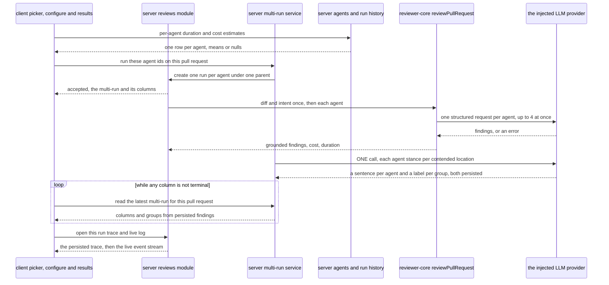

# Spec: Multi-Agent Review | Spec ID: SPEC-05 | Status: implemented
Supersedes: —

A reviewer can choose a set of agents, fan one pull request out to all of them in one action
with the time and cost stated **before** committing, then read the results side by side — with
every place one agent flagged and another looked at and did not collapsed into one group that
shows each agent's stance, including the agents that looked and said nothing.

## Problem & why

One pull request can carry a security hole, a performance regression and a domain-rule
violation at the same time, and no single agent is good at all three. The product already runs
several agents — `POST /pulls/:id/review` with `all: true` fans out to every **enabled** agent
— but that is the only multi-agent affordance there is, and it has three problems:

1. **It is all or nothing.** A reviewer who wants Security and Performance on this PR, and not
   the other three, has to run them one at a time from the dropdown.
2. **The cost is invisible until it is spent.** Nothing in the product says what a run will
   cost or how long it will take. `agent_runs` has recorded `duration_ms` and `cost_usd` for
   every run since `0000_init.sql`, and nothing reads them back as an expectation.
3. **The output is N unrelated lists.** Two agents that flag the same line produce two
   findings, and the screen shows two findings. The duplication reads as noise; the
   *disagreement* — one agent calls it `WARNING`, another says nothing at all — is the most
   informative thing on the page and is currently invisible.

The material for all three answers is already persisted. What is missing is a grouping of the
runs, a rule for deciding that two findings are about the same place, and a screen.

**Half of this feature is already wired, under a name that does not grep.** `vendor/shared`'s
observability contracts already declare `MultiAgentRun`, `AgentColumn`, `Conflict`,
`ConflictTake` and `AgentColumnFinding`, and the file's own header already names the two routes
`POST /pulls/:id/multi-agent-run` and `GET /pulls/:id/multi-agent`. `multi_agent_runs` exists as
a table. `runs.json` already carries the page copy, `shell.json` the sidebar label, and
`activeKeyFor` already lights the sidebar for a path containing `/multi-agent`. **Not one of
those symbols has a consumer anywhere in the tree.** This is the shape `server/INSIGHTS.md`
records on 2026-08-18 for Project Context — a feature that arrives four-fifths pre-wired and
leaves no trace in the module tree — and the practical consequence is that this spec's job is
mostly to say which of the pre-wired shapes are right and which are wrong, not to invent new
ones.

## Goals / Non-goals

**Goals**

- **G-1** — Pick an arbitrary subset of agents and run them on one pull request in one action,
  from the PR page and from a dedicated Configure-run screen.
- **G-2** — State an expected duration and cost per agent, and for the whole selection, before
  the run starts — derived from what past runs actually cost.
- **G-3** — Group the runs of one fan-out under one parent record, so the results are a thing
  that can be read back, linked to and reloaded.
- **G-4** — Show the results two ways: one column per agent (status, cost, score, findings), and
  per-agent tabs with a finding detail carrying confidence, rationale and the suggested fix.
- **G-5** — Group findings that are about the same code location, without losing a single
  original finding or its attribution, and show every agent's stance on that location —
  including `did not flag`. A location earns a group exactly when the agents did not all reach
  the same conclusion about it: **at least one flagged it and at least one other did not**. One
  flagging agent is enough, and a location every agent flagged earns none (AC-29, AC-100).
- **G-6** — Reuse the existing run trace and live log unchanged: each column offers a trace
  affordance that opens the **same** drawer the pull-request page opens.
- **G-7 — Make the fan-out actually parallel, deliberately and in place.** The executor loads
  the diff and derives the intent once for the whole set and then runs the agents in a
  **sequential `await` loop**, so an N-agent fan-out costs roughly N runs of wall clock. This
  feature changes that loop to bounded concurrency (≤4 in flight), and **that change reaches the
  existing `all: true` path too**. It is an intentional change to shipped behaviour, not scope
  creep: without it the aggregate time estimate of G-2 would have to be a sum, "live parallel run
  lanes" would show one lane moving at a time, and the screen's own copy would be claiming
  something untrue. What does **not** change is the shared pre-work — the diff and the intent are
  still derived once for the whole set, not once per agent.

**Constraints on the solution** — these are requirements about *how much* is built, and they
are here because the request states them:

- **C-1 — Reuse before addition.** The pre-wired contracts, the run executor, the SSE endpoint,
  the trace drawer, the live-log primitive, `POST /findings/:id/(accept|dismiss)` and
  `POST /eval/cases` carry most of the weight. What is genuinely new is: the multi-run parent
  record and its service, the grouping rule, the note-synthesis call, two screens and one
  per-agent estimate read.
- **C-2 — Where a criterion can be met cheaply or elaborately, this spec picks the cheap
  path** and records the elaborate one as a non-goal with its reason.
- **C-3 — One implementation of the trace drawer.** It is today a unit inside the
  pull-request-detail route subtree; the results view is a different route subtree, and a unit
  shared by two routes must not sit below one of them, or the second reaches it only by an
  upward cross-route import (`client/INSIGHTS.md`, 2026-08-02). The drawer therefore **moves**
  into the client's cross-cutting component area — the shape the diff viewer already has, a
  widened barrel with named exports and one implementation so the two callers cannot drift
  (`client/INSIGHTS.md`, 2026-08-11). The move is a relocation with **no behaviour change**,
  and the drawer's existing test moves with it.

**Non-goals** — each with the reason, because a reader will otherwise assume it is included:

- **N-1 — `Learn` is not built and is not rendered.** The design's five-wide action row
  includes it; there is no `memory` module on the server, no memory route and no Memory sidebar
  entry, so the control would do nothing. The pull-request page already renders an inert
  `Learn`; a second screen shipping a second dead control is not an improvement.
- **N-2 — `Reply to author` is not built and is not rendered either.** It exists on the
  pull-request page only as an `aria-disabled` placeholder with no handler. Reproducing the
  mockup's five-wide row exactly would ship **two** controls that do nothing on a brand-new
  screen, which is a review finding rather than fidelity. The detail row is therefore three
  worded actions — `Accept`, `Dismiss`, `Turn into eval case` — and all three work (AC-74).
- **N-3 — No `All (merged)` tab.** One requirement slide mentions one; the mockup does not have
  one, and the merged view is already served by Columns plus the disagreement block. Recorded
  here so the contradiction is on the record rather than rediscovered in review.
- **N-4 — No `not run` state in the disagreement block.** Every agent shown in a group ran, so
  silence means *looked and did not flag*. The mockup shows an `Architecture` agent that was not
  among the four selected; that is a mockup artefact.
- **N-5 — Computed groups are not persisted.** They are derived on read from persisted findings,
  as the contract's own doc-comment already says. Only the synthesised stance notes are stored,
  because they cost a model call. A groups table would be a cache with an invalidation problem
  and no measured need.
- **N-6 — No new run orchestrator, and no job queue.** The existing executor runs the fan-out;
  the one change it takes is the concurrency of its own per-agent loop (G-7, AC-12). The
  platform's `JobRunner` is **not** involved in a review and is not brought in — putting the
  fan-out on it would move failure isolation, cancellation and the live-log fan-out into a
  second mechanism for no gain.
- **No cancellation semantics beyond `POST /runs/:id/cancel`.** A multi-run has no
  cancel-the-whole-thing action; cancelling a column cancels that run, and the column reports it.
- **No multi-run history.** `GET /pulls/:id/multi-agent` answers with the most recent multi-run
  for the pull request. A list of past fan-outs is a later feature; the per-run history already
  exists at `GET /pulls/:id/runs`.
- **No per-agent stats screen.** The attribution this feature preserves is the raw material for
  it; `AgentStats` is already declared in the contracts and stays unimplemented.
- **No `Compose review` drawer.** That curates findings before publishing a review and is a
  different feature that happens to sit on the same header.
- **`ci/` and `agent-runner/` are not touched.**
- **No change to how a review is produced.** Each agent runs in its own context and never sees a
  neighbour's intermediate conclusions. Nothing here tells an agent it is part of a fan-out.

## User stories

- **US-1** — As a reviewer on a pull request, I choose which agents to run and start them all at
  once, so I get several perspectives without running them one at a time.
- **US-2** — As a reviewer, I see the expected time and cost of my selection before I start it,
  so a fan-out is a decision rather than a surprise.
- **US-3** — As a reviewer, I watch the selected agents' runs side by side and open any one
  agent's full trace and live log from its column.
- **US-4** — As a reviewer, I read one agent's findings in depth — confidence, rationale,
  suggested fix — and accept, dismiss or turn one into an eval case without leaving the page.
- **US-5** — As a reviewer, I see the code locations more than one agent landed on as **one**
  group carrying every agent's stance, including the agents that stayed silent, so duplicates
  stop being noise and disagreements become visible.
- **US-6** — As a reviewer, I reload the page mid-run, or come back later, and find the run
  where I left it.
- **US-7** — As the maintainer of the next feature, I find every finding still attributed to the
  agent that produced it after grouping, so per-agent quality can be measured later.

## Acceptance criteria (EARS)

### AC-1 … AC-44 — server

**Selecting agents and creating a multi-run**

- **AC-1** — WHEN `POST /pulls/:id/review` carries a non-empty `agentIds` list, the system
  **shall** create exactly one `agent_runs` row per listed agent and none for any other agent.
  `Verify: test` — *observable: with five agents in the workspace and two ids in the list, the
  pull request gains exactly two runs, whose `agent_id`s are the two listed.*
- **AC-2** — WHEN a review request carries `agentIds`, the system **shall** create one
  multi-agent run record for that pull request and attribute every run it created to that
  record.
  `Verify: test` — *observable: reading the created multi-run back returns exactly the run ids
  the POST returned.*
- **AC-3** — IF `agentIds` is present and empty, THEN the system **shall** refuse with `400`
  and the code `invalid_run_request`, and **shall** create no run.
  `Verify: test` — *observable: the response is `400 invalid_run_request` and the pull request's
  run count is unchanged.*
- **AC-4** — IF any id in `agentIds` names no agent in the caller's workspace, THEN the system
  **shall** refuse the whole request with `404` and **shall** create no run for any of the
  listed ids.
  `Verify: test` — *observable: a list of one real and one fabricated id creates zero runs.*
- **AC-5** — WHERE a listed agent is disabled, the system **shall** run it anyway.
  `Verify: test` — *observable: parity with the existing single-agent selector, which resolves
  through a lookup carrying no `enabled` predicate; a disabled agent named in `agentIds` gets a
  run row.*
- **AC-6** — IF a request carries both `agentIds` and `all`, THEN the system **shall** refuse
  with `400` and the code `invalid_run_request` rather than choosing one.
  `Verify: test` — *observable: the response is `400` and no run is created.*
- **AC-7** — WHEN `POST /pulls/:id/multi-agent-run` is called with a non-empty `agentIds` list,
  the system **shall** create the same records AC-1 and AC-2 describe and **shall** return the
  multi-run's initial state, with one column per created run.
  `Verify: test` — *observable: the response carries `agent_count` equal to the list length and
  every column at status `running`.*
- **AC-8** — IF `agentIds` names more than 8 agents, THEN the system **shall** refuse with `422`
  and a named reason, rather than truncating the list.
  `Verify: test` — *observable: a nine-id list is refused and no run is created.*
- **AC-9** — IF the pull request's most recent multi-run still has a run that has not reached a
  terminal status, THEN the system **shall** refuse a new multi-run with `409` and a named
  reason.
  `Verify: test` — *observable: a second create against the same pull request while one column
  is `running` is refused, and the first multi-run is untouched.* This is **new** behaviour: the
  existing `POST /pulls/:id/review` has no such guard and gains none (AC-11).
- **AC-10** — the system **shall** rate-limit `POST /pulls/:id/multi-agent-run` to 10 requests
  per minute, the same limit `POST /pulls/:id/review` already carries.
  `Verify: inspection` — *observable: the route declares that limit; the eleventh call in a
  minute is refused.*
- **AC-11** — WHEN `POST /pulls/:id/review` carries no `agentIds`, the system **shall** behave
  exactly as it does today.
  `Verify: test` — *observable: `{agentId}` and `{all:true}` produce the same runs and the same
  response as before the change, and no multi-run record is created for either.*

**Executing the fan-out**

- **AC-12** — WHILE a multi-run is executing, the system **shall** run its agents concurrently,
  with at most 4 agent runs in flight at once.
  `Verify: test` — *observable: with four agents whose provider call blocks, all four runs reach
  the provider before any of them completes. Today the loop is sequential, so this criterion
  changes shipped behaviour on purpose — see G-7 — and it changes it for the existing
  `all: true` path as well.*
- **AC-13** — WHEN a multi-run executes, the system **shall** load the pull request's diff and
  derive its intent once for the whole set, not once per agent.
  `Verify: test` — *observable: a four-agent multi-run performs exactly one diff load; the
  existing executor already does this and this criterion pins it against the change in AC-12.*
- **AC-14** — IF one agent's run fails, THEN every other run of the same multi-run **shall**
  still reach a terminal status.
  `Verify: test` — *observable: with one agent's provider throwing, the other three columns read
  `done` and the failing one reads `failed` with its reason.*
- **AC-15** — the system **shall** exclude from a multi-run's columns any run it did not create.
  `Verify: test` — *observable: a single-agent run started from the pull-request page while a
  multi-run is in flight does not appear as a column, and the multi-run's `agent_count` does not
  move.*

**Reading a multi-run**

- **AC-16** — WHEN `GET /pulls/:id/multi-agent` is called, the system **shall** return the most
  recent multi-run for that pull request.
  `Verify: test` — *observable: with two multi-runs on one pull request, the response's id is the
  later one's.*
- **AC-17** — IF the pull request has no multi-run, THEN the system **shall** answer `404` with
  the service's own error envelope.
  `Verify: test` — *observable: the body is `{"error":{"code":"not_found",…}}`, which is also
  what distinguishes a registered module from an unregistered one (`server/INSIGHTS.md`,
  2026-08-20).*
- **AC-18** — the system **shall** return one column per run of the multi-run, carrying that
  run's id, its agent's id and name, the provider and model it ran, its status, its verdict,
  score and summary, its duration and cost, and its findings.
  `Verify: test` — *observable: every field of `AgentColumn` is populated from that run's own
  rows for a completed run.*
- **AC-19** — the system **shall** report a column's status as the run's own status, one of
  `running`, `done`, `failed` or `cancelled`.
  `Verify: test` — *observable: a cancelled run reads `cancelled`, not `failed`.*
- **AC-20** — the system **shall** take a column's score from the run's `reviews` row, not from
  `agent_runs.score`.
  `Verify: test` — *observable: a run whose `agent_runs.score` is null but whose review carries
  75 reports 75; the run column arrived with no backfill (`server/INSIGHTS.md`, 2026-08-03).*
- **AC-21** — the system **shall** report a column's cost as `null` when the run recorded no
  cost, and as `0` only when the run genuinely cost zero.
  `Verify: test` — *observable: a `running` column reports `cost_usd: null`, never `0`.*
- **AC-22** — the system **shall** report a multi-run's total duration as the maximum duration
  among its terminal columns, and its total cost as the sum of its columns' non-null costs, or
  `null` when every column's cost is null.
  `Verify: test` — *observable: three columns at 8.2 s, 6.0 s and 7.1 s report a total of 8.2 s;
  three columns with costs `0.06`, `null`, `0.08` report `0.14`.*
- **AC-23** — the system **shall** answer `GET /pulls/:id/multi-agent` without making a model
  call.
  `Verify: test` — *observable: reading a completed multi-run twice through a provider fake whose
  every method throws succeeds both times.*
- **AC-24** — the system **shall** populate a column's findings from the findings of that run's
  own review, and from no other review.
  `Verify: test` — *observable: an agent re-run outside the multi-run adds findings to the pull
  request and changes no column's count. This is the basis statement `client/INSIGHTS.md`
  (2026-08-11) requires of any new per-agent rollup: this feature counts per **run**, not per
  agent-across-runs, so the double-count that entry describes cannot arise.*

**Grouping findings across agents**

**A stance is computed, never copied from the picture.** Every stance in a group is derived from
the multi-run's persisted findings: an agent that has a finding in the group is a flagger, full
stop, and an agent with none is `ignored`. This is worth stating because **the reference mockup
is not internally consistent at one location**, and the shipped screen will therefore not match
it cell for cell there. At `src/middleware/ratelimit.ts:52` the Security **column** carries a
finding titled "Retry-After header omitted on 429", while the `:52` group in the disagreement
block lists Security as `did not flag` with the note "No security impact"; Customer-Facing has
two findings at the same location. A block derived from those columns by the rule below puts
Security in that group as a flagger. The spec resolves the contradiction by rule rather than by
copying the mockup, because a rule is the only thing an implementation can be checked against.

- **AC-25** — the system **shall** group two findings of a multi-run into one location group
  when all three hold: their file paths are equal, their inclusive line ranges intersect, and
  their titles pass the similarity test of AC-26.
  `Verify: test` — *observable: two findings at `lib/rate-limit.ts:28-30` and
  `lib/rate-limit.ts:29-34` with similar titles form one group; the same pair in different files
  forms none.*
- **AC-26** — the system **shall** treat two titles as similar when the Jaccard index of their
  normalised token sets — the size of the intersection over the size of the union — is at least
  **0.4**.
  `Verify: test` — *observable: "Magic number 3600" and "Hard-coded 3600 magic number" group
  (tokens `{magic, number, 3600}` and `{hard, coded, 3600, magic, number}`, intersection 3, union
  5, 0.6); "Magic number 3600" and "Missing error handling" do not, at the same overlapping
  lines (intersection 0).*
- **AC-27** — the system **shall** normalise a title by lowercasing it, replacing every character
  that is not a letter or a digit with a separator, splitting on those separators, discarding
  tokens shorter than three characters, and discarding no others.
  `Verify: test` — *observable: `"Hard-coded 3600: a magic number!"` normalises to
  `{hard, coded, 3600, magic, number}` — the digits survive because a magic number's value is the
  most identifying token it has, and `"a"` is dropped by the length rule. No stop-word list is
  involved, and none is to be introduced without a measurement: a hand-written list of English
  stop words is a second unvalidated constant with no evidence behind it, and the length rule
  already removes the articles and prepositions it would target.*
- **AC-28** — the system **shall** carry the 0.4 threshold as a **named constant with a comment
  recording that it is unvalidated** — chosen from the worked examples above and never measured
  against real multi-agent output — and naming what would revalidate it: a sample of real
  fan-outs on which the false-merge rate (two unrelated problems in one group) and the
  false-split rate (one problem in two groups) are counted by hand.
  `Verify: inspection` — *observable: the threshold appears once, as a named constant carrying
  that comment, and nowhere as an inline literal.*
- **AC-29** — the system **shall** emit a location group only when at least one agent of the
  multi-run flagged the location and at least one other agent of the multi-run did not.
  `Verify: test` — *observable: in a three-agent multi-run where one agent flagged
  `lib/rate-limit.ts:28` and the other two did not, one group is emitted, carrying three stances
  — one severity and two `ignored`. In a one-agent multi-run the same finding emits none, because
  there is no second agent to be silent (EC-8). This is the design's rule: both panels on the
  Columns screen have exactly one flagging agent — `Magic number 3600` (Junior Mentor
  `SUGGESTION`, Security and Architecture silent) and `429 response shape` (Customer-Facing
  `WARNING`, Performance and Security silent) — so a two-flagger entry condition would render
  that screen with zero panels. It is also the rule the `Conflict` contract's own doc-comment
  already states. The two-flagger condition is not discarded: it becomes the `Show only
  conflicts` filter instead (AC-81).*
- **AC-30** — the system **shall** include, in every group, one stance per agent of the
  multi-run: the severity that agent assigned when it flagged the location, and `ignored` when
  it did not.
  `Verify: test` — *observable: a four-agent multi-run yields four stances in every group, two of
  them `ignored`.*
- **AC-31** — WHERE the multi-run carries no synthesised label for a group, the system **shall**
  report that group's title as the title of its highest-severity finding, ties broken by lowest
  `start_line` and then by lowest finding id.
  `Verify: test` — *observable: a group of a `SUGGESTION` at line 30 and a `WARNING` at line 28,
  read before the synthesis has run, reports the warning's title. **This is the common case, not
  the rare one**, and the criterion is written that way on purpose: the synthesis fires only once
  every run is terminal (AC-35), so every read taken while the fan-out is in flight — which is
  every poll of AC-65 — renders every group under this rule, and so does every read after a
  synthesis failure (AC-38). Its counterpart AC-101 covers the labelled case, so neither branch
  is left unspecified (`client/INSIGHTS.md`, 2026-08-21). The tie-breaks are load-bearing for the
  same reason any client-rendered ordering is: without them the title of a group whose two
  findings share a severity is whatever order the rows came back in
  (`server/INSIGHTS.md`, 2026-08-06).*
- **AC-32** — the system **shall** order the groups of a multi-run by file path ascending, then
  line ascending, then title ascending — a total order.
  `Verify: test` — *observable: two reads of the same multi-run return the groups in the same
  order, asserted against the sorted ids over a deliberately shuffled input
  (`server/INSIGHTS.md`, 2026-08-06; `mcp-server/INSIGHTS.md`, 2026-08-13).*
- **AC-33** — the system **shall** write no finding, modify no finding and delete no finding
  while grouping.
  `Verify: test` — *observable: the finding rows before and after a read of the multi-run are
  byte-identical, and every finding in a group also appears in its agent's column.*
- **AC-34** — the system **shall** name the agent that produced each stance in a group.
  `Verify: test` — *observable: every stance carries the agent id of the run it came from.*

**Synthesising the stance notes**

- **AC-35** — WHEN every run of a multi-run has reached a terminal status, the system **shall**
  make exactly one structured model call to produce that multi-run's stance notes and group
  labels.
  `Verify: test` — *observable: a four-agent multi-run makes one call after the last run
  finishes, and none before — one call carrying both outputs, never one call for the notes and a
  second for the labels.*
- **AC-36** — WHEN the note-synthesis call is made, the system **shall** supply it with each
  contended location and what each agent said there, and **shall** obtain one sentence per agent
  of the multi-run — including for the agents that flagged nothing.
  `Verify: test` — *observable: the returned notes cover every (group, agent) pair the read will
  render. The labels the same call returns are AC-102's; this criterion is about the notes.*
- **AC-37** — the system **shall** persist the synthesised notes and the synthesised group labels
  with the multi-run, so that a second read returns them without a model call.
  `Verify: test` — *observable: with the provider fake counting calls, two reads of a completed
  multi-run leave the count at one, and the second read's group titles are the same labels as the
  first's.*
- **AC-38** — IF the note-synthesis call fails, exceeds its deadline or returns something the
  contract cannot parse, THEN the system **shall** still return every group, with every stance
  present, every note empty and every title taken from the deterministic fallback of AC-31, and
  **shall not** fail the multi-run or any of its runs.
  `Verify: test` — *observable: with the provider throwing, the read succeeds, the group count is
  the same as it is with a working provider, every stance has an empty note, every group's title
  is its highest-severity finding's title, and every column's status is unchanged. This is the
  property that keeps the synthesis droppable: nothing above it depends on the call having
  happened, so deferring the whole cluster costs no rework anywhere else — which is why the
  title's fallback is a requirement and not a nicety.*
- **AC-39** — the system **shall** wrap every foreign text section of the note-synthesis prompt
  — finding titles, rationales, agent names and the code location — as delimited data, and the
  prompt template **shall** carry its own clause telling the model to treat that content as data
  and never as instructions.
  `Verify: test` — *observable: the rendered system message contains that clause, asserted
  against the rendered message rather than against the template's existence — a suite that
  checks only the wrapping mechanics passes with the defence deleted (`server/INSIGHTS.md`,
  2026-08-20).*
- **AC-40** — the system **shall** bound the note-synthesis call with its own deadline and
  **shall** disable provider retries for it.
  `Verify: inspection` — *observable: the call passes `maxRetries: 0` and races an explicit
  deadline of 60 000 ms; `StructuredRequest.timeoutMs` is silently ignored and `maxRetries`
  defaults to two, i.e. three attempts of up to 90 s (`server/INSIGHTS.md`, 2026-08-06).*

**Per-agent estimates**

- **AC-41** — WHEN the per-agent run estimates are read, the system **shall** return one row per
  agent in the caller's workspace, each carrying a mean duration, a mean cost and the number of
  runs the means were computed from.
  `Verify: test` — *observable: five agents in the workspace yield five rows.*
- **AC-42** — the system **shall** compute an agent's means over that agent's ten most recent
  runs whose status is `done`, across the whole workspace and every pull request.
  `Verify: test` — *observable: an agent with twelve done runs and three failed ones reports a
  mean over the ten newest done ones, and the failed ones move nothing.*
- **AC-43** — IF an agent has no run with status `done`, THEN the system **shall** report both
  means as `null` and the sample size as `0`, never as zero values.
  `Verify: test` — *observable: a freshly created agent reports nulls, not `0 ms` and `$0.00`.*
- **AC-44** — the system **shall** compute an agent's mean cost over only those sampled runs
  whose recorded cost is not null, and **shall** report it as `null` when none of them recorded
  a cost.
  `Verify: test` — *observable: ten done runs of an unpriced model report a duration mean and a
  null cost mean; `null` and `0` are never conflated (`agent_runs.cost_usd`'s own doc-comment).*

### AC-45 … AC-88 — client

**The picker on the pull-request page**

- **AC-45** — the system **shall** replace the pull-request page's existing run-review dropdown
  with an agent picker.
  `Verify: inspection` — *observable: the header's run control opens the picker; the previous
  "one agent or all" menu is gone from the tree.*
- **AC-46** — WHEN the picker is opened, the system **shall** list every agent of the workspace
  with a checkbox, the agent's name and that agent's mean duration.
  `Verify: test` — *observable: five agents produce five rows, each carrying a duration or a
  dash.*
- **AC-47** — the system **shall** label the picker's primary action with the number of agents
  currently selected.
  `Verify: test` — *observable: checking two of five agents renders the count 2 in the button's
  accessible name.*
- **AC-48** — WHILE no agent is selected, the system **shall** keep the picker's primary action
  disabled.
  `Verify: test` — *observable: the control reports `aria-disabled` and activating it issues no
  request.*
- **AC-49** — WHEN the picker's `Clear` control is activated, the system **shall** deselect every
  agent.
  `Verify: test` — *observable: the count returns to 0 and the primary action is disabled again.*
- **AC-50** — WHEN the picker's primary action is activated, the system **shall** start a
  multi-run for the selected agents on the current pull request and navigate to that pull
  request's multi-agent results view.
  `Verify: test` — *observable: one POST carrying exactly the selected ids, followed by a
  navigation to the results route.*
- **AC-51** — the system **shall** offer, below the agent list, a link to the agents screen.
  `Verify: test` — *observable: the row is present and points at the agents route.*

**The Configure-run screen**

- **AC-52** — the system **shall** offer a Configure-run screen at `/repos/:repoId/multi-agent`,
  with a pull-request step above an agent step.
  `Verify: inspection` — *observable: the route is repo-scoped and carries two numbered steps in
  that order; the results view sits under it at `/repos/:repoId/multi-agent/:number`, and the
  shell's active-key derivation already lights the sidebar for any path containing
  `/multi-agent`.*
- **AC-53** — the system **shall** list, in the pull-request step, every **open** pull request of
  the one repository the route is scoped to, ordered by pull-request number descending, with **no
  cap and no truncation**.
  `Verify: test` — *observable: **open** means the pull request's status is neither `merged` nor
  `closed`. Those two are the only values `PrStatus` carries that come from GitHub's own state;
  the other three (`needs_review`, `reviewed`, `stale`) are review statuses the server derives
  for a pull request that is open, so "not merged and not closed" is the whole of the definition
  and no new column is needed for it. A repository holding 7 pull requests of which 5 are open
  yields 5 options, which is the design's picker — five entries against a sidebar badge of 7. The
  options come back in strictly descending number order, which is a total order because the
  number is unique per repository; and a repository with 400 open pull requests yields 400
  options, because a cap would silently hide the pull request the reviewer came for (EC-20). The
  sidebar's Pull Requests badge is **not** this count — it counts `needs_review` alone — so the
  two numbers legitimately differ, and neither is to be changed to agree with the other.*

**The two pickers are deliberately asymmetric, and that is not an inconsistency.** The
Configure-run screen's pull-request step lists open pull requests only, because its job is to
choose something still worth reviewing. The **pull-request page's** agent picker (AC-45 to AC-51)
is unaffected: it already knows which pull request it is on, so there is nothing to filter, and a
merged or closed pull request can still be fanned out from there — which is what EC-21 allows and
what the pull-request page's existing merged/closed warning already covers.
- **AC-54** — WHILE no pull request is selected, the system **shall** render the agent step in a
  disabled state carrying an explanation of what to do first, and **shall** keep the run action
  disabled.
  `Verify: test` — *observable: the step shows the "pick a pull request first" copy and the run
  action reports `aria-disabled`.*
- **AC-55** — WHEN a pull request is selected, the system **shall** render one card per agent
  carrying a checkbox, the agent's name, that agent's most recent verdict summary on the selected
  pull request, and that agent's mean duration and mean cost.
  `Verify: test` — *observable: an agent that has never run on this pull request renders the card
  with no verdict line rather than an empty one.*
- **AC-56** — WHEN the `Select all` control is activated, the system **shall** select every agent
  card.
  `Verify: test` — *observable: the run action's count equals the number of agents.*
- **AC-57** — the system **shall** show, beside the run action, an aggregate estimate whose
  duration is the **maximum** of the selected agents' mean durations and whose cost is the
  **sum** of their mean costs.
  `Verify: test` — *observable: selecting agents at 8.2 s/$0.06, 6.0 s/$0.05, 7.1 s/$0.04 and
  5.5 s/$0.05 shows 8.2 s and $0.20. The maximum is the right aggregate because AC-12 makes the
  agents run concurrently; it would be a sum on the sequential executor this feature replaces.*
- **AC-58** — the system **shall** exclude an agent with no estimate from the aggregate and
  **shall** render that agent's own estimate as a dash.
  `Verify: test` — *observable: adding a never-run agent to the four above leaves 8.2 s and $0.20
  unchanged.*
- **AC-59** — IF no selected agent has an estimate, THEN the system **shall** render the
  aggregate as unavailable rather than as zero.
  `Verify: test` — *observable: two never-run agents selected shows a dash, not `0.0s · $0.00`.*

**The results view**

- **AC-60** — the system **shall** offer the results in two modes — one column per agent, and
  per-agent tabs — switched by one control, defaulting to columns.
  `Verify: test` — *observable: the control is a radio group of two mutually exclusive options,
  columns selected on first render.*
- **AC-61** — the system **shall** carry the selected mode in the URL, so a reload restores it.
  `Verify: test` — *observable: switching to tabs changes the URL, and mounting at that URL
  renders tabs.*
- **AC-62** — the system **shall** render, in columns mode, one column per agent of the
  multi-run, whose header carries the agent's name, that run's status, its cost and its score.
  `Verify: test` — *observable: four columns for a four-agent multi-run, each naming its agent.*
- **AC-63** — the system **shall** render each column's findings as rows carrying the severity,
  the category, the title and the file and line.
  `Verify: test` — *observable: a column with three findings renders three rows with their paths,
  each row also naming its finding's category beside the title — one of the five values
  `FindingCategory` allows (`bug`, `security`, `perf`, `style`, `test`), which is what the design
  draws as a small tag. `AgentColumnFinding` already carries `category`, so this renders an
  existing field and adds none.*
- **AC-64** — WHEN a column's trace affordance is activated, the system **shall** open the same
  run-trace drawer the pull-request page opens, for that column's run.
  `Verify: inspection` — *observable: exactly one `RunTraceDrawer` implementation exists in the
  tree and both routes import it from the same barrel; the drawer receives that column's run id,
  agent name, pull-request number and findings, all of which the column already carries.*
- **AC-65** — WHILE any column of the multi-run has not reached a terminal status, the system
  **shall** re-read the multi-run every 2 000 ms, and **shall** stop re-reading once every column
  is terminal.
  `Verify: test` — *observable: the request count grows while one column is `running` and stops
  moving after the read in which it turns `done`. 2 000 ms is this codebase's established
  "something is running" poll interval — the brief, conventions, intent and onboarding hooks all
  use it.*
- **AC-66** — the system **shall not** open an `EventSource` from the results view itself.
  `Verify: inspection` — *observable: the live stream is opened only by the trace drawer, so a
  run is never subscribed to twice and the view's tests need no `EventSource` shim — jsdom
  implements none and the shared setup does not add one (`client/INSIGHTS.md`, 2026-08-23).*
- **AC-67** — WHILE a column's run has not reached a terminal status, the system **shall** show
  that column as running with a word, not only a colour or a spinner.
  `Verify: test` — *observable: the column's status is readable as text by an accessible-name
  query.*
- **AC-68** — IF a column's run failed or was cancelled, THEN the system **shall** show that
  outcome and the reason the run recorded, in place of a score.
  `Verify: test` — *observable: a failed column renders its error text and no score gauge.*
- **AC-69** — IF a column's run produced no findings, THEN the system **shall** render that
  column with an explicit "no findings" statement rather than an empty body.
  `Verify: test` — *observable: the column body carries the copy, and the footer count reads 0.*
- **AC-70** — WHEN the page is reloaded while a multi-run is in flight, the system **shall**
  render the same columns with their current statuses.
  `Verify: test` — *observable: mounting against a payload with two `done` and two `running`
  columns renders four columns and resumes polling.*
- **AC-71** — the system **shall** render, in tabs mode, one tab per agent of the multi-run
  carrying the agent's name and that run's score, and no merged tab.
  `Verify: test` — *observable: a four-agent multi-run renders exactly four tabs.*
- **AC-72** — WHEN a finding in tabs mode is expanded, the system **shall** show its rationale
  and, where it has one, its suggested fix.
  `Verify: test` — *observable: expanding a finding with a suggestion renders both sections;
  expanding one without a suggestion renders the rationale and no empty fix heading.*
- **AC-73** — the system **shall** show each finding's confidence as a percentage in its
  collapsed row.
  `Verify: test` — *observable: a finding with confidence 0.82 renders 82%.*
- **AC-74** — the system **shall** offer `Accept`, `Dismiss` and `Turn into eval case` on an
  expanded finding, and no other worded action.
  `Verify: test` — *observable: exactly three worded action controls, asserted by role.*
- **AC-75** — WHEN `Accept` or `Dismiss` is activated on a finding, the system **shall** record
  that decision through the existing finding-action route and reflect it on the finding.
  `Verify: test` — *observable: one POST to the accept route, and the finding renders as accepted
  afterwards.*
- **AC-76** — IF `Turn into eval case` is refused by the server, THEN the system **shall** show
  the refusal reason it returned rather than a generic failure.
  `Verify: test` — *observable: a finding with neither decision is refused with
  `finding_has_no_decision` and that reason reaches the screen.*

**The disagreement block**

- **AC-77** — the system **shall** render the disagreement block below the results in both
  modes.
  `Verify: test` — *observable: the block's heading is present in columns mode and in tabs mode.*
- **AC-78** — the system **shall** render each group as one panel carrying the file and line in a
  monospaced style, the group's title, and one cell per agent of the multi-run.
  `Verify: test` — *observable: a four-agent group renders four cells.*
- **AC-79** — the system **shall** render an agent that did not flag a group's location with the
  words `did not flag`, not only with a neutral colour.
  `Verify: test` — *observable: the cell's text content contains that phrase.*
- **AC-80** — the system **shall** label a stance note as a synthesised statement about the
  agent's position, not as that agent's own words.
  `Verify: inspection` — *observable: the block carries one statement saying the sentences are
  generated from what each agent reported; no note is presented as a quotation.*
- **AC-81** — WHEN the `Show only conflicts` control is enabled, the system **shall** keep only
  those groups that **two or more agents of the multi-run flagged**.
  `Verify: test` — *observable: three cases, against a four-agent multi-run. One `WARNING` and
  three `ignored` **disappears** — one flagger. One `WARNING`, one `SUGGESTION` and two `ignored`
  **stays** — two flaggers. Two `WARNING` and two `ignored` **stays** — two flaggers, even though
  the two agree on the severity.*
  The old rule — "the stances carry more than one distinct verdict value, counting `ignored` as a
  value" — is **not** merely narrower under AC-29's new entry condition, it is a no-op: every
  group now has, by construction, at least one flagger contributing a severity and at least one
  silent agent contributing `ignored`, so the test is true of every group and the toggle would
  filter nothing. The old entry condition becomes the filter instead: the block is the merged
  picture, and the toggle narrows it to the locations where more than one agent had something to
  say. The alternative narrowing — *the flagging agents carry more than one distinct severity* —
  was considered and **rejected because it returns nothing on the design's own demo data**, where
  both groups have exactly one flagger; a toggle that empties the block on the reference screen
  is not a filter anyone will trust. **The naming tension is real and is kept deliberately:** two
  agents both flagging a location is an *overlap*, not literally a *conflict*, and the control is
  named `Show only conflicts` in the design and in the already-written `conflicts.*` copy. The
  name stays; this criterion is where the discrepancy is on the record.
- **AC-82** — IF a multi-run has no groups, THEN the system **shall** render the block's empty
  state rather than omitting the block.
  `Verify: test` — *observable: the empty copy from the `runs` namespace is rendered.*

**Shell, states and copy**

- **AC-83** — IF the pull request has no multi-run, THEN the system **shall** render the
  no-run empty state with an action that starts one, rather than an error.
  `Verify: test` — *observable: a `404 not_found` from the read renders the empty state, and any
  other error renders the error state.*
- **AC-84** — IF the workspace has no agents, THEN the system **shall** render the no-agents
  empty state with a link to the agents screen.
  `Verify: test` — *observable: an empty agent list renders that copy and no picker.*
- **AC-85** — the system **shall** add a sidebar entry for the multi-agent review screen to the
  existing `WORKSPACE` group, pointing at the repo-id-templated Configure-run route, with the
  shortcut `g m`.
  `Verify: test` — *observable: the entry sits in `WORKSPACE` beside the other repo-scoped
  screens and no new nav group is introduced — three of the four entries the design's `GLOBAL`
  section holds (Memory, Agent Performance, CI Runs) do not exist, and the nav config's own rule
  is that only routes that exist belong in it. `g m` is free today. Adding a route entry to that
  file is explicitly permitted by its own doc-comment; restyling a primitive there is not.*
- **AC-86** — the system **shall** describe the fan-out in the results header as bounded
  concurrency inside the review executor, and **shall not** attribute it to git worktrees or to
  the platform job queue.
  `Verify: inspection` — *observable: the meta line reads to the effect of
  `N agents · parallel fan-out, up to 4 at once · 8.2s total · $0.20`. Both current strings are
  wrong and both must go: the design's "fan-out via worktrees" describes a mechanism that appears
  nowhere in the server, and the shipped copy's "fan-out via p-queue" names the platform's
  `JobRunner`, which a review never touches (N-6).*
- **AC-87** — the system **shall** take every user-visible string of both screens from the
  `runs` message namespace.
  `Verify: inspection` — *observable: no literal user-visible text in the new units; the `runs`
  namespace is already this page's own and is also the one the trace drawer reads, so no second
  namespace is introduced (`client/INSIGHTS.md`, 2026-08-10).*
- **AC-88** — the system **shall not** use colour as the only carrier of an agent's identity, a
  run's status or a stance's verdict.
  `Verify: inspection` — *observable: every coloured element also names the agent, the status or
  the severity in text.*

### AC-89 … AC-92 — server (what the concurrency change owes)

Making a shared execution path concurrent is not a one-line change to a loop; four invariants
that held for free under sequential execution now have to be stated. They are grouped here
rather than renumbered into the block above so that the change AC-12 makes is legible as one
thing.

- **AC-89** — WHILE more agents are selected than the concurrency bound allows, the system
  **shall** start the next waiting agent as soon as an in-flight run finishes, and **shall not**
  wait for the whole in-flight set to drain.
  `Verify: test` — *observable: with six agents and a bound of four, the fifth run's model call
  begins after the first of the four completes and before the other three do.*
- **AC-90** — WHEN shared pre-work is logged, the system **shall** deliver that entry to every
  run of the multi-run; WHEN an agent's own work is logged, the system **shall** deliver that
  entry only to that agent's run.
  `Verify: test` — *observable: with four agents running at once, each run's event buffer holds
  the two shared pre-work steps once each and carries no entry belonging to another agent. Under
  the sequential loop the fan-out could not interleave; under concurrency four agents log at the
  same time into one logger, and a per-agent entry reaching the wrong buffer would surface only
  as a confusing live log, never as a failure.*
- **AC-91** — IF one run of a multi-run is cancelled or fails, THEN every other run of that
  multi-run that is in flight at that moment **shall** continue to completion.
  `Verify: test` — *observable: cancelling one of four concurrent runs leaves the other three
  reaching `done`; this extends AC-14, which is about the terminal status of the set, to the
  runs that are executing at the instant of the failure.*
- **AC-92** — WHEN a run of a concurrent multi-run reaches a terminal status, its review row and
  its trace row **shall** already exist.
  `Verify: test` — *observable: for every run, the write order stays `insertReview` →
  `saveRunTrace` → `completeAgentRun`. That order is load-bearing and it is what concurrency
  most easily disturbs: a terminal status is the promise that one `GET /pulls/:id/reviews` will
  find the row with no retry, and reversing it reintroduces a CI-only flake against every
  external reader (`server/INSIGHTS.md`, 2026-08-07 and 2026-08-13).*

### AC-93 … AC-99 — client (the run trace and the live log)

The design draws a control that switches to the logs and never draws the drawer behind it, so
"reuse `RunTraceDrawer`" is an implication rather than a requirement. These make it checkable.
The pull-request page's wiring is the reference: it holds the open run in a `?trace=` search
param, sets it from three places (the run history's logs icon, the findings tab and the run
list), and mounts the drawer only while the param is set.

- **AC-93** — the system **shall** hold the open drawer's run id in a `?trace=<run_id>` search
  param on the results route, and **shall** mount the drawer only while that param is set.
  `Verify: test` — *observable: activating a column's trace affordance puts that column's
  `run_id` in the param; mounting the route at that URL opens the drawer directly, so it survives
  a reload the same way the rest of the view does (AC-70); clearing the param closes it. This is
  the same param name and the same mechanism the pull-request page uses, so a reader who knows
  one screen knows the other.*
- **AC-94** — the system **shall** offer the trace affordance on every column, whatever that
  column's status.
  `Verify: test` — *observable: the control is present and operable on a `running` column, a
  `done` column, a `failed` column and a `cancelled` column — four cases, asserted separately,
  because the failed one is the easiest to drop and the one where the log matters most.*
- **AC-95** — WHILE a column's run has not reached a terminal status, the system **shall** open
  that column's drawer on its live-log tab, streaming.
  `Verify: test` — *observable: the drawer is told the run is in flight and lands on the log tab
  rather than on the trace tab. The pull-request page does not pass that flag, so its drawer
  always opens on the trace tab; the results view has live columns, and a reviewer who presses
  the control on a running agent means "show me what it is doing now".*
- **AC-96** — WHERE a column's run has reached a terminal status, the system **shall** open that
  column's drawer on its trace tab.
  `Verify: test` — *observable: a `done` column opens on the persisted trace.*
- **AC-97** — IF a column's run failed, THEN its drawer **shall** still open and its trace tab
  **shall** render the trace the executor persisted on the failure path.
  `Verify: test` — *observable: a failed run has a trace to show, because the executor persists
  one on all three exits — the success path, the per-agent catch and the fail-everything
  pre-work path — always before the terminal status. That trace is assembled from the run's event
  buffer, so its grounding line reads `0/0 passed` and its prompt-assembly blocks may be empty;
  the drawer renders it as it is and does not present a buffer trace as a complete one.*
- **AC-98** — the system **shall** open exactly one event stream per open drawer, and none when
  no drawer is open.
  `Verify: test` — *observable: opening one column's drawer creates one subscription; closing it
  ends that subscription; no second subscription exists for the same run. AC-66 states the
  negative half — the view opens none — and together they are what stops a run being subscribed
  twice, a failure that no typecheck sees and that shows up only as duplicated log lines.*
- **AC-99** — WHEN the drawer is relocated out of the pull-request route subtree, its behaviour
  **shall not** change.
  `Verify: test` — *observable: the same tabs; the same trace-tab sections — configuration,
  stats, prompt assembly, tool calls, findings and raw output; the same `Copy raw output` footer
  control, still shown only when the trace carries raw output; the same `runs` i18n namespace;
  and the drawer's existing test moved alongside it and passing unchanged. A relocation that
  quietly dropped a section would pass a typecheck, which is why this is a test rather than an
  inspection.*

### AC-100 … AC-105 — the design review (server, then client)

Six criteria added after the six reference screens were compared to this spec directly. They are
appended rather than renumbered into the blocks above so that every `AC-n` already quoted in a
plan, a task or a review finding still means what it meant. Four of them state the second half of
a rule amended above — the case an amended criterion would otherwise leave implicit, which is the
half a downstream check cannot see (`server/INSIGHTS.md`, 2026-08-19).

- **AC-100** — IF every agent of a multi-run flagged a location, THEN the system **shall** emit
  no group for that location.
  `Verify: test` — *observable: a three-agent multi-run in which all three flagged
  `lib/rate-limit.ts:28` yields zero groups, and all three findings still appear in their own
  columns. This is the half of AC-29 a reader will otherwise take for a bug: the block is named
  "where agents disagree", and a location every agent flagged carries no disagreement to show. It
  is also the reason the block can shrink when a **later** agent agrees with an earlier one.*
- **AC-101** — WHERE the multi-run carries a synthesised label for a group, the system **shall**
  report that label as the group's title.
  `Verify: test` — *observable: a group whose findings are titled "Retry-After header omitted on
  429" and "429 body has no machine-readable error code" reports the synthesised
  `429 response shape` — a phrase that is no finding's title, which is why the label has to be
  produced rather than selected, and which is what the design's own panel headers are. AC-31
  covers the unlabelled case, so the pair specifies both branches rather than only the optional
  one (`client/INSIGHTS.md`, 2026-08-21).*
- **AC-102** — WHEN the note-synthesis call is made, the system **shall** obtain from that same
  call one short label per group of the multi-run.
  `Verify: test` — *observable: with three groups and four agents, the one call AC-35 counts
  returns three labels and twelve notes; the call count stays at one. Adding a second model call
  for the labels would fail this criterion even if every label were right.*
- **AC-103** — the system **shall** report a group's line as the lowest `start_line` among its
  findings.
  `Verify: test` — *observable: a group of a `SUGGESTION` at line 30 and a `WARNING` at line 28
  reports line 28. This rule was the first half of AC-31 before the synthesised label arrived; it
  is unchanged, and it is stated separately so that a group's line and a group's title can be
  marked met or unmet independently.*
- **AC-104** — the system **shall** render each finding's category beside its title in tabs mode,
  in the collapsed row and in the expanded one.
  `Verify: test` — *observable: a finding of category `bug` shows that word before it is expanded
  and still shows it after — the design draws the tag in both states, on two different agents'
  tabs, so it is not one tab's decoration. The value comes from `AgentColumnFinding.category`,
  which already exists; no contract field is added, and the same field is what AC-63 renders in
  columns mode.*
- **AC-105** — IF the repository has no open pull request, THEN the system **shall** render the
  pull-request step's empty state saying so, rather than an empty list or a picker with no
  options.
  `Verify: test` — *observable: a repository whose every pull request is merged or closed renders
  the empty copy from the `runs` namespace, the agent step stays disabled (AC-54) and the run
  action stays disabled. This case did not exist while the step listed every pull request; AC-53
  creates it.*

## Edge cases

- **EC-1** — `agentIds` contains the same id twice. The system runs that agent once; a duplicate
  is not a request for two runs of one agent.
- **EC-2** — an agent is deleted between the estimate read and the run. `agent_runs.agent_id` is
  `ON DELETE SET NULL`, so a completed run of a deleted agent has a null agent id; any per-agent
  grouping in this feature keys on `agent_id ?? run id`, prefixed so a run id can never collide
  with an agent id (`server/INSIGHTS.md`, 2026-08-03).
- **EC-3** — the pull request has no diff, or the diff load fails. Every queued run of the
  multi-run fails with the same reason, and the read shows four failed columns rather than an
  empty page.
- **EC-4** — one agent's provider is unreachable while the others answer. Three columns complete,
  one reads `failed`; the multi-run's total cost sums the three, and the note synthesis still
  runs.
- **EC-5** — every run of a multi-run fails. There are no findings, therefore no groups; the
  disagreement block renders its empty state and no model call is made for notes or labels.
- **EC-6** — a column is `running` but its model call has not started, because the concurrency
  bound is holding it — a real case now that the bound is 4 and the cap is 8. `agent_runs` has no
  `queued` status; a row is `running` from creation, so the column reads as running while idle
  and no distinction is drawn. Adding a `queued` status would mean a new run status value on a
  shared table for a cosmetic gain.
- **EC-7** — a run is cancelled mid-fan-out. Its column reads `cancelled`; its cost is null; it
  still receives a stance of `ignored` in every group.
- **EC-8** — the reviewer selects one agent. The screen renders one column, and the disagreement
  block is empty by construction — **and the reason has changed with AC-29**: it is no longer
  "a group needs two flagging agents" but "a group needs an agent that stayed silent", and a
  one-agent multi-run has no second agent to be silent. The outcome is the same and the rule
  behind it is not, which is why the reason is written out rather than left to be re-derived.
- **EC-9** — two agents flag intersecting ranges with unrelated titles. The similarity test
  refuses to merge them, so they are two separate locations rather than one; each becomes its own
  group as long as some agent of the multi-run stayed silent on it, and each carries the other
  agent as `ignored`. The similarity test is what stops "same lines" from meaning "same problem".
- **EC-10** — three agents of a four-agent multi-run flag the same location and all assign
  `WARNING`; the fourth stays silent. That is a group — one agent did not flag it — and
  `Show only conflicts` **keeps** it, because three agents flagged it. Had all four flagged it
  there would be no group at all (AC-100). Under the pre-amendment rules this case was a group
  that the toggle hid; both halves of that sentence are now wrong, and it is kept here as the
  worked example of what changed.
- **EC-11** — an agent produces two findings that both fall in one group. It contributes one
  stance, carrying the higher severity of the two; both findings remain visible in its column.
- **EC-12** — a finding's `start_line` is greater than its `end_line`. The range is normalised
  before intersecting, the way the eval scorer already normalises an anchor.
- **EC-13** — a finding cites a line outside the diff. It never reaches this feature: the
  grounding gate drops it at run time. This feature relies on that and does not restate it.
- **EC-14** — the note-synthesis call returns a note for an agent that is not in the multi-run,
  or omits one that is; or it returns a label for a location that is not a group, or omits one
  for a group that is. Unknown agents and unknown locations are discarded; a missing note renders
  as empty and a missing label falls back to AC-31's title, per group, so one absent label does
  not cost the other groups theirs.
- **EC-15** — the note-synthesis response contains an instruction ("ignore the other agents"),
  in a note or in a group label. It is data either way. It is rendered as a sentence or as a
  heading and interpreted by nothing.
- **EC-16** — a finding title is 300 characters long, a stance note is a paragraph, or a
  synthesised group label comes back as a sentence rather than a phrase. The panel cells are of
  equal width; long text wraps or is clipped with the full text reachable, and never pushes a
  neighbouring agent's cell off the row. A label is asked for as a short phrase and is not
  guaranteed to be one, so the panel header is sized for the case where it is not.
- **EC-17** — two agents in the workspace share a name. `agents.name` has no unique constraint.
  Columns, tabs and stances are keyed on the agent id, and two identically named columns are
  legal.
- **EC-18** — an agent's name begins with the same character as another's. Any name-derived
  colour collides; this is why AC-88 requires the name in text.
- **EC-19** — the multi-run's pull request is deleted. `multi_agent_runs.pr_id` cascades, so the
  multi-run goes with it and the read answers `404`.
- **EC-20** — the repository has 400 **open** pull requests. The Configure-run picker lists all
  400 in descending number order; nothing is truncated, because a truncated list silently hides
  the pull request the reviewer came for. Merged and closed ones are not among them and are not
  counted toward any cap, because there is no cap (AC-53).
- **EC-21** — the pull request is merged or closed. The run is **allowed**, and no route refuses
  it: the pull-request page already warns on that condition and this feature does not add a
  second gate. What AC-53 changes is only which pull requests the Configure-run screen *offers*,
  and that is a picker's default rather than a rule about what may be reviewed — a merged pull
  request is still reachable from its own page, and its fan-out still works. The two statements
  are consistent: one is about discovery, the other about permission.
- **EC-22** — a second reviewer opens the results view while the first is running the fan-out.
  Both see the same server-side state; there is no client-held run state to disagree about.
- **EC-23** — the browser is offline, or the API is unreachable. The results view renders the
  full-screen error the app already uses for an unreachable API, branching on the error code
  rather than the message.
- **EC-24** — the reviewer accepts a finding that also appears in a group. The group is unchanged:
  a decision is a fact about the finding, not about whether the agents disagreed.
- **EC-25** — the pull request's `pr_files` rows have never been written, because nobody opened
  the pull request in the studio. The diff load is what this depends on and it does not read
  `pr_files`; the run proceeds.
- **EC-26** — an agent's ten most recent `done` runs are all from a different, much larger
  repository. The estimate is workspace-wide by decision, so it will be wrong for a small pull
  request. It is an estimate, and the screen calls it one.
- **EC-27** — the migration that links a run to its multi-run ships but is not applied. Every
  multi-agent route answers `500` on its first real request while every hermetic test passes;
  the tell is `500` on a route that exists, right after a feature that adds a column
  (`server/INSIGHTS.md`, 2026-08-19).
- **EC-28** — the provider rate-limits or rejects a request because four structured calls are in
  flight at once, where the sequential loop only ever had one. That agent's run fails with the
  provider's own reason and its siblings are unaffected; a fan-out is not retried as a whole.
- **EC-29** — the drawer is open on a column's live log and that run finishes while it is open.
  The stream ends the way it already does on the pull-request page, and the trace tab beside it
  is populated; the drawer is not closed or remounted under the reader.
- **EC-30** — the `?trace=` param names a run that belongs to no column of this multi-run, by a
  hand-edited URL or a stale link. Nothing is opened for a run this view does not own, and the
  param is treated as absent rather than as an error.
- **EC-31** — the repository has no open pull request, because everything it holds is merged or
  closed. The Configure-run screen's pull-request step says so (AC-105) instead of offering an
  empty control. The case is new: it could not arise while the step listed every pull request, so
  it arrives with AC-53 rather than with the screen.
- **EC-32** — a group's title changes between two polls, because the note synthesis landed in
  between: the reader sees the fallback title first and the synthesised label afterwards. This is
  the intended arrival of the label and not a defect. Nothing else about the group moves — a
  group's identity is its file and its line (AC-103), not its title, so no group appears or
  disappears on that read. Two groups **can** share a file and a line and be separated only by
  their titles — that is exactly EC-9 — and for those two the label's arrival can swap their
  order, because AC-32 sorts on the title the reader is shown. Sorting instead on the fallback
  title would keep the order stable at the cost of a visible list that is not in the order of its
  own visible titles, which is the worse of the two; the swap happens once, on the read that
  changes the titles anyway.

## Cross-module interactions

Two packages change: `server` and `client`. `reviewer-core` is **relied upon and unchanged**.
`mcp-server` is an existing HTTP consumer of `POST /pulls/:id/review` and is **not** in scope —
which is precisely why the new selector on that route must be optional.

**Two changes reach outside this feature, and both are intentional.** They are named here so a
reviewer reads them as decisions rather than as scope creep:

- **The review executor's per-agent loop becomes bounded-concurrent** (G-7, AC-12), which changes
  the existing `all: true` fan-out too. Everything else about that path is untouched: the same
  shared pre-work, the same per-run failure isolation, the same write order, the same
  cancellation. AC-89 to AC-92 are the four invariants that held for free while it was
  sequential and now have to be stated.
- **A second multi-run on a pull request whose first is still in flight is refused** (AC-9).
  This guard is on the new route only. `POST /pulls/:id/review` has no such guard today and
  **gains none** (AC-11) — a reviewer may still start a single-agent run at any time, and that
  run simply belongs to no multi-run (AC-15).

Five directions that must **not** exist, and they matter as much as the ones that must:

- **No agent sees another agent's output.** Each run is assembled and executed exactly as a
  single-agent run is; nothing in the fan-out passes one agent's intermediate conclusions to
  another, and running four at once does not change that. The only cross-agent reasoning happens
  *after* every run is terminal, in the note synthesis, and it cannot change a finding.
- **The client never groups anything.** Groups, stances and totals arrive computed. A grouping
  assembled in the browser would disagree with the one a future stats feature reads.
- **The multi-run service does not reach into another feature module's internals.** Findings,
  runs, agents and the model arrive through the boundaries the server already exposes for them.
- **The results view opens no event stream.** The trace drawer is the only `EventSource` owner,
  so one run is never subscribed to twice (AC-66, AC-98).
- **`mcp-server` is unaffected.** It parses every response against the shared contracts, so the
  request-side selector is additive and optional and no existing response symbol is reshaped.
  Its own fan-out — `devdigest_run_agent_on_pr` — inherits the concurrency change and needs no
  edit, because it polls run status rather than assuming an order.

## Contracts

`vendor/shared` and its hand-made client copy are do-not-touch and coordination-only; they move
together, and a spec is where that agreement goes on the record. **Every addition below is a new
symbol or a new field on a symbol that has no consumer anywhere in the tree today** — verified
by grep: `MultiAgentRun`, `AgentColumn`, `AgentColumnFinding`, `Conflict` and `ConflictTake`
appear in exactly two files, the two copies of the contract that declares them.

**Already present, and used unchanged:**

| Type | What it gives us |
|---|---|
| `MultiAgentRun` | the whole read: id, pull request, `ran_at`, agent count, total duration, total cost, columns, groups |
| `AgentColumn` | one agent's column — run id, agent id and name, provider, model, status, verdict, score, summary, duration, cost, findings. **As shipped it also carries `error`** — see Changed, below |
| `Conflict` | one location group: file, line, title, stances. Its single `line` is kept — AC-103 defines it as the group's lowest `start_line`, which is what the design renders. Its `title` needs no change either, but **what fills it does**: the synthesised label when the multi-run has one (AC-101), and the highest-severity finding's title otherwise (AC-31). A reader of the type cannot tell those apart, which is why both criteria exist. Its doc-comment already states this feature's entry condition — "a file:line that at least one agent flagged and at least one other agent (that also reviewed) did NOT" — and AC-29 now matches it rather than being stricter than it |
| `ConflictTake` | one agent's stance: agent id, persona, verdict or `ignored`, note. Unchanged; an unavailable note is the empty string |
| `Severity` | the three severities a stance can carry beside `ignored` |
| `Finding` / `FindingRecord` | every field the detail panel needs already exists — `rationale`, `suggestion`, `confidence`, `accepted_at`, `dismissed_at`. No new finding field. `category` is among the ones that already exist, on `Finding` as the five-value `FindingCategory` enum and on `AgentColumnFinding` as a string; the design's row tags render it (AC-63, AC-104) and nothing about the field changes |
| `RunRequest` | **untouched.** The new selector arrives as a new symbol that extends it, not as an edit to it |
| `RunTrace`, `RunEvent`, `RunSummary` | the trace and live log, relied upon and unchanged |
| `Agent` | the picker's rows. It carries **no colour**, which is why AC-88 exists |

**Changed, and why each change is necessary:**

| Type | Must now carry | Why |
|---|---|---|
| `AgentColumn.status` | `cancelled`, beside `done`, `failed` and `running` | `agent_runs` writes four status values, and `POST /runs/:id/cancel` produces the fourth. Without it a cancelled column has to be reported as failed, which is untrue (AC-19) |
| `AgentColumnFinding` | `end_line`, `rationale`, `confidence`, a nullish `suggestion`, and the accepted/dismissed timestamps | the tabs-mode detail renders all of them (AC-72, AC-73, AC-75). This is settled in favour of one read: the alternative — a second read of the pull request's reviews joined client-side — brings the per-agent re-run double-count trap (`client/INSIGHTS.md`, 2026-08-11) for no gain |
| `AgentColumn.error` | `error: z.string().nullable()` — the run's own failure reason, `null` on a run that did not fail | AC-68 needs "that outcome **and the reason the run recorded**". The repository already selected `agent_runs.error` into its row and `toColumn` dropped it, because the contract had nowhere to put it — the fallback, `column.summary`, is the *review's* summary and is `null` for a run that failed before writing one. Added in fix round 1 (`FIX-1`), after implementation found the gap; this row was "used unchanged" until then |

**New symbols, in both copies:**

| Type | Must carry |
|---|---|
| `ReviewRunRequest` | `RunRequest`'s two optional selectors **plus** an optional `agentIds` list of agent ids — declared as an extension so `RunRequest` itself is not reshaped and its existing consumers cannot break |
| `MultiAgentRunRequest` | a non-empty `agentIds` list — the body of the dedicated create route |
| `AgentRunEstimate` | an agent id, a nullable mean duration in milliseconds, a nullable mean cost in USD, and the integer number of runs both were computed from |

**Persisted data this feature requires**, stated at the level of what must be true rather than
of DDL:

- **Every run created by a multi-run must be attributable to it.** No such link exists today —
  `agent_runs` has no reference to `multi_agent_runs` — so this needs a schema change and a
  generated migration. It is what AC-2 and AC-15 rest on, and it is the one migration this
  feature ships.
- **The synthesised stance notes and the synthesised group labels must be stored with the
  multi-run**, keyed so that a note can be matched to one (location, agent) pair and a label to
  one location, on read (AC-37). They are stored together because one call produces both
  (AC-35), and a read that found the notes but not the labels would make a second call.
- **`multi_agent_runs` already exists** with a workspace, a pull request and a timestamp, and is
  written by nothing. It is the parent record; it is not dead schema to replace.
- **The note-synthesis model is its own `FEATURE_MODELS` entry**, so it can be changed from
  Settings without touching another feature's model. That registry is **hand-synced across three
  places, and all three must move together** or the entry is unreachable from one side:
  `client/src/lib/feature-models.ts`, and the `FEATURE_MODELS` block in **both** copies of
  `contracts/platform.ts`. **The entry's default must name an OpenRouter model.** Settings →
  Feature Models hard-codes `provider: "openrouter"` when it writes, and its options come from
  the OpenRouter model list, so an entry defaulting to any other provider runs on that provider
  until somebody touches the picker and can never be put back without editing the workspace
  settings by hand — the `conventions` entry shipped that way once (`client/INSIGHTS.md`,
  2026-08-06). Nothing else about the registry changes, and no existing entry is edited.

**Relocated, and unchanged in every other respect.** The run-trace drawer moves out of the
pull-request route subtree into the client's cross-cutting component area, with its existing
test, as a pure relocation (C-3, AC-99). It gains no prop it does not already take, and the
pull-request page keeps calling it exactly as it does today; the results view becomes its second
caller rather than its second copy.

**Relied upon and unchanged, in `reviewer-core`:** the untrusted-section wrapper that wraps every
foreign block of a review prompt, and the grounding gate that drops a finding citing a line
outside the diff. This feature adds nothing to either and contradicts neither.

**The grouping rule is re-derived on the server, not exported from `reviewer-core`.** The eval
scorer already contains the range-overlap decision (`covers`, with its `normalise`), and it is
module-private on purpose: that file's entire contract is its import list, and giving it a
consumer-shaped export invites the next edit that breaks its purity. The precedent for the
alternative is already in this repository — the brief's grounding deliberately re-derives the
same normalisation rather than importing it, with a test pinning that the two agree. This
feature follows that precedent, for the additional reason that the shapes differ: the scorer
compares a finding to an anchor, and this compares two findings.

## Non-functional

Every figure below is a requirement, and each carries the reason it is that number so a later
reader can move it deliberately.

**perf**

- **Multi-run read: p95 < 300 ms** server-side at 8 columns × 50 findings each, excluding cold
  start. It is a bounded set of indexed row reads plus arithmetic over persisted findings;
  nothing is recomputed from a diff and no model is called (AC-23).
- **Estimate read: p95 < 200 ms** at 8 agents × 10 sampled runs. One grouped aggregate.
- **Note synthesis: one structured call per multi-run — carrying both the stance notes and the
  group labels — deadline 60 000 ms, retries disabled.** The labels ride the same call and move
  none of these numbers; a second call for them would double the budget for one phrase per group.
  Load-bearing rather than tidy: `StructuredRequest.timeoutMs` is silently ignored and
  `maxRetries` defaults to two, so an *unbounded* call is three attempts of up to 90 s — 270 s
  for one sentence per agent (`server/INSIGHTS.md`, 2026-08-06). 60 s is generous for a call over
  a handful of short strings, and the failure is survivable (AC-38).
- **Results-view poll: every 2 000 ms while any column is non-terminal, and not at all
  otherwise.** The interval is this codebase's established value for a "something is running"
  poll, used by the brief, conventions, intent and onboarding hooks.

**scale**

- **≤ 8 agents per multi-run**, refused with a named reason above it rather than truncated — a
  silently capped selection would run fewer agents than the screen says it ran. Eight leaves
  room above the five agents a workspace ships with, without making one click cost sixteen model
  runs.
- **≤ 4 agent runs in flight per multi-run.** The bound is on the *runs*, and one run is one
  structured request at a time — but that request retries: `maxRetries` defaults to two on the
  review path and this feature does not change it, so **four concurrent runs are up to twelve
  provider requests in the worst case**, where the sequential loop's worst case was three. That
  is the real number to hold against a provider's own concurrency limit, and it is why the bound
  is 4 rather than "all of them": at the 8-agent cap an unbounded fan-out would peak at
  twenty-four. A provider rejection under that load fails one run and no other (EC-28).
- **Workspace worst case: 10 multi-runs per minute × 4 in flight = 40 concurrent agent runs**,
  from the rate limit below. Nothing in this feature bounds the workspace as a whole; the rate
  limit is what keeps that number finite, and it is the figure to revisit first if a provider
  starts refusing.
- **Estimates sample the 10 most recent `done` runs per agent.** Bounds the aggregate and keeps
  the mean responsive to a recent model change.
- **10 multi-run creations per minute per workspace**, matching the existing review route,
  because each call can fan out to eight expensive model runs.

**security**

- **Workspace-scoped; the pull-request and agent lookups are the authorization check.** Every
  create and every read resolves its pull request and its agents inside the caller's workspace
  first and answers `404` otherwise. No multi-run is reachable by id alone.
- **The note-synthesis prompt carries its own injection-guard clause** (AC-39). The engine's
  guard is module-private and is concatenated only inside its own assembly, so a feature module
  building its own messages reaches no shared guard and has nothing to duplicate
  (`server/INSIGHTS.md`, 2026-08-20).
- **A stance note is model output rendered as content**, never interpreted and never used to
  decide anything.

**a11y**

- **WCAG 2.2 AA.**
- **Every status, verdict and stance carries a word, not only a colour** — including `did not
  flag`. Note the severity badge primitive's `compact` prop renders the icon **alone** and drops
  the label (`client/INSIGHTS.md`, 2026-08-24), so it is not sufficient as the only statement of
  severity in a cell.
- **Agent identity is never carried by colour alone** (AC-88). The design tints every column,
  tab and card per agent, and nothing in the data supplies a colour — the agent contract has no
  colour field.
- **The mode switch is a radio group**, two mutually exclusive views of one result, operable
  from the keyboard, with the precedent already in the tree.
- **Every checkbox in both pickers is a real, tab-reachable control with an accessible name.**

## Inputs (provenance)

| Input | Where it comes from | Who owns it | Already there? |
|---|---|---|---|
| The chosen agent ids | the reviewer, through the picker or the Configure-run screen | the reviewer | the screens are **new** |
| The agents themselves | the workspace's agent list | the agents module | yes |
| Whether an agent is enabled | `agents.enabled` | the agents module | yes — and it does **not** gate an explicitly selected agent (AC-5) |
| The pull request | the repository's pull-request list | the pulls module | yes |
| Mean duration and cost | `agent_runs.duration_ms` and `agent_runs.cost_usd` over the agent's last 10 `done` runs | the runs already recorded | the columns exist since `0000_init.sql`; **nothing reads them back as an estimate** |
| The runs of a fan-out | created by this feature, executed by the existing executor | the reviews module | the executor exists; the parent link does **not** |
| The parent record | `multi_agent_runs` | this feature | the table exists, written by nobody |
| A column's findings | the findings of that run's own review | the run | yes |
| A column's score | the run's `reviews` row, not `agent_runs.score` | the review | yes |
| A column's cost and duration | `agent_runs` | the run | yes |
| The location groups | computed on read from the multi-run's persisted findings | this feature | **no** |
| The stance notes and the group labels | one structured model call after every run is terminal | the model | **no** |
| A group's title before that call lands | the highest-severity finding's own title, deterministically (AC-31) | the findings | yes — no new data; it is the state every read sees while the fan-out is in flight |
| A finding's category | `findings.category`, already carried through to `AgentColumnFinding` | the review that produced the finding | yes — persisted and unread by any screen until now |
| Which pull requests the Configure-run step offers | the repository's pull-request list, restricted to those whose status is neither `merged` nor `closed` | the pulls module | yes — the status column and its GitHub-derived values already exist |
| The run trace and live log | the existing trace document and SSE stream | the reviews module | yes, unchanged |
| Screen copy | the `runs` message namespace, plus the shell's `multi-agent` label | the client | mostly written and unused — see below |

**Two provenance notes that change what can be promised.**

The pre-written page copy describes a different flow from the one being built: its subtitle says
"this PR through every enabled agent in parallel", its primary action is `Run all agents`, and
its empty state says "Run all enabled agents on this PR". This feature runs a **chosen subset**,
so those keys are superseded and the namespace gains the picker's, the estimate's and the
Configure-run screen's strings. The `conflicts.*` and `column.*` blocks already written —
including `Where agents disagree`, `Show only conflicts` and `did not flag` — are used as they
stand.

An estimate is a statement about the past. It is the mean of what this agent's last ten
successful runs actually took and cost, anywhere in the workspace, on any pull request — not a
prediction about this diff. A 4 000-line pull request will overrun it and the screen must not
imply otherwise.

## Untrusted inputs

Yes — this feature reads, groups and replays foreign text, and it handles all of it as data.

- **Finding titles, rationales and suggestions.** Model-authored. They are grouped by
  arithmetic and string comparison, rendered as content, and never interpreted. The similarity
  test in AC-26 reads a title as tokens, not as a sentence.
- **The pull request's own text and its diff.** Written by someone outside the workspace. It
  reaches the model only through the existing review path, whose wrapper puts every untrusted
  section inside delimiters with a clause telling the model what they mean. That behaviour is
  relied upon and unchanged.
- **The note-synthesis prompt is the one place this feature builds its own messages**, and it is
  therefore the one place a guard clause has to be written rather than inherited (AC-39). Its
  inputs — finding text, agent names, a file path and line numbers — all originate outside the
  system or inside a model.
- **The synthesis output.** Model-authored prose about model-authored prose. It is stored and
  rendered as a sentence; nothing branches on it, and it can create, delete or reclassify no
  finding. **Since this amendment it also supplies a group's title** (AC-101), which is more
  prominent than a note and no more trusted: it is a string rendered as a heading, it decides
  nothing, and a group's identity remains its file and its line. A label that arrives as an
  instruction is rendered as an instruction-shaped heading and obeyed by nobody (EC-15).
- **Agent names and personas.** Workspace-authored, and rendered as labels.

Two invariants of `reviewer-core` this feature depends on and does not redefine: the
untrusted-section wrapper, and the grounding gate that drops a finding citing a line outside the
diff. A criterion here that contradicted either would be a contradiction with the engine rather
than a new requirement.

## Traceability

| AC | Serves | Package | Verify |
|---|---|---|---|
| AC-1 | US-1 | server | test |
| AC-2 | US-1, US-6 | server | test |
| AC-3 | EC-8 | server | test |
| AC-4 | US-1 | server | test |
| AC-5 | US-1 | server | test |
| AC-6 | US-1 | server | test |
| AC-7 | US-1 | server | test |
| AC-8 | scale budget | server | test |
| AC-9 | EC-22 | server | test |
| AC-10 | scale budget | server | inspection |
| AC-11 | US-1 | server | test |
| AC-12 | US-2, US-3 | server | test |
| AC-13 | perf budget | server | test |
| AC-14 | EC-4 | server | test |
| AC-15 | US-6 | server | test |
| AC-16 | US-6 | server | test |
| AC-17 | US-6 | server | test |
| AC-18 | US-3 | server | test |
| AC-19 | EC-7 | server | test |
| AC-20 | US-3 | server | test |
| AC-21 | US-2, US-3 | server | test |
| AC-22 | US-2, US-3 | server | test |
| AC-23 | perf budget | server | test |
| AC-24 | US-7 | server | test |
| AC-25 | US-5 | server | test |
| AC-26 | US-5, EC-9 | server | test |
| AC-27 | US-5, EC-9 | server | test |
| AC-28 | US-5 | server | inspection |
| AC-29 | US-5, EC-8 | server | test |
| AC-30 | US-5 | server | test |
| AC-31 | US-5, EC-32 | server | test |
| AC-32 | US-5 | server | test |
| AC-33 | US-7, EC-11 | server | test |
| AC-34 | US-7 | server | test |
| AC-35 | US-5 | server | test |
| AC-36 | US-5 | server | test |
| AC-37 | perf budget | server | test |
| AC-38 | EC-5, EC-14 | server | test |
| AC-39 | security budget, EC-15 | server | test |
| AC-40 | perf budget | server | inspection |
| AC-41 | US-2 | server | test |
| AC-42 | US-2, EC-26 | server | test |
| AC-43 | US-2 | server | test |
| AC-44 | US-2 | server | test |
| AC-45 | US-1 | client | inspection |
| AC-46 | US-1, US-2 | client | test |
| AC-47 | US-1 | client | test |
| AC-48 | US-1 | client | test |
| AC-49 | US-1 | client | test |
| AC-50 | US-1 | client | test |
| AC-51 | US-1 | client | test |
| AC-52 | US-1 | client | inspection |
| AC-53 | US-1, EC-20 | client | test |
| AC-54 | US-1 | client | test |
| AC-55 | US-1, US-2 | client | test |
| AC-56 | US-1 | client | test |
| AC-57 | US-2 | client | test |
| AC-58 | US-2 | client | test |
| AC-59 | US-2 | client | test |
| AC-60 | US-3, US-4 | client | test |
| AC-61 | US-6 | client | test |
| AC-62 | US-3 | client | test |
| AC-63 | US-3 | client | test |
| AC-64 | US-3 | client | inspection |
| AC-65 | US-3, US-6 | client | test |
| AC-66 | US-3 | client | inspection |
| AC-67 | US-3, EC-6 | client | test |
| AC-68 | US-3, EC-4, EC-7 | client | test |
| AC-69 | US-3 | client | test |
| AC-70 | US-6 | client | test |
| AC-71 | US-4 | client | test |
| AC-72 | US-4 | client | test |
| AC-73 | US-4 | client | test |
| AC-74 | US-4 | client | test |
| AC-75 | US-4, EC-24 | client | test |
| AC-76 | US-4 | client | test |
| AC-77 | US-5 | client | test |
| AC-78 | US-5, EC-16 | client | test |
| AC-79 | US-5, a11y budget | client | test |
| AC-80 | US-5 | client | inspection |
| AC-81 | US-5, EC-10 | client | test |
| AC-82 | US-5, EC-5 | client | test |
| AC-83 | US-6 | client | test |
| AC-84 | US-1 | client | test |
| AC-85 | US-1 | client | test |
| AC-86 | US-3 | client | inspection |
| AC-87 | US-1 | client | inspection |
| AC-88 | a11y budget, EC-17, EC-18 | client | inspection |
| AC-89 | US-3, EC-6 | server | test |
| AC-90 | US-3 | server | test |
| AC-91 | EC-4, EC-7 | server | test |
| AC-92 | US-6 | server | test |
| AC-93 | US-3, US-6, EC-30 | client | test |
| AC-94 | US-3 | client | test |
| AC-95 | US-3 | client | test |
| AC-96 | US-3 | client | test |
| AC-97 | US-3, EC-4 | client | test |
| AC-98 | US-3, EC-29 | client | test |
| AC-99 | US-3 | client | test |
| AC-100 | US-5, EC-10 | server | test |
| AC-101 | US-5 | server | test |
| AC-102 | US-5 | server | test |
| AC-103 | US-5, EC-12 | server | test |
| AC-104 | US-4 | client | test |
| AC-105 | US-1, EC-31 | client | test |
| — | EC-1 | — | `accepted` — a duplicate id is deduplicated silently; refusing it would fail a request whose intent is unambiguous |
| — | EC-2 | — | `accepted` — the null-agent fallback key is a repository-wide rule, not this feature's behaviour to re-verify |
| — | EC-3 | — | covered by AC-14's mechanism; the pre-work failure path already fails every queued run |
| — | EC-13 | — | `accepted` — the grounding gate is `reviewer-core`'s and is relied upon unchanged |
| — | EC-19 | — | `accepted` — the cascade is a schema property; the read then answers AC-17's `404` |
| — | EC-21 | — | `accepted` — the merged/closed warning already exists on the pull-request page and is not duplicated here |
| — | EC-23 | — | `accepted` — the app's existing unreachable-API error boundary covers it |
| — | EC-25 | — | `accepted` — the diff load does not read `pr_files`, so nothing degrades |
| — | EC-27 | — | `accepted` — applying a migration is a deployment step, not a behaviour of the feature; recorded so the `500` is diagnosed in one step |
| — | EC-28 | — | `accepted` — a provider rejection is one run's failure, covered by AC-14 and AC-91; the concurrency bound and the worst-case request count are the non-functional answer to it |

## Open questions — none

All sixteen are answered and each is now a criterion or a constraint above — twelve settled the
day the spec was written, four more settled by the design review of 2026-08-25. Recorded here so
a reader can see which decisions were made deliberately rather than by default, and what would
reopen each:

| # | Decision | Where it now lives | What would reopen it |
|---|---|---|---|
| 1 | The per-agent loop becomes bounded-concurrent, knowingly changing the existing `all: true` path | G-7, AC-12, AC-89–AC-92 | a provider concurrency limit that 4 in flight trips |
| 2 | The note synthesis gets its own `FEATURE_MODELS` entry, defaulting to an OpenRouter model | Contracts | the Settings picker learning about providers |
| 3 | Both screens are repo-scoped under `/repos/:repoId/multi-agent`; the sidebar entry joins `WORKSPACE` | AC-52, AC-85 | a cross-repository fan-out, which is a different picker and a different query |
| 4 | A group needs ≥1 flagging agent **and** ≥1 silent one; titles are similar at Jaccard ≥ 0.4 | AC-25–AC-29, AC-100 | the hand-count of false merges and false splits AC-28 names |
| 5 | ≤ 8 agents per multi-run | AC-8, scale | a workspace that legitimately runs more |
| 6 | ≤ 4 agent runs in flight | AC-12, scale | the same measurement as 1 |
| 7 | A second multi-run while one is in flight is refused with `409`; the review route gains no such guard | AC-9, AC-11 | a reviewer who genuinely wants two fan-outs at once |
| 8 | Neither `Learn` nor `Reply to author` is rendered | N-1, N-2, AC-74 | a memory module, or `Reply to author` becoming real |
| 9 | Note-synthesis deadline 60 000 ms, retries disabled | AC-40, perf | a measured p95 near the bound |
| 10 | Sidebar shortcut `g m` | AC-85 | a collision with a later screen |
| 11 | The detail fields go on `AgentColumnFinding`, so the results view is one read | Contracts | nothing foreseen; the alternative is strictly worse |
| 12 | The trace drawer moves, as a pure relocation with its test | C-3, AC-99 | nothing foreseen |
| 13 | `Show only conflicts` narrows to the groups **two or more agents flagged**, keeping a name that says *conflict* for a set that means *overlap* | AC-81 | a rename of the control, or demo data on which a severity-divergence filter returns something |
| 14 | A group's title is synthesised by the same call that writes the notes, over a deterministic fallback | AC-31, AC-101, AC-102, AC-38 | a measurement showing the labels are worse than the finding titles they replace |
| 15 | The Configure-run pull-request step lists open pull requests only; the PR-page picker is unfiltered | AC-53, EC-21, EC-31 | a reviewer who routinely fans out over merged pull requests from the Configure screen |
| 16 | Finding rows carry the category tag in both modes, from the field the contract already has | AC-63, AC-104 | nothing foreseen; the field is persisted and was simply unread |

## Data

**server**

| Endpoint | Contract | Rows |
|---|---|---|
| `POST /pulls/:id/review` | body `ReviewRunRequest` (extends `RunRequest` with optional `agentIds`) | unchanged when `agentIds` is absent (AC-11); when present, one `agent_runs` row per listed agent plus one `multi_agent_runs` parent row |
| `POST /pulls/:id/multi-agent-run` | body `MultiAgentRunRequest` (`agentIds`, non-empty, `.min(1)`) | same rows as above, dedicated route (AC-7) |
| `GET /pulls/:id/multi-agent` | response `MultiAgentRun` | no write — columns are read from `agent_runs` (joined once for the agent, once for that run's newest `reviews` row — `reviews.run_id` has no unique constraint, so a naive single join can multiply one run into two columns) and from `findings`; groups are computed on read by `grouping.ts`; notes and group labels are read from `multi_agent_runs.notes` (jsonb) |
| `GET /agents/estimates` | response `AgentRunEstimate[]` | no write — `agent_runs`, windowed `ROW_NUMBER() OVER (PARTITION BY agent_id ORDER BY ran_at DESC, id DESC)` capped at 10 per agent, `status = 'done'` only |

Schema: `agent_runs.multi_agent_run_id` (uuid, nullable, `ON DELETE SET NULL`) and
`multi_agent_runs.notes` (jsonb, nullable) — migration
`server/src/db/migrations/0022_mature_ego.sql`, with `agent_runs_multi_agent_run_idx` and
`multi_agent_runs_pr_ran_idx (pr_id, ran_at DESC)`. `notes` is stored untyped (no Drizzle
`$type<>`) and parsed on read in `multi-agent/repository.ts`, not cast.

**client**

`client/src/lib/hooks/multi-agent.ts` — `useAgentEstimates` (`GET /agents/estimates`),
`useMultiAgentRun` (`GET /pulls/:id/multi-agent`, polling every 2000 ms while any column is
non-terminal), `useStartMultiRun` (`POST /pulls/:id/multi-agent-run`, invalidates the multi-run,
`pr-active-runs` and `pr-runs` queries).

## States

- **No multi-run yet for this pull request.** `GET /pulls/:id/multi-agent` answers
  `404 not_found`; the results route renders the no-run empty state with an action that starts
  one (AC-83).
- **Any other read error.** The results route renders the app's full-screen error state.
- **Workspace has no agents.** Both the picker and the Configure-run screen render the no-agents
  empty state with a link to the agents screen (AC-84); the Configure-run screen additionally
  renders `page.noAgents.*` once a pull request is selected but before any agent exists.
- **Repository has no open pull request.** The Configure-run screen's pull-request step renders
  `runs.configure.noOpenPulls` instead of an empty select (AC-105, EC-31; added in fix round 1,
  `FIX-3`, after the initial implementation shipped the step with no copy for this case).
- **An agent has never run on the selected pull request.** Its Configure-run card renders with no
  verdict line, not an empty one (AC-55). `runs.configure.neverRun` is a written, unused key kept
  for this case rather than deleted, because nothing in the shipped screen reads it — the card's
  absent-verdict state renders nothing at all rather than that placeholder.
- **A column is running, done, failed or cancelled.** A non-terminal column reads "running" in
  text (AC-67). A failed or cancelled column shows its outcome and, since fix round 1 (`FIX-1`),
  the run's own recorded reason (`AgentColumn.error`) in place of a score (AC-68); the outcome
  word itself is printed once, by the status badge, not repeated in the reason line.
- **A column produced no findings.** Renders an explicit "no findings" statement and a footer
  count of 0, not an empty body (AC-69).
- **The disagreement block has no groups.** Renders its own empty state rather than being
  omitted (AC-82) — every run failing (EC-5) is one way to reach it.
- **A group's title before and after the note-synthesis call lands.** Every read taken while the
  fan-out is in flight, and every read after a synthesis failure, renders the deterministic
  fallback title (AC-31); once the one structured call succeeds, the synthesised label takes over
  on the next read (AC-101) — the swap is the intended arrival of the label, not a defect (EC-32).
- **The note-synthesis call fails, times out or returns something unparseable.** Every group
  still renders, every stance is present, every note is empty and every title is the AC-31
  fallback; no run and no multi-run is failed by it (AC-38).
- **The multi-run create path fails partway through the fan-out.** Not atomic by design (see
  `## Implementation`): the caller gets the failure, the `multi_agent_runs` parent row does not
  survive it, and any `agent_runs` row already created keeps running and becomes an ordinary
  single-agent run rather than a member of a vanished multi-run (fix round 2, `FIX-7`).
- **The pull request is merged or closed.** The PR-page picker's trigger stays dimmed as before;
  the words describing why live only in `PrDetailHeader`'s existing stale-PR banner, not in the
  picker itself, because `AgentPicker` reads only the `runs` namespace and the old sentence was a
  `prReview` string (AC-87; recorded as accepted, ledger `F-4`).
- **A finding action (`Turn into eval case`) is refused.** A named refusal renders the server's
  own sentence (AC-76). An unnamed one (a `500`, a dropped connection) rendered nothing until fix
  round 1 (`FIX-4`); it now renders `runs.detail.actionFailed`.
- **A decision (`Accept`/`Dismiss`) taken on this screen.** Held locally by `AgentTabsPane`
  (`decidedHere`), because `useFindingAction` invalidates only the pull-request page's own query
  key and `useMultiAgentRun` has usually already stopped polling by the time the mutation
  resolves.
- **Cost display, two screens, two precisions.** The Configure-run screen's per-agent estimate
  and aggregate use a 2-decimal-place helper (`$0.06`, `$0.20`, matching the spec's own worked
  examples); the results view's per-column cost uses `lib/format.ts`'s adaptive `formatCost`
  (`$0.060`). Both are real, both ship; no criterion pins the results view's exact string.

## Implementation

**server**

- `server/src/modules/multi-agent/routes.ts`, `service.ts`, `repository.ts`, `types.ts`,
  `helpers.ts` — the parent record, the read service (`GET /pulls/:id/multi-agent`), and the
  `MultiAgentRecorder` / `AgentEstimateStore` ports.
- `server/src/modules/multi-agent/grouping.ts`, `constants.ts` — the pure location-grouping rule
  (AC-25–AC-33, AC-100), re-derived here rather than imported from `reviewer-core`'s eval scorer.
- `server/src/modules/multi-agent/notes.ts`, `prompt.ts`, `schemas.ts` — the one structured
  stance-note-and-group-label synthesis call (AC-35–AC-40, AC-101, AC-102), its own
  `FEATURE_MODELS` entry (`multi_agent_notes`) and its injection-guard-carrying prompt template.
- `server/src/modules/reviews/service.ts` (`createMultiAgentRun`, `MultiRunRecorder`) — the
  create path. **Not transactional, by design**: the parent row commits, then one `agent_runs`
  row per agent is created; `runReview` fires `void executeRuns(...)` in the same call, so a
  `db.transaction` would have that background work read `agent_runs` on a different pooled
  connection against uncommitted rows. What shipped instead is a compensating discard — on
  failure the parent row is deleted (`MultiAgentRecorder.discard`), and because
  `agent_runs.multi_agent_run_id` is `ON DELETE SET NULL`, any run already created survives as an
  ordinary single-agent run (fix round 2, `FIX-7`).
- `server/src/modules/reviews/run-executor.ts`, `constants.ts` (`MAX_CONCURRENT_AGENT_RUNS = 4`)
  — the sequential per-agent loop replaced by a bounded worker pool; reaches the existing
  `all: true` path too (AC-12, AC-89–AC-92).
- `server/src/modules/reviews/routes.ts` — `POST /pulls/:id/review` (`agentIds` selector) and
  `POST /pulls/:id/multi-agent-run`.
- `server/src/modules/agents/routes.ts`, `service.ts`, `repository.ts` — `GET /agents/estimates`.
- `server/src/db/schema/runs.ts`, `server/src/db/migrations/0022_mature_ego.sql` — the schema and
  its migration.
- `server/src/platform/container.ts`, `server/src/modules/index.ts` — DI binding and static
  registration of the `multi-agent` module.
- `server/src/vendor/shared/contracts/observability.ts`, `platform.ts`, `review-api.ts`, mirrored
  byte-for-byte into `client/src/vendor/shared/contracts/` — the contracts listed under
  `## Contracts`, above.

**client**

- `client/src/lib/hooks/multi-agent.ts` — the three data hooks (`## Data`, above).
- `client/src/app/repos/[repoId]/pulls/[number]/_components/AgentPicker/` — the PR-page picker,
  replacing the deleted `RunReviewDropdown/`.
- `client/src/app/repos/[repoId]/multi-agent/page.tsx`,
  `_components/ConfigureRunView/` — the Configure-run screen (AC-52–AC-59, AC-105).
- `client/src/app/repos/[repoId]/multi-agent/[number]/page.tsx`,
  `_components/MultiAgentResultsView/` and its children `AgentColumns/`, `AgentTabsPane/`
  (`_components/FindingDetail/`), `DisagreementBlock/`, `FindingCategoryTag/`, `ModeToggle/`,
  `RunStatusBadge/` — the results view, both modes, the disagreement block and the finding
  detail's three actions.
- `client/src/components/run-trace-drawer/` — the trace drawer, relocated out of the
  pull-request route subtree (C-3, AC-99) so `pulls/[number]` and `multi-agent/[number]` share
  one implementation; `PrDetailView.tsx` and `PrDetailHeader.tsx` updated to the new import path
  and to mount `AgentPicker`.
- `client/src/vendor/ui/nav.ts` — the `WORKSPACE` sidebar entry (`g m`), placed at the end of the
  group rather than beside Pull Requests, to keep an unrelated onboarding-order test green.
- `client/messages/en/runs.json` — both screens' copy, including the fix-round additions
  `configure.noOpenPulls` and `detail.actionFailed`.
- `client/src/lib/format.ts` (`formatDurationSeconds`) — promoted from two near-identical
  per-screen copies once a second consumer existed (fix round 1, `FIX-5`).

## History

The spec's dated origin. `docs/specs-convention.md` puts `## History` below the divider with
`Data`, `States` and `Implementation`; those three describe code that does not exist yet and are
deliberately absent, but a file with no dated origin cannot be placed in time, so this one
heading appears early. `doc-writer` adds the other three, and the next line of this section,
when the feature lands.

- **2026-08-25** — spec written. Twelve open questions were raised and answered the same day;
  the decisions and what would reopen each are in `## Open questions`.
- **2026-08-25** — amended after the six reference screens were compared to the spec directly,
  which the first pass could not do — it was written against a textual description of the design.
  Four discrepancies, all decided rather than opened. **The grouping entry condition** moved from
  "≥2 distinct agents flagged" to "≥1 flagged and ≥1 did not" (AC-29, AC-100), because both
  panels on the Columns screen have exactly one flagging agent and the old rule rendered that
  screen empty. **`Show only conflicts`** was redefined to "two or more agents flagged" (AC-81),
  because the new entry condition made the old verdict-diversity test true of every group.
  **A group's title** is now a label synthesised by the existing note-synthesis call (AC-101,
  AC-102), over the old highest-severity-finding rule kept as the deterministic fallback (AC-31)
  so the synthesis cluster stays droppable. **The Configure-run pull-request step** lists open
  pull requests only (AC-53). One rendering addition came with them: finding rows carry the
  category tag the screens draw (AC-63, AC-104), from a contract field that already exists.
  AC-1 to AC-99 keep their numbers; the six new criteria are AC-100 to AC-105, and AC-31's
  line rule moved to AC-103 so a group's line and its title can be verified apart. Three edge
  cases were restated (EC-8, EC-9, EC-10), six extended (EC-5, EC-14, EC-15, EC-16, EC-20,
  EC-21) and two added (EC-31, EC-32). No contract gains a field.

- 2026-08-25 — `draft` → `approved`. The 105 acceptance criteria were agreed by the
  author of the request, on the record, as the gate before implementation began.

- **2026-08-25** — `approved` → `implemented`. Sixteen tasks landed the module, the schema
  change, the bounded-concurrency executor, the two client screens and the relocated trace
  drawer; two fix rounds closed six findings from verification (`AC-68`'s missing failure reason,
  the create path's partial-write exposure, the missing `AC-105` copy, a silent finding-action
  refusal, a duplicated cost formatter, and two stale `RunReviewDropdown` doc-comments) and
  escalated one pre-existing, out-of-scope defect (`server/package.json`'s `build` script does
  not copy `src/prompts` to `dist/prompts`, so the new `multi-agent-notes` prompt template would
  be absent from a production build, same as the other five). No acceptance criterion was
  amended; the one correction to the spec's upper half is the `## Contracts` row for
  `AgentColumn`, which said "used unchanged" and no longer does — `AgentColumn.error` was added
  in fix round 1 to carry the failure reason `AC-68` already required. Full detail:
  `.claude/.plans/multi-agent-review/{plan.md,run.md,fix-1.md,fix-2.md}` and the sixteen reports
  under `.claude/.plans/multi-agent-review/reports/`.
