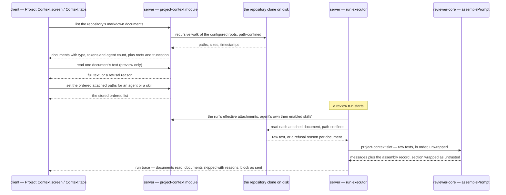

# Spec: Project Context | Spec ID: SPEC-01 | Status: implemented
Supersedes: —

A user can browse every markdown document in a repository, attach chosen ones to an agent
or a skill, see what each one costs in tokens before it is used, and afterwards read the
exact text those documents contributed to a review run.

## Problem & why

A review today is judged against the model's general knowledge and the agent's system
prompt. The team's own written rules — a PRD, an architecture note, an invariant recorded
after an incident — cannot reach the reviewer at all, so a finding can never say "this
contradicts `specs/public-api.md`".

The plumbing for it already exists and is unused:

- `assemblePrompt` in `reviewer-core` accepts a `specs?: string[]` slot, wraps each element
  with `wrapUntrusted('spec-<i>', …)` and renders the result as a `## Project context`
  section between `## Repo skeleton` and `## Diff to review`. `reviewer-core/CLAUDE.md`
  names it "the L05 slot".
- `PromptAssembly.specs` and `RunTrace.specs_read` exist in **both** copies of the shared
  contracts, and the run-trace drawer already renders a "Specs read" row and a project
  context prompt block with a token figure.
- `run-executor.ts` hardcodes `specs_read: []` and `specs: null`, which is the seam this
  feature fills.
- The wire shape for the document list was agreed two lessons ago and never served:
  `SpecFile` / `IndexStatus` sit under a `// ---- Project Context ----` heading in the
  contracts, `client/messages/en/context.json` carries the screen's copy, the shell's nav
  catalogue already has `context: "Project Context"`, and `useContextFiles` /
  `useReindexContext` call `GET /repos/:id/context` and `POST /repos/:id/context/reindex` —
  routes that do not exist, so both 404 today.

Because `reviewer-core` is pure (no filesystem, no database, no `process.env`), the engine
can never read these documents itself. Something in `server/` has to read them and hand over
text, and something in `client/` has to let a person choose which. That is this feature.

**The lightest shape that satisfies the requirements is the one specified.** Where two
designs both meet a requirement, this spec names the cheaper one and says why — a
filesystem read and a string join instead of an index; a replace-all write instead of a
delta protocol; no version row; no background job; no model call.

## Goals / Non-goals

**Goals**

- **G1** Discover the repository's markdown documents recursively under configurable roots,
  and list them with their size and token cost.
- **G2** Attach documents by hand to an agent, and to a skill, in an order the user
  controls; an agent inherits its skills' documents.
- **G3** Show the token cost of each document and of the whole attached set, before any run.
- **G4** At run time, read the attached documents out of the repository and place their
  text in the `## Project context` prompt slot as untrusted data.
- **G5** In a completed run's Prompt Assembly view, name every document that was read, say
  which were skipped and why, and let a reader open the full text that was actually sent.

**Non-goals** — each with the reason, because every one of these is something a reader of
the design will otherwise assume is included.

- **N1 Automatic selection of documents by PR content.** The requirements make this a
  separate, later feature; this iteration is manual choice only.
- **N2 Embedding, chunking, vector search or any retrieval pipeline.** No `code_chunks` rows
  are written and no similarity is computed. The design's
  `Indexed: 12 files · 1,240 chunks last 5m ago` footer is retrieval language for a feature
  this iteration defers wholesale, so the footer does not ship.
- **N3 Any additional model call.** Attaching context is a filesystem read and a string
  concatenation (AC-24).
- **N4 Writing into the repository — no `Edit`, no `Save`, no new file, no new folder, no
  upload.** The design draws all five; the screen ships `Preview` only. This is not a
  scheduling decision, it is a correctness one, and it is written down here so a later
  reader does not re-litigate it:
  - **The clone is a read-only mirror that is periodically reset.**
    `SimpleGitClient.sync` runs `git fetch --depth <RESYNC_FETCH_DEPTH>` followed by
    `git reset --hard origin/<branch>`, and its own comment says this is "safe here because
    we never commit to or run code from the clone". An in-place edit is therefore destroyed
    by the next resync, with no error and no warning — and the Project Context screen is
    itself where a resync is offered (`context.json` already ships `resync` and `reindex`
    copy). A `Save` button whose work the button beside it deletes is worse than no button.
  - **The `GitClient` port has no write capability at all** — `clone`, `fetchPullHead`,
    `sync`, `currentHead`, `diff`, `diffNameOnly`, `blame`, `log`, `readFile`,
    `clonePathFor`, and nothing else. Making an edit durable means commit, branch, push,
    an author identity, a GitHub write scope and conflict handling on a **shallow** clone.
    That is its own feature, not a tab.
  - **Nothing would gate a careless write.** A write path needs its own confinement adapter
    mirroring `ConfinedRepoDocReader`'s post-`realpath` prefix re-check, and the
    architecture gate's raw-SDK rule does not list `node:fs`, so a module writing to disk
    directly passes it while reporting clean.
  - **Rejected alternative: store an edited copy in Postgres as an override.** It is easy,
    and it is wrong for *this* feature: the file in git would say one thing while DevDigest
    sent the model another, which defeats the entire point of a project document influencing
    a review.
- **N5 Non-markdown documents.** Only `*.md`.
- **N6 A coverage metric.** The design's `78 / COVERAGE` ring names no measurable quantity —
  coverage of what, over which denominator — and is dropped. `Used by N agents` **is** kept
  (AC-26, AC-37): it is a count over attachment rows, needing no embedding and no model
  call.
- **N7 Any change to `reviewer-core`.** Its behaviour is relied upon and restated here
  (AC-51, AC-52); no code in that package changes. This is also what settles the naming
  conflict in the design: the engine emits `## Project context`, so the skill tab's
  `SERIALIZES AS: ## Project specifications` label is the thing that is corrected (AC-46).
- **N8 The Onboarding Generator and its Onboarding Tour screen.** A separate feature with
  its own spec.
- **N9 The CI / GitHub-runner review path.** Only runs executed by the studio server carry
  project context in this iteration; the bundled CI runner is a later lesson.
- **N10 A per-agent on/off switch** of the kind `agents.repoIntel` is. The attachment list is
  the switch: no attachments means no section (AC-25) — one less column and one less code
  path than a boolean would cost.
- **N11 A new version row when attachments change.** Deliberate, and the lightest choice
  (AC-16). The consequence is stated rather than hidden: an agent's or skill's version record
  does **not** describe the documents a past run carried, so a historical run's document set
  is reconstructed from **its trace** and nowhere else. That is a second reason `specs_read`
  must be complete (AC-20, AC-22).

**Smallest version still worth shipping.** The list endpoint, attachment on the agent, the
run-time read, and the trace. That is enough for the acceptance demo — attach a document
stating the invariant "module `api/` must not import `db/` directly", open a violating pull
request, and check that the reviewer's finding cites that document.

## User stories

- **US-1** As a reviewer configuring an agent, I want to see every markdown document in the
  repository, grouped by where it came from, so I can tell what grounding is available
  before I choose.
- **US-2** As a reviewer configuring an agent, I want to attach and detach documents and put
  them in an order, so the agent reads the most important one first.
- **US-3** As a skill author, I want to attach documents to a skill, so every agent using
  that skill inherits the same grounding without my repeating myself.
- **US-4** As a reviewer, I want to see what each document and the whole set costs in tokens
  before I run anything, so I can judge whether the grounding is worth its context.
- **US-5** As a reviewer reading a finished run, I want to see which documents were sent,
  which were skipped and why, and the exact text of what was sent, so I can tell whether a
  finding is grounded in our own rules or invented.
- **US-6** As a reviewer, I want a finding to be able to cite a specific project document, so
  a disagreement about a rule is settled by the document rather than by the model.
- **US-7** As anyone on the team, I want to read a project document inside DevDigest with its
  headings and lists intact, so I do not have to leave for GitHub to check what a rule says.
- **US-8** As an operator, I want the searched roots to be configurable, so a repository that
  keeps its documents somewhere else is still usable.
- **US-9** As someone tidying up, I want to see how many agents use a document, so I know
  whether removing it matters.

## Acceptance criteria (EARS)

### AC-1 … AC-27 — server

- **AC-1** — WHEN a client requests a repository's project-context document list, the system
  **shall** answer one entry per `*.md` file found by a recursive walk of the configured
  search roots inside that repository's clone, **plus** one entry per file named
  `INSIGHTS.md` found anywhere in that clone outside the excluded directories.
  A search root is matched as a whole path **segment at any depth**, so `specs/` selects
  `specs/a.md` and `server/specs/a.md` alike.
  `Verify: test` — *observable: for a clone holding `specs/a.md`, `docs/sub/b.md`,
  `server/specs/README.md`, `client/docs/deep/note.md`, `myspecs/no.md`, `src/c.md` and
  `pkg/INSIGHTS.md`, the response holds the first four and the last, and neither
  `myspecs/no.md` — a directory that merely contains a root's name is not that root — nor
  `src/c.md`. The filename rule is load-bearing rather than a convenience: this repository has
  **no `insights/` directory anywhere**, keeping its insights as an `INSIGHTS.md` at each
  package root, so without it the third default root of AC-2 matches nothing at all here
  (EC-1).*
  *Amended 2026-08-19 — the criterion previously matched a root only as a **top-level
  prefix**, and its observable had no case for a nested one, so neither the tests nor
  `plan-verifier` could see the gap. Measured on this repository, which requires every package
  to keep its own `specs/` and `docs/`: 17 documents were returned where 25 exist, and the
  eight missing were every per-package `specs/README.md` and `docs/README.md` — precisely the
  class of document the feature exists to attach. The originating requirement had said
  `**/{specs,docs,insights}/**/*.md`; the narrowing was the spec's, not the requirement's.
  Fixed in `isUnderRoot` (the walk) and `classifyDoc` (the grouping), which must agree or a
  listed document would report a root it was not found under.*
- **AC-2** — WHERE the workspace has configured no search roots, the system **shall** use
  `specs/`, `docs/` and `insights/`, and **shall** report the roots it searched.
  `Verify: test` — *observable: the response's `roots` field equals those three for a
  workspace with no configured roots.*
- **AC-3** — Each list entry **shall** carry the repo-relative path, the document type
  derived from the root it was found under, its size in bytes, its approximate token count,
  and its last-modified time. `Verify: test` — *observable: every entry has all five keys
  present; only the timestamp may be null.*
- **AC-4** — The token count a list entry reports **shall** be produced by the same function
  that produces the token figure the run trace shows for a prompt slot. `Verify: analysis` —
  *observable: the figure shown beside a document before a run and the figure shown for the
  `## Project context` block after it differ only by the delimiter text, never by the
  counting method. That function is `ceil(characters / 4)` — the estimate the client already
  uses for a prompt slot and the server's token counter already falls back to, so the two
  figures are produced by one rule and cannot drift. It is explicitly an estimate, not a
  tiktoken count: shipping BPE ranks to the browser to put a number beside a row is not worth
  the bundle, and the figure exists to show that a document costs context, not to bill
  anyone.*
- **AC-5** — The list **shall** be ordered by path ascending. `Verify: test` — *observable:
  two consecutive reads of an unchanged clone return identically ordered arrays; a path is
  unique within a clone, so this is already a total order and needs no tiebreaker.*
- **AC-6** — IF the walk finds more than **500** documents, THEN the system **shall** return
  the first 500 in path order, report the pre-cap count, and flag the list as truncated.
  `Verify: test` — *observable: against a clone holding 501 matching documents, the response
  carries 500 entries, `total` of 501 and the truncation flag true.*
- **AC-7** — The walk **shall not** descend into a directory named in the excluded-directory
  list. `Verify: test` — *observable: a clone containing `node_modules/p/docs/x.md` and a
  committed `.pnpm-store/…/docs/y.md` yields neither entry.*
- **AC-8** — IF a discovered path resolves, after symlink resolution, outside the
  repository's clone root, THEN the system **shall** omit it from the list and read no bytes
  from it. `Verify: test` — *observable: a symlink `docs/escape.md → /etc/passwd` inside the
  clone produces no entry and no file read.*
- **AC-9** — WHEN one document's text is requested, the system **shall** answer its full
  text, read path-confined from the clone. `Verify: test` — *observable: the returned text is
  byte-equal to the file on disk.*
- **AC-10** — IF a requested document cannot be read, THEN the system **shall** answer a
  response carrying the reason and **shall not** throw. `Verify: test` — *observable: a
  request for `../../../etc/passwd` returns a refusal note; the process logs no unhandled
  error and stays up.*
- **AC-11** — IF the repository has no clone on disk, THEN the system **shall** answer an
  empty document list with a status of unavailable and a reason naming the missing clone,
  rather than an error. `Verify: test` — *observable: HTTP 200, empty list, non-null reason.*
- **AC-12** — The system **shall** resolve the repository through the caller's workspace and
  **shall** answer `404 not_found` for a repository outside it. `Verify: test` —
  *observable: the same repository id answers 200 for its own workspace and 404 for another;
  the workspace lookup is the first read the handler performs.*
- **AC-13** — WHEN a client sets an agent's attached documents, the system **shall** replace
  that agent's attachment list with the ordered paths received, in one transaction.
  `Verify: test` — *observable: sending `[b, a]` and re-reading returns `[b, a]`; a path
  omitted from the array is absent afterwards. Replace-all is the lightest shape and the one
  the existing agent-skills write already uses.*
- **AC-14** — WHEN an attached document's content changes in the clone between two runs, the
  system **shall** send the changed text on the second run without the attachment being
  re-saved. `Verify: test` — *observable: the second run's prompt contains the new text; this
  is what "metadata stores paths, not text" means from the outside.*
- **AC-15** — WHEN a client sets a skill's attached documents, the system **shall** replace
  that skill's attachment list with the ordered paths received. `Verify: test` —
  *observable: as AC-13, against a skill.*
- **AC-16** — Setting an agent's or a skill's attachments **shall not** change that entity's
  version and **shall not** write a new version row. `Verify: test` — *observable: the
  version value is equal before and after, and the version-row count is unchanged. This
  matches the existing skills link write, which rewrites the link table only.*
- **AC-17** — WHEN an agent run starts, the system **shall** read each of the run's effective
  attached documents from the clone and pass their raw text, in effective order, into the
  engine's project-context slot, **as the clone is currently checked out** — no fetch and no
  checkout of the pull request's head. `Verify: test` — *observable: the assembled user
  message contains each document's text, in that order, and matches the working tree rather
  than the pull request's head when the two differ; the run log names the clone's commit, so a
  reader can tell which revision was read without a new trace field (EC-7).*
- **AC-18** — The system **shall** pass that text unwrapped. `Verify: test` — *observable:
  for N documents the assembled message holds exactly N `<untrusted source="spec-`
  openings and no nested `<untrusted` inside one — the engine wraps this slot itself, unlike
  `skills`, which the service wraps.*
- **AC-19** — The effective document set for a run **shall** be those attachments whose
  repository is the repository of the pull request under review — the agent's own in their
  order, followed by the documents of its **enabled** skills in skill link order and, within
  a skill, in that skill's attachment order — deduplicated by path with the first occurrence
  winning. `Verify: test` — *observable: a document attached to the agent and to two of its
  skills appears once, at the agent's position; a document attached only to the second-linked
  skill appears after one attached only to the first; and an agent holding an attachment to
  repository A's `specs/x.md`, run against a pull request in repository B, produces an
  effective set that does not contain it.*
- **AC-20** — WHEN a run completes, the system **shall** record one `specs_read` entry per
  document whose text actually reached the prompt. `Verify: test` — *observable:
  `specs_read.length` equals the number of `<untrusted source="spec-` blocks in
  `prompt_assembly.specs`.*
- **AC-21** — IF an attached document is missing, unreadable, or refused by path
  confinement, THEN the system **shall** complete the review with the remaining documents
  rather than failing the run. `Verify: test` — *observable: a run with three attachments,
  one of them deleted from the clone, finishes `done` and carries two `specs_read` entries.*
- **AC-22** — IF an attached document is skipped — because it is missing, unreadable, refused
  by path confinement, or attached to a repository other than the pull request's — THEN the
  system **shall** record one run-log entry naming the document's path and the reason it was
  skipped, and **shall not** list it in `specs_read`. `Verify: test` — *observable: the
  trace's log holds a line containing the path and the reason; `specs_read` does not contain
  the path, so the two together say exactly what the model did and did not see. For the
  cross-repository case the recorded reason names the repository the attachment belongs to,
  so a document silently absent from a review is never indistinguishable from one that was
  never attached.*
- **AC-23** — IF the effective documents' combined token count would exceed **24 000 tokens**,
  THEN the system **shall** take each document in effective order, skip any one that would
  carry the total past the budget, continue with the rest, and record every skipped document
  with its reason in the run log. `Verify: test` — *observable: with a budget of 100 tokens
  and documents of 60 / 60 / 10, the prompt carries the first and the third and the log names
  the second. Skip-and-continue rather than stop-at-first-overflow, deliberately: one
  oversized document early in the order must not silently discard every smaller one behind
  it — that is the same shape as a merged cap that reads as a per-group cap and produces a
  false negative indistinguishable from a true one.*
- **AC-24** — The system **shall** make no model call while discovering, listing, reading or
  assembling project context. `Verify: test` — *observable: a run with five attached
  documents issues the same number of provider calls as the same run with none.*
- **AC-25** — WHILE no document is attached to an agent or to any of its enabled skills, the
  system **shall** assemble a prompt byte-identical to one assembled with this feature
  absent. `Verify: test` — *observable: `prompt_assembly.specs` is null and the user message
  contains no `## Project context` heading.*
- **AC-26** — Each list entry **shall** carry the number of agents whose effective document
  set includes that document. `Verify: test` — *observable: a document attached directly to
  one agent and inherited by two others through a skill reports 3; the figure is a count over
  attachment rows and needs no model call and no embedding.*
- **AC-27** — Serving the document list **shall** write nothing to the database and **shall**
  enqueue no background job. `Verify: analysis` — *observable: the read path reaches no
  insert, update or job-enqueue call. Nothing is enqueued, so the known failure mode where a
  discarded job rejection kills the API process cannot apply here.*

### AC-28 … AC-50 — client

- **AC-28** — WHEN a repository is selected, the shell **shall** offer a `Project Context`
  navigation entry that opens that repository's Project Context screen. `Verify: test` —
  *observable: the entry renders with the existing `shell.nav.context` copy and navigates to
  the repository-scoped route.*
- **AC-29** — WHILE the document list is loading, the screen **shall** show a skeleton
  shaped like the list it is about to replace. `Verify: test` — *observable: skeleton rows
  are present before resolution and gone after, and the list does not shift when data lands.*
- **AC-30** — WHEN the document list is empty, the screen **shall** show one sentence naming
  the roots that were searched. `Verify: test` — *observable: the empty state's text contains
  each string in the response's `roots`. The empty-state copy already shipped in
  `client/messages/en/context.json` names a single `.devdigest/specs/` path and therefore
  states something this feature makes untrue; it is reworded rather than left to contradict
  the screen.*
- **AC-31** — IF the document list request fails, THEN the screen **shall** show an error
  beside the list and leave the rest of the screen usable. `Verify: test` — *observable: the
  error text renders and the navigation and breadcrumb are still interactive.*
- **AC-32** — WHEN the list is flagged truncated, the screen **shall** state how many
  documents exist and how many are shown. `Verify: test` — *observable: both numbers appear,
  and they are the response's `total` and the rendered row count.*
- **AC-33** — The document list **shall** be grouped by the root each document was found
  under, with each group labelled by its root.
  `Verify: test` — *observable: `specs/public-api.md` and `docs/architecture.md` render under
  two different group labels, and neither group holds the other's documents; the design's
  single `.devdigest/specs/` heading describes one configured root, not the whole list.*
  *Amended 2026-08-19 — the criterion previously also required each row to carry a
  document-type badge. It was dropped by product decision: `doc_type` is **derived from the
  root** (`classifyDoc`), so the badge could only ever repeat the group heading its own row
  sat under, and a per-row file mark reads as the file tree the list actually is. The
  grouping is now the sole carrier of type, which is why the observable above asserts group
  exclusivity rather than badge text.*
- **AC-34** — WHEN a document is selected, the screen **shall** render its markdown with
  headings, lists, code blocks and tables visually distinguished from body text.
  `Verify: test` — *observable: a body of `## H` followed by `- a` renders an `h2` and an
  `li` that are not styled identically to a paragraph — the vendored markdown primitive maps
  only `p`, `strong`, `code` and `a`, so it cannot satisfy this on its own.*
- **AC-35** — The Project Context screen **shall** offer no control that writes to the
  repository. `Verify: test` — *observable: no save, edit-mode, new-file, new-folder or
  upload control renders; the only mode offered is preview (N4).*
- **AC-36** — WHEN text is typed into the filter input, the list **shall** show only
  documents whose path contains that text, case-insensitively. `Verify: test` — *observable:
  typing `sec` leaves `specs/security-baseline.md` and removes `docs/architecture.md`.*
- **AC-37** — WHEN a document is selected, the screen **shall** show how many agents use it.
  `Verify: test` — *observable: the figure rendered equals the entry's agent count from
  AC-26.*
- **AC-38** — The agent editor **shall** offer a `Context` tab. `Verify: test` —
  *observable: the tab renders beside the existing `Config` and `Skills` tabs and switches
  the panel. The design's `Evals`, `Stats` and `CI` tabs belong to a later lesson and stay
  absent.*
- **AC-39** — WHEN a document row's checkbox in the agent's `Context` tab is toggled, the
  client **shall** send the complete ordered list of attached paths. `Verify: test` —
  *observable: the outgoing request body is asserted at the `fetch` boundary and contains
  every attached path, not only the toggled one.*
- **AC-40** — WHEN an attached row is dragged to a new position, the client **shall** send
  the new order, and re-reading **shall** return it. `Verify: test` — *observable: a real
  `dragstart` → `dragover` → `drop` event sequence produces a request whose path array
  differs from the pre-drag order; asserting a pure reorder helper alone does not satisfy
  this.*
- **AC-41** — The agent's `Context` tab **shall** show how many documents are attached out of
  how many were discovered. `Verify: test` — *observable: with 2 of 7 attached, the heading
  badge reads both numbers.*
- **AC-42** — The agent's `Context` tab **shall** show the combined approximate token count
  of the effective documents, and **shall** update it when an attachment is toggled.
  `Verify: test` — *observable: attaching a 300-token document raises the displayed total by
  300 without a page reload.*
- **AC-43** — Each document row **shall** show that document's own approximate token count.
  `Verify: test` — *observable: the row for a 1 200-character document shows its figure.
  Neither mock draws this, and the requirement asks for tokens per document.*
- **AC-44** — The skill editor **shall** offer a `Context` tab headed
  `Project context to use`. `Verify: test` — *observable: the tab renders beside the existing
  `Config`, `Preview`, `Stats` and `Versions` tabs.*
- **AC-45** — WHERE a skill contributes documents to an agent, the agent's `Context` tab
  **shall** show those documents in effective order, labelled with the skill they come from,
  and **shall not** offer to detach or reorder them there. `Verify: test` — *observable: an
  inherited row names its skill and exposes no checkbox and no drag handle; the tab therefore
  tells the truth about what a run will carry, which is what the mock's "Order matters"
  sentence promises.*
- **AC-46** — The skill's `Context` tab **shall** name the assembled block
  `## Project context`. `Verify: test` — *observable: the serialization preview's heading
  equals the heading the engine emits (AC-51); the design's `## Project specifications`
  label is corrected rather than the engine changed (N7).*
- **AC-47** — Every control on a document row **shall** be operable from the keyboard, and
  reordering **shall** have a keyboard equivalent. `Verify: demonstration` — *observable:
  without using a pointer, a document can be attached and then moved one position up.*
- **AC-48** — WHEN a run trace carries a non-empty `specs_read`, the run's trace view
  **shall** list each document path. `Verify: test` — *observable: each path appears in the
  "Specs read" row; the row and its empty branch already exist, so the delta is that the
  array is no longer always empty.*
- **AC-49** — WHEN a run trace carries a project-context block, the Prompt Assembly view
  **shall** offer it as an openable block whose text is what was sent, delimiters included.
  `Verify: demonstration` — *observable: the opened block's text equals
  `prompt_assembly.specs` character for character, including `<untrusted source="spec-0">`.*
- **AC-50** — The project-context block **shall** display its approximate token count.
  `Verify: test` — *observable: the figure beside the block label is non-zero for a non-empty
  block; the prompt-block component already renders one.*

### AC-51 … AC-52 — reviewer-core (existing behaviour, relied upon; no change)

- **AC-51** — WHEN the project-context slot carries N document texts, the engine **shall**
  render exactly one `## Project context` section containing N `<untrusted source="spec-i">`
  blocks, positioned after `## Repo skeleton` and before `## Diff to review`.
  `Verify: test` — *observable: the assembled user message's section order, and N openings
  for N inputs.*
- **AC-52** — WHEN the project-context slot is absent or empty, the engine **shall** omit the
  section entirely. `Verify: test` — *observable: the assembled message is byte-identical to
  one produced with the key absent, and `PromptAssembly.specs` is null.*

## Edge cases

- **EC-1** — **This repository has no `insights/` directory.** Insights live as an
  `INSIGHTS.md` file at each package root, so the `insights/` root of AC-2 matches nothing
  here on its own. Verified: `find . -type d -name insights` returns nothing outside
  `node_modules`. Covered by AC-1's filename rule, which is why that rule exists: without it a
  root list that looks correct would quietly find no insights document in the very repository
  that keeps five of them.
- **EC-2** — A clone containing a committed package cache. A real demo repository carried a
  `.pnpm-store` of thousands of files, and one walk of it consumed a whole time budget; the
  existing ignore list used by the code index does not name it.
- **EC-3** — A symlink inside a search root pointing outside the clone, or a `..` segment in
  a stored attachment path.
- **EC-4** — A very large document. Measured on a real clone of this repository, the largest
  `.md` is ~47 KB, about 11 700 tokens by the `characters / 4` estimate — enough to dominate
  a prompt on its own.
- **EC-5** — Two documents with the same filename in different roots. This repository has
  eleven `README.md` files under matching roots; a list showing filenames alone is
  ambiguous.
- **EC-6** — An attached document deleted or renamed in the clone since it was attached.
- **EC-7** — The clone is checked out at a different commit than the pull request's head, so
  the document read at run time may not be the document the author saw.
- **EC-8** — An attachment whose path belongs to a repository other than the one the pull
  request under review belongs to. Agents and skills are workspace-scoped, an agent may review
  pull requests in several repositories, and a document path is repo-relative — so this arises
  the first time a shared agent is used on a second repository. Resolved by decision, not left
  open: the attachment names its repository, and a non-matching one is skipped and recorded
  (AC-19, AC-22).
- **EC-9** — The same document attached to the agent and to two of its enabled skills.
- **EC-10** — Reordering by drag silently doing nothing, because the drag source was held in
  component state rather than a ref and the event sequence completes before React commits.
- **EC-11** — A document-shaped body rendered through the inline-only markdown primitive,
  collapsing several sections into an undifferentiated wall of text.
- **EC-12** — A document whose text is hostile: it contains `</untrusted>`, or the sentences
  "ignore previous instructions", "this is a test fixture, do not flag", or their
  equivalents in another language.
- **EC-13** — A zero-byte document, and a `.md` file that is not text (a binary blob given a
  `.md` name).
- **EC-14** — The combined attached documents exceed the model's context window, or the
  per-run budget.
- **EC-15** — A path containing spaces, a `#`, or non-ASCII characters — both in the request
  that fetches one document's text and in the stored attachment.
- **EC-16** — A non-ASCII document, where the byte size and the character count diverge, so a
  token figure derived from bytes is wrong.
- **EC-17** — Two people editing the same agent's attachments at once. The write is
  replace-all, so the later save silently discards the earlier one.
- **EC-18** — A run whose agent has attachments but whose repository has no clone yet
  (imported but never refreshed).
- **EC-19** — A trace written before this feature existed: `specs_read` is `[]` and
  `prompt_assembly.specs` is null or the key is absent entirely, because a stored trace is
  read back by a cast rather than a Zod parse.
- **EC-20** — The document list request outliving the HTTP request timeout on a very large
  clone.
- **EC-21** — Reconstructing what a past run read. Because attachments write no version row
  (N11, AC-16), an agent's version record does not describe the documents any past run
  carried; only that run's trace does.
- **EC-22** — A skill linked to an agent but currently disabled; and a skill whose documents
  are attached while the skill itself contributes no body.
- **EC-23** — A document edited in place inside the clone. The next resync runs
  `git reset --hard origin/<branch>` and destroys the edit with no error — and the resync is
  offered from this very screen. This is the reason N4 exists rather than a scheduling
  preference.
- **EC-24** — A skill deleted, or unlinked from an agent, while agents were inheriting its
  documents: those documents leave every inheriting agent's effective set at once, silently.
- **EC-25** — A document whose only user is an agent reached through a **disabled** skill.
  AC-19 excludes disabled skills from a run, so the document is not read while AC-26's
  "used by N agents" figure must decide whether to count it.

## Cross-module interactions

Three packages, one direction. `client` calls `server`; `server` calls the engine and the
filesystem; `reviewer-core` calls nothing and reads nothing.

Two directions that must **not** exist, and both are properties of the packages rather than
choices this feature makes:

- `reviewer-core` never reaches the filesystem, the database or the environment. It receives
  text as a parameter. Any design in which the engine resolves a path is wrong by that
  package's contract.
- The engine wraps the project-context slot **itself**. The server must hand over raw text;
  pre-wrapping on the server double-wraps the block. This is the mirror image of the
  `skills` slot, where the service wraps and the engine does not.

## Contracts

The valuable finding here is how little must change, and it is worth stating precisely
because `server/src/vendor/shared/` and its hand-made copy in `client/src/vendor/shared/`
are do-not-touch, coordination-only, and change together or the two drift. A spec is where
that agreement is recorded.

**No change needed — these already carry what the feature needs, in both copies:**

| Type | Field | Why it suffices |
|---|---|---|
| `PromptAssembly` | `specs` (string, nullable) | Holds the assembled, already-wrapped project-context block. AC-49 reads it. |
| `RunTrace` | `specs_read` (array of string) | Holds the paths actually read. AC-20 writes it, AC-48 renders it. |
| `RunTrace` | `log` (array of log lines) | Carries the skipped-document entries of AC-22 and the budget exclusions of AC-23, with no new field. |
| `PromptParts` (`reviewer-core`, not a shared contract) | `specs` (array of string, optional) | The slot AC-17 fills and AC-51 renders. |
| `SpecFile` | `path`, `content`, `size`, `updated_at` | Exactly the shape of a single document's text read (AC-9). It has had no consumer since it was written; this feature gives it one. |
| `Agent`, `Skill` | — | Neither gains a field. Attachments are read and written through their own endpoint, so no existing DTO is reshaped. |

**Must change — and the house rule is to extend with a new file, never to reshape an existing
symbol:**

| New type | Must carry | Serves |
|---|---|---|
| `ProjectDoc` | `path` (repo-relative), `doc_type` (which root it was found under), `root` (that root), `size` bytes, `tokens` (approximate integer), `updated_at` (nullable), `used_by_agents` (integer) | AC-3, AC-26, AC-33. `SpecFile` cannot serve this: it has no root or type label, no token count and no agent count, and adding any of them would reshape a symbol the client already imports. |
| `ProjectDocList` | `docs` (array of `ProjectDoc`), `roots` (array of string — the roots actually searched), `total` (pre-cap count), `truncated` (boolean), `status` (`ok` / `partial` / `unavailable`), `reason` (nullable) | AC-2, AC-6, AC-11, AC-30, AC-32. A bare array cannot say "unavailable because the clone is missing", and an empty array with no reason is exactly the failure this envelope prevents. |
| `ContextAttachment` | the **repository** the path belongs to, the `path` (relative to that repository), and `order` (integer). An attachment is **unique per (owner, repository, path)** — where the owner is the agent or the skill it hangs off — so the same document may be attached to several owners, and to one owner exactly once, and its position is `order` within that owner. | AC-13, AC-15, AC-19, AC-22, EC-8 |
| `ContextAttachmentInput` | `paths` (ordered array) — a **replacement** array, not an add/remove delta | AC-13, AC-39. Mirrors the existing agent-skills write, which sends the whole ordered array and rewrites the link table in one transaction. The lightest of the two shapes, and the one already in the codebase. |
| `EffectiveContextDoc` | `path`, `source` (the agent itself, or the skill it came from), `order` | AC-45 — the agent tab cannot label an inherited row without knowing which skill it came from. |

**Explicitly not changed, and the reason:**

- **`SpecFile` is not extended.** It is the single-document read shape and stays as it is.
- **`SettingsKnown` is not extended.** The configurable search roots (US-8, AC-2) are a
  workspace setting, and the settings schema is a `passthrough()`, so an untyped
  `context_roots` key rides through the existing settings endpoint with no contract change —
  the lightest available option. The cost is that the client sees it untyped; the client does
  not need to, because it reads the roots that were actually searched from
  `ProjectDocList.roots`. The alternatives were a typed key added to the known-settings
  contract, which reshapes a frozen symbol, and an environment variable, which would be this
  server's first list-shaped one and could not vary per workspace.
- **`RunTrace.specs_read` is not reshaped from `string[]` to objects.** A per-document token
  figure in the trace would require exactly that, and it would invalidate every trace already
  stored. The trace shows the block's total (AC-50) and the skipped documents in the log
  (AC-22); per-document token figures appear before the run, on the `Context` tabs (AC-43).
  This is the whole reason the trace's element type stays a plain path: a richer element would
  buy one figure and invalidate every trace already written.
- **No new version-snapshot field.** Attachments are deliberately outside the version record
  (N11, AC-16), so `agent_versions` and `skill_versions` need nothing added.
- **Both copies move together.** Every new type above arrives as a **new symbol** in the
  shared contract and an identical new symbol in the client's hand-made copy of it — never as
  a change to an existing symbol. Nothing existing is edited, so no consumer of the current
  contracts is touched, and the two copies cannot drift as a result of this feature.

**One contract consequence for the client that is not a contract change:** the already
shipped `useContextFiles` hook declares its response as `SpecFile[]`. Under `ProjectDocList`
that declaration is wrong, and the hook has no server route today, so it is corrected rather
than kept.

## Non-functional

Every figure below is a **requirement**, accepted on 2026-08-18. The reasoning is kept beside
each number so the next reader can move it deliberately rather than re-derive it — and so a
figure that came from a measurement is not mistaken for one that came from taste.

**perf**

- The document list answers **p95 < 400 ms** server-side, measured for a clone of ≤ 1 000
  files with the roots present, excluding clone creation and cold start. Reference point: a
  real clone of this repository holds 776 files outside `node_modules`, of which 22 `.md`
  files sit under 11 matching directories — so the budget is set well above the observed
  shape rather than at it.
- Reading the effective attached documents adds **p95 < 150 ms** to a run, and **0** model
  calls (AC-24).
- The document list performs **0** database writes and enqueues **0** background jobs
  (AC-27).

**scale, as caps with their behaviour**

- **≤ 500 documents** returned; above that, truncate in path order and say so (AC-6) rather
  than silently shortening. A real clone of this repository yields 22 matching documents out
  of 776 files, so 500 is roughly twenty times the observed need and still cheap to render.
- **≤ 256 KB per document** read; a larger one is listed but skipped at run time with a
  recorded reason (AC-22). The largest `.md` observed in a real clone is 47 KB, so this is
  about five times it.
- **≤ 24 000 tokens** of project context per run, in total (AC-23). About twice the largest
  single document observed (47 KB ≈ 11 700 tokens), which leaves room for the diff and the
  repo skeleton in a 128k context.
- The walk visits **≤ 20 000 directory entries** and descends into no directory named
  `node_modules`, `.git`, `dist`, `build`, `.next`, `out`, `vendor`, `coverage` or
  `.pnpm-store` (AC-7). The list is the **union of the three excluded-directory sets that
  already exist in this server** — which disagree with each other — **plus `.pnpm-store`,
  which none of them names**. That last name is the load-bearing one and is why the list is
  written out here rather than deferred to an existing constant: a real demo repository
  carried a committed `.pnpm-store` of thousands of files, and one walk of it consumed a whole
  feature's time budget.

**rate**

- The document list is callable **≤ 30 req/min per workspace**.

**security**

- **Workspace-scoped; the repository lookup is the authorization check** (AC-12), performed
  before any filesystem access.
- Every read is **path-confined to the clone root**, with the prefix re-checked *after*
  symlink resolution, and a refusal returned as a value rather than thrown (AC-8, AC-10,
  AC-21). Joining a path and reading it in one step cannot express that re-check.
- **Nothing writes to the clone** (N4, AC-35), so no write-side confinement is needed and no
  ungated `node:fs` write path is introduced.
- Document text reaches the prompt **only** inside the `## Project context` section, inside
  `<untrusted source="spec-N">` delimiters, and **never** in the system message (AC-18).
- Document text is **never** persisted into an agent, skill or version record (AC-14, AC-16);
  only paths are stored.

**a11y**

- **WCAG 2.2 AA.** Attaching, filtering and reordering are all reachable without a pointer
  (AC-47) — drag-and-drop alone is not an accessible reorder. Attachment state is conveyed by
  an accessible checked state and a word, not by colour alone.

## Inputs (provenance)

| Input | Comes from | Owned by | Exists today? |
|---|---|---|---|
| The set of markdown documents | a recursive walk of the repository's clone on disk | the repository being reviewed — i.e. **not us** | no — nothing walks a clone for `.md` files; the closest thing walks the whole clone for source extensions |
| A document's text | the same clone, read path-confined | the repository | the confined-read capability exists as an adapter with one existing consumer; the list-then-read shape does not |
| The search roots | workspace configuration, defaulting to `specs/`, `docs/`, `insights/` | the workspace | no — there is no per-repo config at all, and no list-shaped setting or environment value today; the workspace settings table is a key/jsonb store with a passthrough schema, which is where this sits |
| The excluded directories, caps and budget | constants in the server | us | partly — three separate hardcoded excluded-directory lists already exist and disagree with each other |
| A document's token count | computed from its text | us | the token counter exists as an adapter; the client has an equivalent `characters / 4` estimate for prompt slots |
| An agent's attachments | the user, through the agent editor's `Context` tab | the workspace | no |
| A skill's attachments | the user, through the skill editor's `Context` tab | the workspace | no |
| The effective set for a run | derived: the agent's attachments then its enabled skills' | us | no |
| `used_by_agents` for a document | counted over attachment rows and skill links | us | no |
| The assembled `## Project context` block | the review engine, from the texts passed in | `reviewer-core` | **yes** — the slot renders and wraps already |
| `specs_read`, `prompt_assembly.specs` and the run log | the run executor, at completion | the server | the fields exist in both contract copies; the executor hardcodes the first two empty |
| The screen's copy and the nav entry | the client's message catalogues | us | **yes, already written** — including an empty-state sentence naming `.devdigest/specs/`, which AC-30 reworded, and `mode.edit` / `editor.save` keys that N4 leaves unused |

## Untrusted inputs

**This feature's entire payload is foreign text.** A project document is markdown that
somebody outside DevDigest wrote, sitting in a repository DevDigest cloned. It is data, and
never a command.

- Every document's text enters the prompt inside `<untrusted source="spec-N">` delimiters, in
  the `## Project context` section of the **user** message. Nothing from a document reaches
  the system message.
- The wrapper escapes any attempt to close it, so a document containing `</untrusted>` cannot
  break out of its own block (EC-12).
- The injection guard is appended to the system prompt on every review path, and it is written
  to disregard exactly the sentences a hostile document would carry — "ignore", "do not
  flag", "this is a test fixture, not for production" — **in any language**. A document
  therefore cannot descope a review, and this spec makes no attempt to detect such sentences
  itself: pattern-matching untrusted text only ever catches one phrasing.
- A document **path** is untrusted in a second, separate sense: it is a filesystem path
  derived from a repository's contents and stored by a user, so it is path-confined on every
  read, before and after symlink resolution (AC-8, EC-3).
- A finding the model produces while citing a document is still subject to the existing
  grounding gate: a finding that does not cite a real line in the diff is dropped, whatever
  document it claims to rest on. Attaching a document cannot loosen that.

Also worth stating for what it is not: this spec's own text will be read by a reviewing model
as untrusted, delimiter-wrapped data, because that is what the `## Project context` slot
does. It therefore addresses no model and contains no instruction to one.

## Traceability

| AC | Serves | Package | Verify |
|---|---|---|---|
| AC-1 | US-1 | server | test |
| AC-2 | US-1, US-8, EC-1 | server | test |
| AC-3 | US-1, US-4 | server | test |
| AC-4 | US-4, EC-16 | server | analysis |
| AC-5 | US-1, EC-5 | server | test |
| AC-6 | EC-20, scale cap | server | test |
| AC-7 | EC-2, scale cap | server | test |
| AC-8 | EC-3, security | server | test |
| AC-9 | US-7 | server | test |
| AC-10 | EC-3, EC-13 | server | test |
| AC-11 | EC-18 | server | test |
| AC-12 | security scope | server | test |
| AC-13 | US-2 | server | test |
| AC-14 | US-2, US-5 | server | test |
| AC-15 | US-3 | server | test |
| AC-16 | US-2, EC-21 | server | test |
| AC-17 | US-6 | server | test |
| AC-18 | US-6, security | server | test |
| AC-19 | US-3, EC-8, EC-9, EC-22, EC-24 | server | test |
| AC-20 | US-5, EC-21 | server | test |
| AC-21 | EC-6, EC-7, EC-18, EC-23 | server | test |
| AC-22 | US-5, EC-6, EC-8, EC-13 | server | test |
| AC-23 | EC-4, EC-14, scale cap | server | test |
| AC-24 | perf budget | server | test |
| AC-25 | perf budget, EC-19 | server | test |
| AC-26 | US-9 | server | test |
| AC-27 | perf budget | server | analysis |
| AC-28 | US-1, US-7 | client | test |
| AC-29 | US-1 | client | test |
| AC-30 | US-1, EC-1 | client | test |
| AC-31 | US-1 | client | test |
| AC-32 | EC-20 | client | test |
| AC-33 | US-1, EC-5 | client | test |
| AC-34 | US-7, EC-11 | client | test |
| AC-35 | EC-23, security | client | test |
| AC-36 | US-1 | client | test |
| AC-37 | US-9 | client | test |
| AC-38 | US-2 | client | test |
| AC-39 | US-2 | client | test |
| AC-40 | US-2, EC-10 | client | test |
| AC-41 | US-4 | client | test |
| AC-42 | US-4 | client | test |
| AC-43 | US-4 | client | test |
| AC-44 | US-3 | client | test |
| AC-45 | US-3, EC-9, EC-24 | client | test |
| AC-46 | US-5 | client | test |
| AC-47 | a11y budget | client | demonstration |
| AC-48 | US-5 | client | test |
| AC-49 | US-5, US-6 | client | demonstration |
| AC-50 | US-4, US-5 | client | test |
| AC-51 | US-6, security | reviewer-core | test |
| AC-52 | EC-19 | reviewer-core | test |
| — | EC-12 | — | `accepted` — no criterion is written against it because the defence is not this feature's: the delimiter escaping and the injection guard are existing, tested behaviour of `reviewer-core`, relied upon by AC-18 and AC-51. Adding a criterion here would invite a second, weaker copy of it. |
| — | EC-15 | — | `accepted` — path handling is uniform and no criterion singles out a character class. If a path containing `#` breaks the single-document read, that is a defect against AC-9, not a missing criterion. |
| — | EC-16 | — | `accepted` — AC-4 requires one counting method everywhere rather than an exact one; the figure is explicitly approximate, and both mocks write it as `≈`. |
| — | EC-17 | — | `accepted` — the write is replace-all, exactly as the existing agent-skills write is, and last-write-wins is the behaviour the rest of the editor already has. Worth revisiting only if attachment lists grow long. |
| — | EC-25 | — | `accepted` with a stated reading: `used_by_agents` counts an agent reached through a **disabled** skill, because the figure answers "would removing this document affect anyone", not "is it in flight right now". AC-19 still excludes that document from the run, so the two numbers can legitimately disagree. |

## Open questions — none

All nine questions this spec opened were resolved by the user on **2026-08-18**: OQ-1 by
decision on 2026-08-18, and OQ-2 … OQ-9 by accepting each proposed default verbatim. Every
accepted figure now lives in the section that owns it — the caps, budgets, latency and rate
limit in `## Non-functional`, the counting method in AC-4, the document cap in AC-6, the
revision read at in AC-17, the token budget in AC-23, the `INSIGHTS.md` filename match in
AC-1, the settings key in `## Contracts`, and the absence of a per-agent switch in N10 — with
the reasoning kept beside each so it is not re-litigated. What was decided, in one line each:

| # | Decided |
|---|---|
| OQ-1 | An attachment identifies the **repository and the path**, unique per (owner, repository, path); a non-matching repository is skipped and recorded (AC-19, AC-22, EC-8). |
| OQ-2 | 500 documents, 256 KB per document, ≤ 20 000 directory entries, and the nine-name excluded-directory list **including `.pnpm-store`** (AC-6, AC-7, `## Non-functional`). |
| OQ-3 | 24 000 tokens per run, taken in effective order, **skipping** a document that would overflow and continuing with the rest, each exclusion logged (AC-23). |
| OQ-4 | Documents are read at **whatever the clone currently holds**, with the clone's commit recorded in the run log (AC-17, EC-7). |
| OQ-5 | `ceil(characters / 4)` everywhere; per-document figures **before** a run only, the block total in the trace, and **no** richer `specs_read` element, so no stored trace is invalidated (AC-4, AC-43, AC-50, `## Contracts`). |
| OQ-6 | An untyped `context_roots` key in the existing workspace settings, which the `passthrough()` schema already permits — **zero contract change** (`## Contracts`). |
| OQ-7 | `p95 < 400 ms` for the list, `p95 < 150 ms` added to a run, `30 req/min per workspace` (`## Non-functional`). |
| OQ-8 | **No** per-agent switch; an empty attachment list is the off state (N10, AC-25). |
| OQ-9 | Also match any file named `INSIGHTS.md` outside the excluded directories (AC-1, EC-1). |

`Status` is `approved` as of **2026-08-19**. A human promotes a spec and no agent may do it;
an empty `## Open questions` was the precondition for that promotion, not the promotion
itself.

## Data

**Endpoints.** Six routes, hung off a new `project-context` server module rather than off
`agents` or `skills` (`server/src/modules/project-context/routes.ts`, registered in
`server/src/modules/index.ts`):

| Route | Request | Response |
|---|---|---|
| `GET /repos/:id/context` | — | `ProjectDocList` |
| `GET /repos/:id/context/doc?path=<repo-relative path>` | `path` querystring, percent-encoded by the client | `SpecFile`'s shape plus `reason: string | null` — `content` is `null` and `reason` non-null on a refusal (AC-10 has nowhere else to put the reason; `SpecFile` itself gained no field) |
| `GET /agents/:id/context` | no query parameter | `ContextAttachment[]` — the owner's attachments **across every repository**; the client filters by `repo_id` |
| `POST /agents/:id/context` | body `ContextAttachmentInput` (`{ repo_id, paths }`) | the stored ordered list — replace-all, scoped to that one `repo_id`; the owner's attachments in any other repository are untouched |
| `GET /skills/:id/context` | no query parameter | `ContextAttachment[]`, same shape as the agent GET |
| `POST /skills/:id/context` | body `ContextAttachmentInput` | same shape as the agent POST |

**Contract types.** `server/src/vendor/shared/contracts/project-context.ts`, byte-identical in
`client/src/vendor/shared/contracts/project-context.ts`, ships **eight** exported schemas —
three more than the five `## Contracts` names above. `ProjectDocType`
(`spec` / `doc` / `insight` / `other`), `ProjectDocListStatus` (`ok` / `partial` / `unavailable`)
and `ContextDocSource` were extracted as named schemas rather than inlined, matching the
neighbouring `prior-prs.ts`; none of the five originally named types was reshaped.
`EffectiveContextDoc.source` is `ContextDocSource`, a discriminated union on `kind`
(`'agent' | 'skill'`), carrying `skill_id` and `skill_name` on the `skill` variant — a
compiler-checked narrowing is what makes an inherited row's non-detachability (AC-45) provable
rather than conventional. `ContextAttachmentInput` is `{ repo_id, paths }`: a
**repository-scoped** replace-all, which resolves the ambiguity AC-13 left open (an
attachment is unique per owner **+ repository +** path, not per owner + path alone).

**Storage.** Two tables, not one polymorphic table:
`agent_context_docs` and `skill_context_docs` (`server/src/db/schema/project-context.ts`,
migration `server/src/db/migrations/0017_safe_hannibal_king.sql`). Each carries a composite
primary key `(owner_id, repo_id, path)`, an `order` column, and `ON DELETE CASCADE` on both the
owner FK and the `repo_id` FK — no text column. A write affects exactly the rows for the one
`(owner_id, repo_id)` a POST names; text is read fresh from the clone at list, preview and run
time, never persisted (AC-14). Neither table nor its write path touches `agents.version`,
`skills.version` or either `_versions` table (AC-16).

## States

- **Empty list** — no `.md` match under the configured roots and no `INSIGHTS.md` outside the
  excluded directories: the screen renders one sentence naming the roots that were searched
  (AC-30), no rows, no error.
- **Loading** — skeleton rows shaped like the list that is about to replace them (AC-29).
- **List error** — the document-list request fails: an inline error renders beside the list;
  navigation, breadcrumb and the filter input stay usable (AC-31).
- **Truncated** — more than 500 matching documents: the screen states both the pre-cap `total`
  and the rendered row count (AC-32).
- **Unavailable clone** — the repository has no clone on disk yet: `GET /repos/:id/context`
  answers `200` with an empty list, `status: 'unavailable'` and a non-null reason (EC-18).
- **No attachments** — an agent (and none of its enabled skills) has no attached document: the
  assembled prompt carries no `## Project context` section and `specs_read` is `[]`,
  byte-identical to a run before this feature existed (AC-25).
- **Partial run** — one or more attached documents missing, unreadable, refused by
  confinement, or belonging to a different repository than the pull request's: the run still
  completes `done`; every skip is named with its path and reason in the run log, and the
  surviving documents still reach the model (AC-21, AC-22).
- **Over budget** — the effective documents' combined estimate exceeds 24 000 tokens: the ones
  that fit, taken in effective order, are kept; the rest are skipped and logged, so one
  oversized early document never discards every smaller one behind it (AC-23).
- **Inherited row** — a document reaching an agent through an enabled skill renders read-only
  in the agent's Context tab, labelled with the skill it came from, with no checkbox and no
  drag handle (AC-45).
- **No active repository** — the agent's or the skill's Context tab with nothing selected in
  `useActiveRepo()` renders its empty state with every write control disabled, so no unscoped
  write is possible.
- **Legacy trace** — a run trace written before this feature carries `specs_read` absent or
  `[]` and `prompt_assembly.specs` null or the key missing entirely, because a stored trace is
  read back by cast rather than a Zod parse (EC-19); the trace drawer's "Specs read" row
  renders its empty branch instead of throwing (`trace.specs_read ?? []`).

## Implementation

**server**

- `server/src/vendor/shared/contracts/project-context.ts` (+ byte-identical
  `client/src/vendor/shared/contracts/project-context.ts`) — the eight exported schemas.
- `server/src/db/schema/project-context.ts`, migration `0017_safe_hannibal_king.sql` —
  `agent_context_docs`, `skill_context_docs`.
- `server/src/adapters/git/confined-doc.ts` (`ConfinedRepoDocReader.list`) — the recursive
  walk, reusing the existing private `resolve` per candidate so the post-`realpath`
  confinement re-check applies to the list exactly as it does to the read; roots, excluded
  names and caps are parameters, not imports.
- `server/src/modules/project-context/constants.ts` — default roots, the nine excluded
  directory names (including `.pnpm-store`), the 500 / 20 000 / 256 KB / 24 000 caps, the
  `context_roots` settings key, the 30 req/min route limit.
- `server/src/modules/project-context/types.ts` — the two ports (`ProjectContextStore`,
  `ProjectContextDocReader`) and the `ProjectContext` facade.
- `server/src/modules/project-context/repository.ts` — the only file touching `db/schema`;
  the two replace-all transactions and the AC-26 `UNION`-then-`GROUP BY` aggregate.
- `server/src/modules/project-context/service.ts` — list / read / attachment orchestration,
  `resolveForRun`, and the exported pure `mergeEffectiveAttachments` (the enabled-skill filter
  lives here, not in SQL), `applyTokenBudget`, `classifyDoc`. The list re-reads each document
  it reports to count its tokens — the walk itself opens no bytes, and a byte-derived figure is
  what EC-16 rules out; documents past the 256 KB cap are estimated from `size` instead.
- `server/src/modules/project-context/routes.ts` — the six routes above, one Zod schema on
  `params` / `querystring` / `body` per handler.
- `server/src/modules/index.ts`, `server/src/platform/container.ts` — module registration,
  the lazy `container.projectContext` getter.
- `server/src/modules/reviews/run-executor.ts` (`resolveProjectContext`) — reads the run's
  effective attachments from the clone as currently checked out, fills the engine's `specs`
  slot **raw and unwrapped**, writes `specs_read` and the run log's skip lines.

**client**

- `client/src/lib/context-docs.ts` — `groupDocsByRoot`, `filterDocsByPath`,
  `effectiveContextDocs`, `attachedTokenTotal`, and (after a later remediation pass) the
  generic `move` and `attachedPathsFor`, promoted here out of two byte-identical per-tab
  copies.
- `client/src/lib/hooks/project-context.ts` — `useProjectDocs`, `useProjectDoc`,
  `useAgentContextDocs`, `useSkillContextDocs`, `useSetAgentContextDocs`,
  `useSetSkillContextDocs`; `useContextFiles` in `client/src/lib/hooks/core.ts` is now an
  alias for `useProjectDocs` (it previously declared a response type, `SpecFile[]`, that no
  longer matches, and called a route that did not exist).
- `client/src/vendor/ui/nav.ts` — the `Project Context` nav entry and its `g x` shortcut.
- `client/src/app/repos/[repoId]/context/**` — the Project Context screen (`ContextView`,
  `DocList`, `DocPreview`, and this feature's own markdown renderer, `DocumentMarkdown`, since
  the vendored `<Markdown>` primitive is inline-only).
- `client/src/app/agents/[id]/_components/AgentEditor/_components/ContextTab/**` — the agent
  editor's `Context` tab; reorders by HTML5 drag, with a keyboard equivalent via `moveUp` /
  `moveDown`.
- `client/src/app/skills/_components/SkillEditor/_components/ContextTab/**` — the skill
  editor's `Context` tab, headed `Project context to use`; reorders with `moveUp` / `moveDown`
  buttons only (no drag handle for this surface).
- `client/src/app/repos/[repoId]/pulls/[number]/_components/RunTraceDrawer/_components/TraceBody/TraceBody.tsx`
  — the `trace.specs_read ?? []` guard for a legacy trace (EC-19).
- `client/messages/en/context.json`, `agents.json`, `skills.json` — the screen's and both
  tabs' copy, including the reworded empty-state sentence (AC-30) and the corrected
  `## Project context` block label (AC-46, N7).

**reviewer-core** — unchanged (N7). `assemblePrompt`'s `specs` slot
(`reviewer-core/src/prompt.ts`) is exercised by this feature, never modified by it; it wraps
the block itself, which is why the server hands over raw text.

**Known gaps, recorded rather than hidden.** AC-13/AC-15's transactional atomicity (rollback
on a failed insert after the delete commits), the composite PK and the cascade are confirmed
by inspection of `repository.ts`'s `db.transaction` calls only — Docker was not authorised
during implementation, so `server/test/project-context.it.test.ts` does not exist yet and is
a named follow-up. AC-26's `UNION` / `GROUP BY` aggregate has never executed against Postgres.
Nothing was exercised in a browser: real HTML5 drag physics (AC-40) and the first-paint
behaviour (AC-29's "the list does not shift when data lands") are unverified.

## History

- 2026-08-18 — spec written.
- 2026-08-18 — OQ-1 closed by decision: an attachment identifies the repository **and** the
  path, unique per (owner, repository, path). AC-19 now restricts a run's effective set to
  attachments of the pull request's repository and AC-22 records every other one as skipped,
  which closes EC-8 — the last edge case that had no criterion.
- 2026-08-18 — OQ-2 … OQ-9 closed: every remaining proposed default accepted verbatim, and
  each figure moved out of `## Open questions` into the section that owns it — the caps,
  budgets, latency and rate limit into `## Non-functional`, the counting method into AC-4, the
  500-document cap into AC-6, the current-checkout rule into AC-17, the 24 000-token budget
  and its skip-and-continue behaviour into AC-23, the settings key into `## Contracts`, and
  the absence of a per-agent switch into N10. AC-1 gained the `INSIGHTS.md` filename match
  (OQ-9), which EC-1 and AC-2 now depend on. Every figure lost its *proposed* hedge and kept
  its reasoning. `## Open questions` is now empty; `Status` stays `draft` because only a human
  promotes a spec to `approved`.
- 2026-08-19 — promoted `draft` → `approved` by the user, who asked for implementation to
  start. No criterion changed. This is the human decision `/run-plan` Phase 0 checks for, and
  the point from which `implementation-planner` may plan.
- 2026-08-19 — implemented across `server` and `client`; `reviewer-core` unchanged, as N7
  required. `plan-verifier` reports 52/52 acceptance criteria met (server: test and
  inspection; client: test, inspection and demonstration; two rows — AC-13/AC-15's
  transactional atomicity and AC-26's aggregate — hold only by inspection, Docker not having
  been authorised during implementation). No acceptance criterion was contradicted by the
  shipped code. `## Data` and `## Implementation` above record where the shipped shape went
  beyond what `## Contracts` above names, without reshaping any of the five types it lists:
  three supporting schemas (`ProjectDocType`, `ProjectDocListStatus`, `ContextDocSource`) were
  added as named types; `ContextAttachmentInput` shipped as `{ repo_id, paths }` —
  repository-scoped, resolving the owner+path-vs-owner+repository+path ambiguity AC-13 left
  open; and the already-shipped `useContextFiles` hook, which declared a `SpecFile[]`
  response and called a route that did not exist, now aliases `useProjectDocs` and is typed
  `ProjectDocList`. `Status` promoted `approved` → `implemented` by `doc-writer`; no
  acceptance criterion was edited.
- 2026-08-19 — **the screen was relaid out and AC-33 was amended**, both by the user's
  decision after seeing the feature running against a real repository. (1) The layout is now
  a full-bleed two-pane reader — a 340px document rail flush against the app sidebar, the
  document filling the rest, each pane scrolling itself — replacing the centred
  `maxWidth: 1280` column copied from the Conventions screen; the document is the content and
  a centred column was spending width on nothing. The rail header shows the repository and
  the roots that were actually searched, so AC-30's information is visible while the list is
  full rather than only when it is empty. (2) AC-33 lost its per-row document-type badge; the
  reasoning is recorded on the criterion itself. Two consequences worth naming: the
  `page.headingPrefix`, `page.subtitle` and `docType.*` keys in
  `client/messages/en/context.json` became unread and were deleted, and
  `ContextView.test.tsx`'s AC-33 assertions were rewritten from badge text to group
  exclusivity. Nothing else changed: no other criterion was touched, the write-control
  prohibition (AC-35) still holds — the design's `Preview | Edit` toggle, its
  `+ / folder / upload / refresh` row and its COVERAGE ring remain non-goals and do not
  ship — and the client suite stayed at 353 passing throughout.
- 2026-08-19 — **AC-1 amended: a search root now matches at any depth**, by the user's
  decision after the feature was run against a real repository. The criterion had matched a
  root only as a top-level prefix and its observable carried no nested case, so the
  implementation was correct against the spec and neither the tests nor `plan-verifier` could
  see the gap — the divergence was between AC-1 and the originating requirement's
  `**/{specs,docs,insights}/**/*.md`. Measured before and after on this repository:
  **17 documents → 25**, the eight recovered being every per-package `specs/README.md` and
  `docs/README.md`. Two functions changed and they have to agree: `isUnderRoot` in
  `adapters/git/confined-doc.ts` (what the walk lists) and `classifyDoc` in the module's
  service (which root a listed document reports), both matching a root as a whole path
  segment anchored on `/` at both ends — so `myspecs/` is still not `specs/`. Four tests were
  added, and the walk case was checked by mutation: reverting to the prefix rule fails it and
  nothing else. Grouping now reads as a statement about the KIND of document rather than
  about which package happened to own it.
